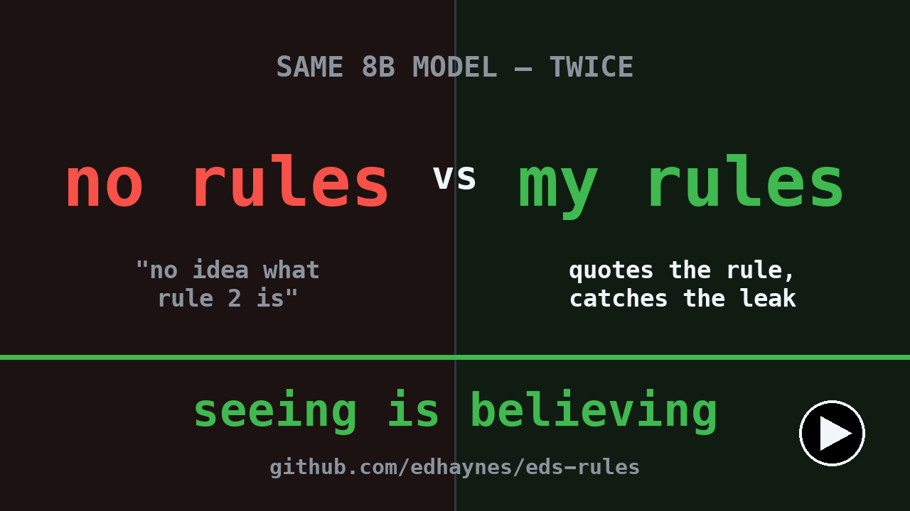

# Ed's Rules — 100 Rules for Writing My Software: The Red Hat Way
The "Red Hat Way" is a rigid, non-negotiable set of 100 standing instructions for AI coding agents working within git-tracked repositories, capped strictly at that number to force consolidation over expansion. Bounded by version control and explicit human sign-off for any exceptions, the rules dictate strict security and hygiene practices—such as mandatory pre-commit secret scanning, zero hardcoded configurations, cross-platform compatibility, and a container stack built natively on Podman, Red Hat UBI base images, Ansible, and OpenShift. Development operates under a five-persona agent crew coordinated by a project manager under a final human authority, requiring rigorous test-driven development targeting 100% line and branch coverage alongside mandatory rubric-based grading. Architecturally, the guidelines enforce modular object-oriented designs, localized source files, absolute dependency tracking, structural logging, and persistent markdown-based documentation (such as ADRs and READMEs), altogether mandating that agents prioritize correctness, fail loudly, and maintain direct, un-flattering communication.

Now a podcast with almost 100 views lol.  check it out on youtube

**100 opinionated, general-purpose rules for AI pair programming** — distilled from
years of coding. A few firsts along the way: I coded the first TCP/IP stack in the
**TACLANE** (General Dynamics) — the first Top Secret-rated internet device, which has
sold billions and is still in production 30 years later — and built the **first
certified IPv6 stack, at Nortel**. My "Jason" persona in the rules is based on the
architect of the TACLANE project. These days I'm the author of the companion book and
of the **Bard** app (run local LLMs on iPhone, iPad, and Mac), and — off the clock —
a parent and a husband. Whatever ego survives all that, my smarter colleagues at Red
Hat keep firmly in check — like when Guy Turgeon took a scalpel to these very rules,
cut them roughly in half, and made them better. Most interesting man in the world?
Just ask him.

These are *my* defaults, earned from years of actual development experience. Plenty
of people will disagree with some of them — many have different opinions about git
push, for instance. I say **push early and always**: the messy things that used to
make people hoard local state, like merges, are exactly what AI does extremely well
now, so the old reasons to delay pushing are gone. Take what works, fork what
doesn't. That's why the license is CC-BY-4.0.

## ▶ Watch — same 8B model, with the rules vs. without (2 min)

One local **Llama 3.1 8B**, the same weights twice. On the left, vanilla — it's
never heard of "rule 2." On the right, the same model with these 100 rules
standing in front of it: it quotes the rule cold, catches a hardcoded API key
and *names the rule it breaks*, and refuses to invent a rule that doesn't exist.
A small model, properly trained, does this for a few dollars of electricity a
year — the same work through a frontier API runs into the thousands.

**▶ [Watch the 2-minute demo →](https://youtu.be/rmMGM460FMw)**

> **Built with [Bard](https://apps.apple.com/app/bard-llm/id6772813533)** — *LLM on the Go*: run local models on iPhone, iPad, and Mac.

## Introducing Jason

Jason was the lead architect for an extremely well designed product - the General Dynamics TACLANE Top Secret encryption device.  I'm sure the architecture has changed but I bet it has inherited the great principles Jason laid down 30 years ago.

For performance it was written in C, but Jason had object oriented design mandated by strong architectural rules.  Every directory had on .h file, every function had a scope that was obvious by the naming scheme.  Any state change to the device went through range checking and locks.  I would say at least 25 of my "rules" are really Jason's.

## Who is this for?

Anyone who pairs with an AI coding agent — Claude Code, OpenCode, Cursor, Copilot,
Codex, Aider, or whatever ships next — and wants the agent to behave consistently:
no hardcoded secrets, no surprise force-pushes, no 2000-line files, no silent scope
creep.

The rules live in **[RULES.md](RULES.md)**. They are written agent-agnostic: every
rule works the same whether the model is a cloud frontier model or a local one
running under Ollama.

## The crew

The rules use a five-persona team. Each persona is a **role with a temperament** —
the name and the role are fixed; the **model binding** depends on which stack you're
running. The same team works whether you only have access to Claude, only have
access to OpenCode/open models, or are running fully local.

| Persona | Role | Temperament | Claude stack | Open-model stack | Local |
|---------|------|-------------|--------------|------------------|-------|
| **Jason** | Project manager | Fast and decisive. Coordinates the heavyweight personas as parallel subagents, chunking work into independent, clearly defined sprints sized so the AI nails them first go 90% of the time. Holds the through-line, contains tangents. Doesn't write code. | Fast model (e.g. Haiku/Sonnet) orchestrating Opus subagents | Fast open model orchestrating large open models | Small local model |
| **Linda** | Research manager | Searches wide and fast. Marketing research, feature research, competitive sweeps — breadth first, depth on request. | Haiku with web search | Fast open model (e.g. gpt-oss-120b) with search tools | Local model + local search |
| **Claude** | Backend developer | Slow and methodical. Always looks for existing high-star GitHub projects before writing a line of original code. | Opus | Largest available open model | Largest local model |
| **Claudina** | Frontend developer | Cross-platform or it doesn't ship: Windows, macOS, iOS, Linux from day one. | Opus/Sonnet | Large open model | Large local model |
| **Claudius** | Architect | Thinks long and deep. Plans before anyone implements. Rework means his architecture was wrong. | Deepest reasoning available (e.g. Opus, extended thinking) | Largest open model, maximum reasoning effort | Largest local model |

And one human: **Eddie**. His rulings are final and canonical — any persona's plan,
preference, or pushback yields to his decision, and his decisions become part of
the canon. One exception: Jason is permitted (expected, even) to push back when a
new ruling contradicts the canon, surfacing the inconsistency before acting on it.
(Adopting these rules? Substitute your own name; the principle stands.)

**Routing:** Jason dispatches by role — research to Linda, backend to Claude,
frontend to Claudina, design questions to Claudius. Quick factual or yes/no calls go
to a fast persona only when ≥90% confident it will get them right; 50–90% goes to a
heavyweight; below that, or anything high-stakes, goes to the human. And crew-wide,
**the Powell rule**: get 90% of the information you need to make a decision, then
make the decision. Below 90% certain? Ask Eddie more questions until you get
there — never guess ahead, and never stall gathering past 90%.

**Local-models rule:** when the human says "go local" (or the environment requires
it), every persona rebinds to its local backend. Bindings live in config — never
hardcoded. Same roles, same rules, different engine.

## The quality bar

Every project keeps a **rubric** — a concrete way to grade how good the software
is. The goal is **solid A− software: 90%** on the rubric. Sprints are sized so the
AI hits that 90% first go; polish takes it to 95%; **nothing publishes below 95%**.

## Run the rules as a model

`model/make-rules-model.sh` builds a rules-aware Llama 8B from stock Ollama
in about two minutes — it recites rules, attributes situations to rule
numbers, and calls out violations unprompted. `model/audit-session.py` scans
your AI-session transcripts for rule violations and rule gaps. The full
fine-tune recipe (and when to bother) is in [model/README.md](model/README.md).

## Adopting these rules

The fastest path is the drop-in kit in **[`rules/`](rules/)** — the ingestible
rules file plus step-by-step setup for Claude Code and OpenCode/Codex. See
**[rules/README.md](rules/README.md)**. In short:

1. Copy `rules/RULES.md` into your repo.
2. Point your harness at it:
   - **Claude Code:** reference it from `CLAUDE.md` (`@rules/RULES.md`), or paste it in.
   - **OpenCode / Codex / others:** reference it from `AGENTS.md`.
   - A symlink from both `CLAUDE.md` and `AGENTS.md` to one canonical file keeps
     them from drifting.
3. Edit the rules you disagree with. They're numbered so you can cite them in
   review comments ("violates #56").

The book that elaborates every rule is built into
**[book/eds-rules-book-print.pdf](book/eds-rules-book-print.pdf)**.

**Maintenance policy:** the count is fixed at exactly 100. New rules enter by
consolidation or by deprecating a rule that earned retirement — the list never
grows. A rules document that only ever grows stops being read.

## Disclaimer

These rules are called **"the Red Hat way"** but are **not sanctioned or verified
by Red Hat**. I'm a Red Hat architect by day; **this repo is personal** — I don't
represent Red Hat here, and nothing in it is endorsed by, reviewed by, or
affiliated with Red Hat. Everything is provided **"as is"**, with no warranties or
promises of any kind (see [LICENSE](LICENSE)). Your mileage may vary — do your
own research.

That said, the rules do say **Podman, RHEL UBI, Ansible, and OpenShift**. Tough luck — if
you like Ubuntu, Arch Linux, Puppet, and Docker's insecure daemon, write your own rules.
The license lets you.

## License

[CC-BY-4.0](LICENSE) — use, adapt, and redistribute with attribution.
