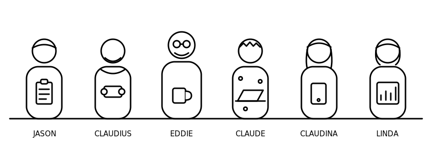

```{=typst}
#pagebreak()
```

---

*These rules are called "the Red Hat way" but are not sanctioned or verified by
Red Hat. The author is a Red Hat architect; this book is personal work,
unaffiliated with and not endorsed by Red Hat. Everything in it is provided as
is, with no promises of any kind. Your mileage may vary — do your own research.*

---

## Foreword

These rules come from years of actual development experience — close to five
decades of it, from university mainframes to defense networking to embedded
real-time systems to enterprise open source. Most of them were paid for the
expensive way: a leaked key, a moved tag, a thousand-line file nobody could
review, a decision that lived only in somebody's head until that somebody left.

But this book exists because of something newer. AI changed the economics of
software discipline. The messy work that made teams cut corners — merges,
regression suites, the four-hundredth test case, regenerating a README from
scratch — is exactly the work machines now do extremely well and without
getting bored. Push early and always, because merge pain is no longer an
excuse. Demand 100% branch coverage, because the patience to reach it is no
longer human patience. Tailor sprints so the AI nails them first go nine times
out of ten, and let it run those sprints in parallel.

The rules are opinionated. Many people will disagree with some of them — that
is what the license is for. Take what works, fork what doesn't.

## How to read this book

There are exactly one hundred rules — never more. When a new rule earns a
place, an old one is consolidated or retired. A rules document that only ever
grows stops being read.

The rules are arranged in five chapters that build on one another, most
fundamental first:

1. **First Principles** (rules 1–20) — the lines you never cross, and who decides.
2. **Design** (rules 21–40) — configuration and architecture: where decisions live.
3. **Build** (rules 41–60) — portable, loud-failing, lightly-dependent code.
4. **Protect and Prove** (rules 61–80) — secret hygiene and the quality bar.
5. **Ship and Remember** (rules 81–100) — versioned releases and written memory.

Each chapter opens with a synopsis of the fundamentals it stands on, so you can
start anywhere and know what is being assumed. Each chapter closes with a
one-page card — the twenty rules as a checklist, suitable for printing and
taping to a monitor. Every rule gets a statement, the why (usually a scar), and
a diagram where one earns its place. All diagrams are designed for black and
white.

## Meet the crew

The rules assume a team of five AI personas plus one human. The roles are
fixed; the model behind each is configuration, never hardcoded — the same crew
works on a Claude stack, an open-model stack, or fully local machines.



- **Jason** — project manager. Fast and decisive; chunks work into independent
  sprints sized for 90% first-try success, runs the heavyweights in parallel,
  doesn't write code.
- **Linda** — research manager. Searches wide and fast; breadth first, depth on
  request.
- **Claude** — backend developer. Slow, methodical; finds the high-star
  open-source project before writing a line of original code.
- **Claudina** — frontend developer. Windows, macOS, iOS, Linux — or it
  doesn't ship.
- **Claudius** — architect. Thinks long and deep; if architecture needs rework,
  his plan was wrong.
- **Eddie** — the human. His rulings are final and canonical. (Substitute your
  own name; the principle stands.)

Chapter 1 introduces them properly, along with the rule that governs every
decision any of them makes: get 90% of the information you need, then decide —
and below 90% certainty, ask the human. We call it the Powell rule.
