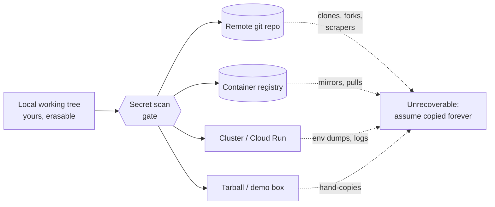
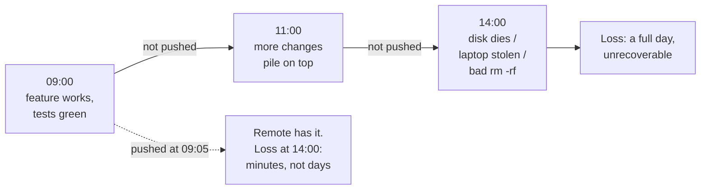
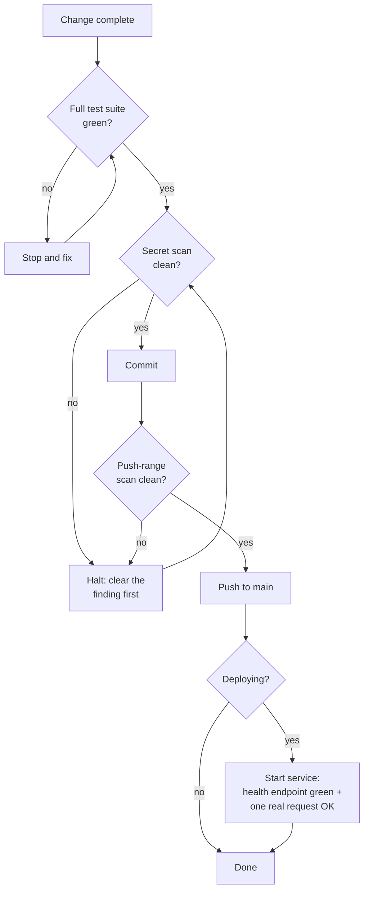

# Chapter 1 — The Ten Commandments

I have been writing software for about forty-seven years — mainframes, defense networking gear, embedded real-time systems, and lately enterprise open source. In all that time I have never once regretted following a hard rule, and I have a small museum of scars from the times I didn't. That asymmetry is the whole argument for this chapter.

Here is the math that nobody does in the moment. Skipping a secret scan saves you maybe forty seconds. A leaked API key costs you a rotation, a history rewrite, an audit of every repo the same agent touched that day, and — if you're slow — a cloud bill run up by someone mining cryptocurrency on your credentials. Skipping the "are you sure?" prompt before a destructive command saves you three seconds. A dropped production table costs you a restore from backup, if you have one, and a career story you'll tell at conferences, if you don't. The downside is three to six orders of magnitude bigger than the upside, every single time. Any gate with that cost profile should never be skippable by mood.

That's why these ten are commandments and the other ninety are rules. Rules bend to judgment. A rule like "files target 500 lines" has exceptions, and a senior engineer is allowed to find them. Commandments don't bend, because the failure they prevent is irreversible. You can refactor a long file next sprint. You cannot un-push a secret. Git's content-addressed object store, the registry your image landed in, the fork someone made twenty minutes ago — these things have memory, and they do not forgive.

The other reason hard rules exist is the one nobody likes to say out loud: under pressure, everyone's judgment gets worse, and pressure is exactly when these failures happen. Nobody leaks a key on a quiet Tuesday morning. They leak it at 11 p.m. before a demo, "just this once," because the scan is slow and the deploy is urgent. A hard rule is a decision you make once, calmly, on behalf of your future panicked self. I learned this in industries where the cost of a bad release was measured in things considerably worse than money. The discipline transfers.

One more thing before the rules themselves. These apply to every agent — human or AI — touching the repo. An AI coding agent works faster than you can review, which means its gates matter *more* than yours, not less. Ten commandments, no exceptions, no mood.

## Rule 1: No scan, no ship

**Run a secret scan before every commit, push, and deploy. No scan, no ship — ever, on any agent, to any target.**

This rule is first because it guards the only mistake in software that cannot be undone by typing harder. A bug ships, you patch it. A bad design ships, you refactor it. A secret ships, and it is *gone* — copied by every clone, every fork, every registry mirror, every scraper that watches public commits for key-shaped strings (and they watch in close to real time; a key pushed to a public repo gets probed in minutes, not days).

The how is mechanical, which is the point: gitleaks in a pre-commit hook, the same scan again pre-push over the whole push range, and a scan of the full artifact before any deploy. Three gates, all automated, none of them asking your opinion. If the scan finds something, you stop. Not "stop unless the demo is in an hour." Stop. A finding that can't be cleared — false positive documented, secret rotated, file scrubbed — blocks the ship.

The trap this rule exists to close is the *trust boundary* you didn't notice crossing. Your working tree is yours; everything past it isn't. The remote repo, a container registry, a cluster, a tarball handed to a colleague, a "quick demo box" — each is a host you don't control with a memory you can't erase.

*Everything to the right of the gate is a trust boundary: once a secret crosses, assume it has been copied forever.*

The failure mode is always the same sentence: "it's just a private repo." Private repos get forked, made public, cloned to laptops that get stolen. The scan takes forty seconds. Run it.

## Rule 2: Never hardcode a secret

**Never hardcode secrets, API keys, tokens, passwords, or private endpoints. Find one already in the codebase → stop and flag it; never propagate it, even temporarily.**

Rule 1 is the gate; this rule keeps contraband from approaching the gate at all. A secret that never enters a source file never has the chance to slip through a scanner's blind spot — and every scanner has blind spots. Gitleaks knows what an AWS key looks like; it does not know that `db_host_2` is the IP of a box that should never appear in public.

The "how" is the config layer: secrets arrive through environment variables, mounted files, or a secrets manager, and the repo carries only a `.env.example` documenting what's needed. That's covered in detail later in the book; the hard-rule part is the second sentence. When you *find* a secret already sitting in the codebase — and you will, usually in a yaml file committed by someone in a hurry — the rule is stop and flag, never propagate. Don't copy it into your own branch "while we sort it out." Don't paste it into chat to ask if it's real. Don't move it to a "temporary" scratch file. Every copy is a new leak surface, and the half-life of "temporary" in software is roughly forever.

This rule matters double in the AI era, and here's the part that took me a while to internalize: an AI agent is a champion propagator. It reads the codebase for patterns and reproduces what it sees. One hardcoded key becomes the template for the next five files the agent writes. The agent isn't malicious; it's *consistent*, which is worse. A human might feel a twinge copying a credential. The agent feels nothing. So the rule is absolute for agents precisely because their judgment never kicks in: found a secret, stop, surface it to the human, touch nothing.

The failure this prevents is the slow-motion one: a private endpoint hardcoded in 2024, copy-pasted into six services by 2026, and unrotatable by the time anyone notices because nobody knows all the places it lives.

## Rule 3: Destruction requires a human

**Never delete files, drop tables, run destructive shell commands, force-push, or rewrite history without explicit human confirmation.**

There is a category of command whose undo button is a backup tape, and the category deserves a category-level rule. `rm -rf`, `DROP TABLE`, `git push --force`, `git filter-repo`, deleting a branch, moving a tag — these don't fail loudly when they're wrong. They succeed loudly. The damage report comes later, from someone else.

I once watched a cleanup script — mine, decades ago, I'll own it — interpret an unset environment variable as an empty string and recursively delete from a path two directories higher than intended. The script worked perfectly. The variable was the bug. Total time to type the command: two seconds. Total time to recover: most of a week, because the backups were good but not *that* good. Every gray-haired engineer has a version of this story, and the stories all share a shape: the destructive command was routine, the operator was confident, and the precondition was wrong.

The rule's mechanism is friction, applied surgically. Not friction on everything — that just trains people to click through — friction on the irreversible. A human must say the actual words: "yes, force-push," "yes, drop it." For AI agents this is non-negotiable in the strictest sense: an agent may *propose* destruction, with the exact command and the expected blast radius spelled out, but the confirmation must come from a person, in the current conversation, naming the specific act. A "yes" from twenty minutes ago does not transfer.

The failure mode prevented isn't malice and it isn't even incompetence. It's confidence plus a wrong assumption, moving at the speed of a shell. The confirmation step exists to make the assumption visible for one breath before it executes. One breath is usually enough.

## Rule 4: No anonymous dependencies

**Never add a dependency without stating its name, purpose, license, and platform support.**

Every dependency is a hire. You're bringing someone else's code into your process space, granting it your permissions, your network access, your users' data — and, increasingly, your build pipeline, which is where the supply-chain attacks of the last decade actually landed. You wouldn't hire an engineer without asking their name and what they're for. The bar for a package should not be lower than the bar for a person.

The four questions are deliberately cheap to answer. *Name* — so it's in the record and the human saw it go in. *Purpose* — so we can ask whether twelve lines of stdlib would do instead; the answer is yes more often than anyone admits. *License* — because a copyleft license in a proprietary product is a legal problem you find out about at the worst possible moment, usually during an acquisition. *Platform support* — because I target arm64 and x86_64 on three operating systems, and a dependency with no ARM build is a workaround I'll be documenting and maintaining for years. Five minutes of stating the answers beats five months of living with the wrong ones.

The AI angle is again the multiplier. An agent asked to solve a problem will happily `npm install` its way there, because that's what the training data does. Left ungated, you get a lockfile with nine hundred transitive entries and no human who can say why any of them are present. The rule forces a pause: every addition is announced, every announcement is a chance to say no.

The failure prevented: the 3 a.m. vulnerability advisory for a package you didn't know you depended on, doing something you didn't need, under a license you never read.

## Rule 5: Assume no path, no OS, no shell

**Never assume a path, OS, or shell — use cross-platform primitives.**

This is the hard-rule version of a whole chapter that comes later, and it earns its commandment status because path assumptions are the most *contagious* class of bug I know. One hardcoded `/tmp` works fine for months — right up until the code runs in a container with a read-only root, or on Windows, or under a service account whose temp directory is somewhere else entirely. Then it fails somewhere far from the assumption, in code nobody thinks to look at, because "it's just a path."

The how is boring and absolute: the language's path library (`pathlib`, `path`, `filepath`), never string concatenation, never a hardcoded separator. Platform APIs for temp and home directories, never `/tmp` or `~/`. Orchestration in Python or Node, not in bash with its `&&` chains and `source` and process substitution — because bash isn't where your code will always run, and the day it runs somewhere else should be a non-event.

I spent years in embedded systems where "the environment" was whatever the board gave you, and the habit it beat into me was: the platform is an input, not a constant. Code that encodes assumptions about its host is code with an expiration date you can't read. The forty-seven-year version of this lesson is that every environment I ever treated as permanent is now a museum piece — and the code that survived each transition was the code that never asked what it was running on.

The failure prevented is the port that should have been trivial and wasn't: the "Linux-only for now" service that takes a quarter to move because ten thousand small assumptions have to be found one stack trace at a time. Write it portable on day one. Day one is cheap.

## Rule 6: Push early and push always

**Working code lands on main frequently. Uncommitted, unpushed work is a liability — the remote is the backup. The classic excuse (merge pain) is gone: AI handles messy merges extremely well.**

Of the ten, this is the rule that has actually *changed* in the last few years, so let me give the old version first. The old discipline said: commit often locally, but batch your pushes, because integrating early means merge conflicts and merge conflicts eat afternoons. That advice was rational once. It is now obsolete, because the messy mechanical merge — the thing we all dreaded — is precisely the kind of work AI does extremely well. The cost side of the trade collapsed. Only the benefit side remains.

And the benefit side was always this: unpushed work doesn't exist. The remote is the backup. A laptop is a single point of failure with a battery, and a working tree is one `rm`, one disk failure, one stolen bag away from never having happened. Every hour that working code sits only on your machine, you are running an uninsured risk for zero return.

*Solid path: the liability compounding hour by hour. Dashed path: what a five-minute push buys you.*

The rhythm I want: a change works, its tests pass, the scan is clean — it goes to main, now. Not at end of day, not "with the next thing." If a session ends with working code unpushed, that's a process failure to flag, not a state to leave behind. I say push early and always — your mileage may vary, but I've lost work and I've never lost a push.

## Rule 7: Green before commit, healthy before handover

**Never commit while tests fail, and never present a service as done without verifying it is up, healthy, and answering a real request.**

Two clauses, one principle: *checked* is a different state from *believed*, and only checked things move forward.

Green before commit is the simpler half. A failing suite is a stop-and-fix, never a "commit now, fix later" — because "later" arrives with three more commits stacked on the red one, and now the bisect is archaeology. Every commit on main answers one question the same way: did everything pass? If the answer is ever "mostly," the history stops being a record and becomes a rumor.

Healthy before handover is the half people skip, and it's the half with my favorite failure mode in it. A build script ends in `make build | tee build.log`, the pipe exits 0 because `tee` succeeded, and "the build passed" enters the record as fact. The build failed. The exit code you trusted belonged to a different program. I have seen variations of this lie — always accidental, always confident — for four decades. The fix is to never report health you didn't observe: start the actual service, hit the actual health endpoint, send one representative real request, and watch it succeed. Then say it's done.

*The gate chain. No edge skips a diamond; "mostly green" is not an exit condition.*

For AI agents the rule is load-bearing: an agent that reports unverified success poisons the next decision. Verify, then claim.

## Rule 8: One purpose per commit

**One purpose per commit, one purpose per deploy. No "while I'm in there" fixes.**

"While I'm in there" is the most expensive phrase in software. It feels like efficiency — the file is open, the fix is obvious, why make a second trip? Here's why. Every operation you'll ever perform on history operates on commits as atoms. Revert a commit: everything in it reverts together. Bisect to a commit: everything in it is the suspect together. Review a commit: everything in it must be understood together. A commit that does two things makes every one of those operations worse, forever, for everyone downstream — to save its author one context switch, once.

The deploy version of the rule is the same logic with higher stakes. A deploy that ships one change has a one-line rollback story. A deploy that ships a feature, two fixes, and a dependency bump ships four suspects, and when the pager goes off, you get to interrogate all of them at 2 a.m.

The how: when you notice the unrelated problem — and you will, constantly; noticing things is the job — you *file it*. A line in the bug tracker, thirty seconds, and back to the purpose at hand. The fix becomes its own commit, with its own test, on its own merits, usually within the day. Nothing is lost. What's gained is a history where `git log --oneline` reads like a narrative instead of a junk drawer.

Discipline note for AI agents, who are the worst offenders I've ever worked with: an agent told to fix a bug will cheerfully also reformat the file, rename two variables, and "improve" an unrelated function — because it can, and it can't feel the reviewer's pain. The rule exists so the diff contains the change and nothing else. If X isn't a literal blocker for the stated task, X waits.

## Rule 9: Fail fast

**Invalid config, missing dependencies, or unreachable backends crash loudly at startup with a clear message — never limp along degraded.**

This one comes straight from my embedded years, where the principle had a sharper name: a system that fails *predictably* is safe to build on, and a system that fails *gracefully but silently* is a trap with good manners. In real-time work you learn fast that the dangerous component isn't the one that crashes — you can see a crash, route around it, fix it. The dangerous one is the component that keeps answering with degraded data while looking healthy. Everything downstream builds on the lie.

The software version: a service starts with a bad database URL. Option one, it crashes at startup with `FATAL: config key DB_URL invalid: connection refused to db.internal:5432`. Thirty seconds to diagnose, fixed before coffee. Option two — the "resilient" option — it logs a warning nobody reads, falls back to a local cache, and serves stale data for three weeks until a customer asks why their numbers are wrong. Now the diagnosis starts from the *symptom*, miles from the cause, and the incident review uses the word "silently" four times.

The how: validate all config at startup, fail with a message that names the exact key and what's wrong with it. Check that backends are reachable at startup or first use. Never substitute a fallback backend without being explicitly configured to — a silent fallback is a lie about what's running. And make the crash *informative*: the goal isn't drama, it's a message that points a tired human directly at the fix.

The failure prevented is the worst kind in distributed systems: the slow, plausible, compounding wrongness that no alert fires on. A loud crash at startup is not a failure of robustness. It is robustness — moved to the only moment it's cheap.

## Rule 10: No recoverable history, no autonomy

**Agent autonomy is bounded by version control: an agent only writes inside a git repo with a synced remote. No recoverable history, no autonomy.**

This is the newest commandment and the one I'd argue is the most important sentence in the chapter for the AI era, because it answers the question everyone is quietly negotiating right now: how much can you let an AI agent do *unattended*?

My answer isn't a trust score or a capability tier. It's a property of the workspace. An agent operating inside a git repo whose remote is synced can be wrong at full speed — every write it makes lands on top of a recoverable history, every mistake is a `git revert` or a `git reset` away from undone. The safety net isn't the agent's judgment; it's the substrate. Inside that boundary, run unattended, skip the permission prompts, let it work. The same agent writing *outside* a versioned repo — a home directory, a system config, an unversioned scratch folder — is performing surgery with no undo, and gets no autonomy at all. Read anywhere; write only where history protects you. If a task needs a write outside the boundary, the agent stops and asks a human. Not because the write is necessarily dangerous — because it's *unrecoverable if* dangerous, and the agent can't reliably tell the difference.

What I like most about this rule is its shape: it doesn't try to make the agent smarter or the human more vigilant, the two approaches that consistently fail. It bounds the blast radius structurally, the way the rest of this chapter bounds it procedurally. Version control was always the profession's time machine. This rule just notices that a time machine is exactly what makes delegation safe — and that the synced remote is what makes the time machine real. Local-only history dies with the disk. The remote is the net under the net.

### Chapter 1 card

1. **No scan, no ship** — secret scan before every commit, push, and deploy; a finding blocks until cleared.
2. **Never hardcode a secret** — secrets live in config; one found in the codebase is flagged, never propagated.
3. **Destruction requires a human** — no delete, drop, force-push, or history rewrite without explicit confirmation.
4. **No anonymous dependencies** — name, purpose, license, and platform support stated before anything is added.
5. **Assume no path, OS, or shell** — cross-platform primitives only; the platform is an input, not a constant.
6. **Push early and push always** — working code lands on main now; unpushed work is an uninsured risk.
7. **Green before commit, healthy before handover** — tests pass before committing; services verified up and answering before "done."
8. **One purpose per commit** — and per deploy; unrelated fixes get filed, not bundled.
9. **Fail fast** — bad config or missing backends crash loudly at startup with the key named; never limp along.
10. **No recoverable history, no autonomy** — agents write only inside git repos with synced remotes; outside, they stop and ask.
