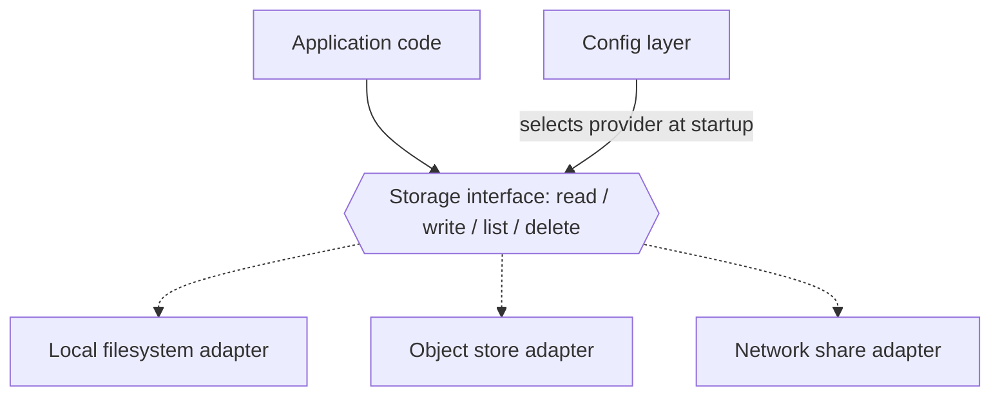
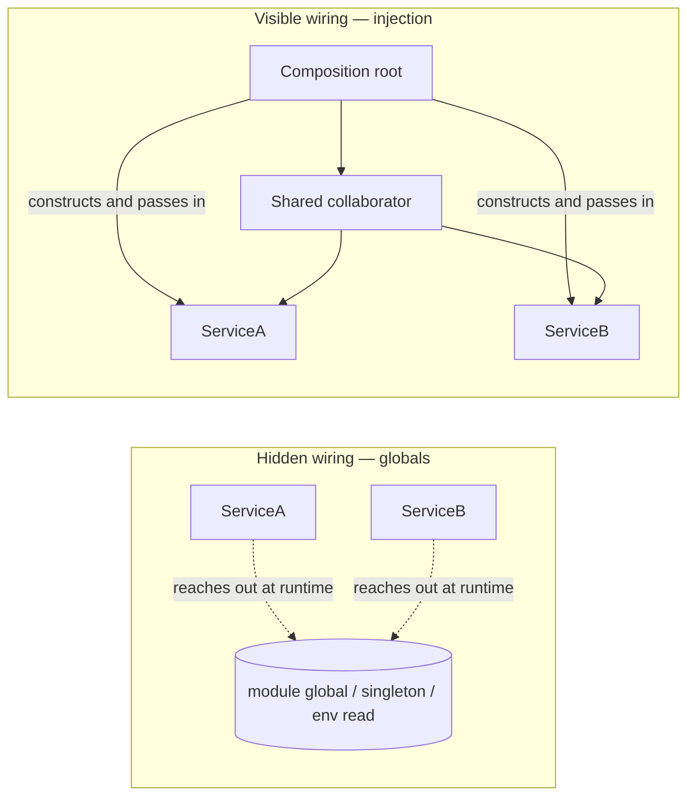
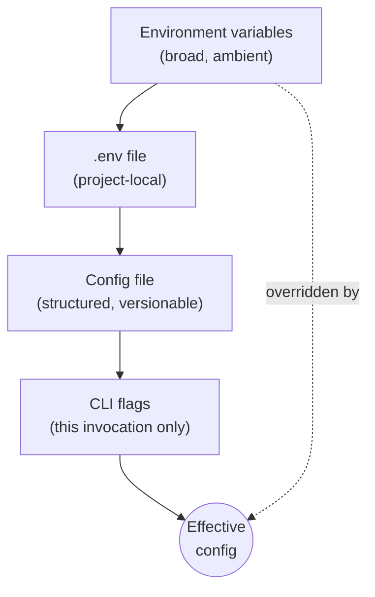
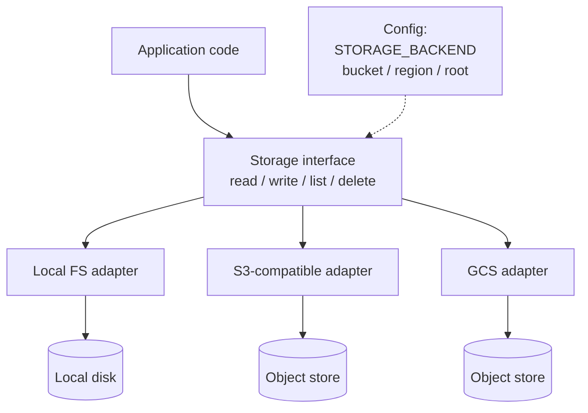
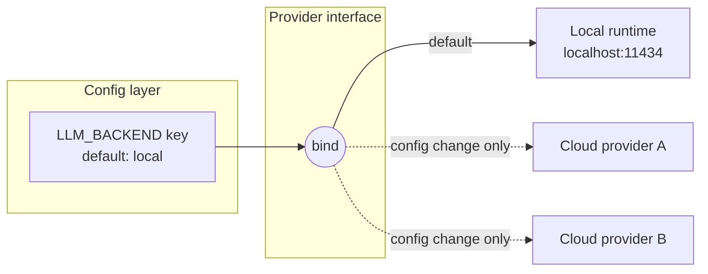
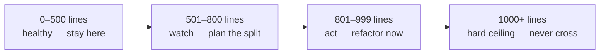

# Chapter 2 — Design

> **Standing on Chapter 1:**
> - The hard rules: scan every trust boundary, never hardcode a secret, never destroy anything without confirmation, green before commit.
> - Push early and always; one purpose per commit; fail fast and loud; autonomy extends exactly as far as version control backs it up.
> - The crew: five fixed roles plus a human whose rulings are final.
> - The Powell rule: get 90% of the information, then decide; below 90% certain, ask — and size sprints so the AI nails them first go 90% of the time.

Chapter 1 laid down the principles, and principles are constraints. They don't write your code; they fence in the code you're allowed to write. The first thing they fence in is design, because design happens before the first line of business logic exists — and a design that fights the principles loses to them slowly, one painful commit at a time.

Here is my working definition, earned across five decades of shipping systems: **design is deciding where decisions live.** Every system is a pile of decisions. The port number, the model name, the storage backend, the retry ceiling, who owns the parsing, who talks to the database, how big a file gets to be. The question that matters is never whether each decision was right on the day it was made. The question is: who gets to change it later, and what does changing it cost? Design is the act of answering that question deliberately, before the codebase answers it for you by accident.

There are two good homes for a decision, and this chapter is ten rules about each.

The first home is **configuration**. When a value lives in a config layer, changing it costs an edit and a restart. When it lives in the source, changing it costs a code change, a review, a test run, a build, and a deploy — and that's the good case, where you found it. The bad case is the value duplicated in four files, three of them updated, and a system that disagrees with itself in someone else's on-call shift. A hardcoded value is a decision hidden from the people who will need to change it. The original author knew why the retry count was 3; the person staring at a production incident five years later doesn't know it's even *there* to change.

The second home is an **interface**. When an implementation lives behind a contract, it can change without its callers knowing or caring. The most successful system I ever worked on was written in C — no classes, no `interface` keyword, a language that hands you a pointer and wishes you luck. And it was object-oriented in every way that matters: each module owned one responsibility and a private data structure nobody else touched, function pointers in structs gave us swappable implementations behind a fixed contract, initialization passed collaborators in explicitly. We swapped hardware platforms underneath that system without touching the core logic. It shipped, passed certifications that would make your auditor weep, and ran for decades. I have also watched a beautifully fashionable codebase — latest framework, conference-talk tooling — collapse in eighteen months because nobody could say what any module was *for*. The lesson is permanent: **architecture matters more than language or framework.** Languages never saved a project and never killed one. Where the decisions live did both, repeatedly.

AI agents make all of this more urgent, not less. An agent will happily inline whatever value gets the test passing, and just as happily produce a god class by Friday — at a volume no human reviewer can chase. The same agent will produce clean, configured, composed, injected modules if the rules demand it. The agent doesn't care. The rules have to.

Twenty rules follow, ordered by weight rather than by theme. The config workhorse leads, because it fires hundreds of times a day and most of the chapter implements it. The architecture-beats-language thesis and the seam rules come next — interfaces, search-before-build, dependency injection — because those are the decisions that cost the most to reverse once they're wrong. The middle works through the config and deployment discipline those seams make possible, and the size and refactor gauges close the chapter. Config rules and structural rules interleave on the way down; both are answers to the same question of where decisions live.

## Rule 21: If it can change, it's config

**Zero hardcoded values for anything that could plausibly change: hosts, ports, model names, paths, timeouts, retry counts, feature flags, prompts.**

The test is the word *plausibly*. Not "will this change next sprint" — *could* this change, ever, for any deployment, any customer, any environment? Hostnames change. Ports collide. Model names change roughly every twenty minutes in the current AI economy. Paths differ between your laptop, the container, and the cluster. Timeouts that were generous on a LAN are absurd over a satellite link — I learned that one on a network where round trips were measured in geosynchronous orbits, and a hardcoded three-second timeout turned a working protocol into a brick.

Note what's on the list besides the obvious networking values: *prompts*. If you're building anything that talks to a language model, the prompt is the most-edited artifact in the system. Burying it in a string literal next to the HTTP call means every wording tweak is a code deploy. Promote it.

The counterargument is always the same: "it's faster to just put the value in." It is. It is faster the way not writing tests is faster. You're not saving the work; you're moving it to someone else's future, with interest, and removing the signpost that would have helped them find it.

A practical heuristic for code review — human or agent: every literal that isn't `0`, `1`, an empty string, or a genuine mathematical constant gets challenged. Either it graduates to a named constant (Rule 34) or a config entry (this rule), or its author explains why it can never, ever change. Most can't survive that conversation.

## Rule 22: Architecture beats language

**Architecture matters more than language or framework.**

I told the story in the opener; here is the principle distilled. The system I'm proudest of was written in C — a language with no native objects, no interfaces, no memory safety — and it had an object-oriented architecture so disciplined that we swapped hardware platforms underneath it without touching the core logic. The architecture was the asset. The language was a detail.

Run the experiment mentally. Take a great team and a clean architecture, and force them to use a boring, unfashionable language: you get a solid system with some verbose patches. Now take a muddled architecture — no boundaries, global state, everything coupled to everything — and hand it the most elegant language of the decade: you get an elegant-looking mess, and the elegance makes it worse, because expressive languages let you build tangles faster and with fewer keystrokes.

This is why language and framework debates are the most overweighted conversations in software, dorm-room arguments wearing business casual. Languages are mostly interchangeable for mainstream work; choose for ecosystem, team fluency, and platform fit, then stop talking about it. The decisions that will determine whether the system is alive in ten years are the ones this chapter is about — responsibilities, interfaces, dependency direction, size — and every one of them can be made well or badly in any language.

Frameworks deserve one extra warning: a framework is a set of architectural decisions someone else made, on a schedule someone else controls. Sometimes that trade is worth it. But keep the framework at the edges and the core logic framework-free, because frameworks have a half-life and your domain logic shouldn't share it. I've outlived a lot of frameworks. Architecture is the part that travels.

## Rule 23: Every vendor axis gets an interface

**Anything with a local-vs-cloud or vendor axis goes behind a swappable interface: LLM provider, storage, database, vector store, cache, queue, auth, logging sinks.**

Any time your system touches something that comes in more than one flavor — and today, everything does — the flavor decision goes behind an interface. One contract, N providers, selected by configuration at startup. The application code knows the contract and nothing else.



*One contract, many providers: application code depends on the solid line; the dashed implementations are interchangeable at configuration time.*

The payoff list is long. Local development runs against the filesystem adapter with zero cloud credentials. Unit tests run against an in-memory fake satisfying the same contract — no network, no flakes. The on-prem customer gets their deployment with a config change instead of a fork. And when the vendor you chose triples its prices — they do this; I've watched it happen more than once — migration is one new adapter and one config line, not a six-month rewrite with a project codename.

This rule has teeth in the AI era specifically. Model providers are the most volatile vendor axis in computing right now: pricing, capability, and availability shift quarterly. A codebase with provider calls inlined at fifty call sites is married to that provider. A codebase with one `LLMProvider` interface dates them.

The interface itself should be boring: the minimal set of operations your application actually needs, not the union of every feature every vendor offers. Design the contract from the consumer's side. If only one provider supports a feature, that feature is not in the contract — it's a reason to reconsider the feature.

## Rule 24: Search before you build

**Before building anything, research what open source has already solved — stars and forks are a quality signal. Check the codebase for something to adapt before inventing.**

The most expensive code in any system is the code you didn't need to write. It costs the writing, then the testing, then the documenting, then the maintaining, forever — and it usually re-solves a problem that a thousand-star open-source project solved years ago, complete with the edge cases you haven't hit yet.

So the standing order, for humans and agents alike: before writing original code, search. First the world — is there a maintained open-source project that does this? Stars and forks aren't a popularity contest; they're a proxy for battle-testing. A project with thousands of stars, recent commits, and a real issue tracker has had its corner cases found by other people, on other people's schedules, at other people's expense. That is a gift. Take it. (Vet the license and the maintenance pulse first — Chapter 3 covers the vetting funnel.)

Then search your own repository — the codebase you're standing in probably solved a similar problem last quarter. Adapt the existing pattern instead of inventing a rival one. Two retry mechanisms, two config loaders, two date-formatting helpers: that's how codebases develop dialects, and dialects are where bugs breed.

Original code is the last resort, reserved for the parts that make your system *yours* — the domain logic, the secret sauce. Everything else is plumbing, bought off the shelf. I learned this slowly, because early in my career there was no shelf: if you wanted a protocol stack, you wrote a protocol stack. That world is gone. The engineer who spends a week hand-rolling what a library does better isn't being rigorous; they're being expensive. The lazy engineer who searches first — in the best sense of lazy — ships sooner and maintains less.

## Rule 25: Collaborators come through the front door

**Dependency injection over module-level globals and singletons — collaborators arrive via the constructor.**

Dependency injection has an enterprise-framework reputation it does not deserve. Strip away the XML and the annotations and it is one sentence: an object is *given* the things it needs, instead of going out and finding them. The constructor is the front door. Everything an object collaborates with walks through it, visibly, at construction time.

The alternative — module-level globals, singletons, classes that read the environment from inside a method — is hidden wiring. The object's true dependencies are invisible in its signature and discoverable only by reading every line of its implementation. You can't test it without recreating its ambient world. You can't run two configurations in one process. And when something misbehaves in production, you get to play "who mutated the global" at 2 a.m. I once played that game on a system where the global was a hardware register map shared across interrupt contexts — a layer where the crash takes the whole box with it. I do not recommend the experience.



*Globals hide the wiring inside the boxes; injection puts every dependency on the diagram — and in the constructor signature.*

There should be exactly one place in the program — call it the composition root, usually `main` — where concrete objects are built and snapped together. Everything below that point receives its collaborators and asks no questions. This pairs directly with Rule 23: the interface defines what can be swapped; injection is the mechanism that does the swapping. You rarely need a framework for it. A constructor and some discipline cover ninety percent of real systems.

## Rule 26: No silent fallbacks

**Never silently fall back to a different backend.**

This is the rule in this chapter with the sharpest scar tissue behind it, so let me be blunt: the helpful fallback is a lie generator.

The temptation is always dressed as robustness. The cloud database is unreachable, so the code "gracefully degrades" to local SQLite. The configured model errors out, so the client "helpfully retries" with a different one. The object store rejects the credentials, so the writer "falls back" to the local disk. The process stays up, the logs look quiet, the demo proceeds. Everyone smiles.

Here's what actually happened: the system silently stopped doing what its operator believes it is doing. Data that should be in the durable store is on an ephemeral disk that vanishes with the container. Results that should have come from the evaluated, approved model came from whatever the fallback was. The dashboard is green and every number on it is wrong. When the truth surfaces — and it surfaces at the worst possible moment, that's not pessimism, that's selection bias, because the worst moment is when someone finally *needs* the data — nobody can even say when the lie started.

I spent years in environments where a system that failed visibly was an inconvenience and a system that failed *silently* was a catastrophe. The rule we lived by transfers exactly: **a loud crash is recoverable; a quiet lie is not.**

The configured backend is a contract. If it can't be honored, the correct behavior is Rule 27's: crash at startup or first use, name the backend, name the reason. If a fallback genuinely makes sense for your use case, make it *explicit* — a config flag the operator deliberately set, a startup log line in capital letters, a status endpoint that reports degraded mode. Chosen degradation is engineering. Silent degradation is fraud with good intentions.

## Rule 27: Validate at startup, name the key

**Validate config at startup and fail with a message naming the missing or invalid key.**

There are two times a configuration error can surface: at startup, when a human is watching and the fix takes thirty seconds, or three hours into a run, when the half-finished state has to be cleaned up and the human watching is the on-call engineer. You get to pick. Pick startup.

Embedded systems taught me this with a stick. On a device with no console, no debugger, and a field technician at the end of a phone line, a config error that surfaced at startup with a clear code was a service call; one that surfaced mid-operation was a returned unit and an angry customer. The economics haven't changed just because we have terminals now — only the latency of the pain.

The second half of the rule is where most implementations fail: *name the key*. The error message is for the person fixing the problem, and the difference between these two lines is the difference between a thirty-second fix and a debugging session:

```
Error: invalid configuration
```

```
Error: STORAGE_BUCKET is not set (required when STORAGE_BACKEND=s3).
       See .env.example for documentation.
```

Name the key. State what's wrong with it — missing, malformed, out of range, mutually inconsistent with another key. Point at the documentation. If several keys are bad, report them *all* in one pass instead of failing one-at-a-time like a slot machine that pays out errors.

And validation means more than presence-checking. Parse the port as an integer and range-check it. Verify the URL scheme. Confirm the named backend is one you actually support. Fail fast, fail loud, fail *specific* — this is Rule 8 from Chapter 1's hard rules, applied to the config layer where it earns the most.

## Rule 28: One config layer, one precedence order

**All config flows through one layer — env vars → `.env` → config file → CLI flags, in increasing precedence. No environment reads scattered across modules.**

Configuration that arrives through one door can be reasoned about. Configuration that seeps in through forty scattered `os.environ` reads cannot — every module becomes its own little config system with its own defaults, its own parsing bugs, and its own opinion about what happens when the variable is missing. I've debugged systems where two modules read the same environment variable and disagreed about its default. Both authors were locally correct. The system was globally insane.

So: one config object, built once at startup, passed to everything that needs it (dependency injection, Rule 25). And one precedence order, increasing from broad to specific:



*The config precedence stack: each layer overrides the one above it; the most specific, most deliberate setting wins.*

The logic of the ordering is scope. Environment variables are ambient — set by the platform, inherited by everything, easy to forget about. The `.env` file is project-local and explicit. The config file is structured and reviewable. CLI flags are the most deliberate act of all: a human typed them, for this run, right now. The more deliberate the act, the more it should win. A flag beats a file beats an env var, every time, no exceptions, and — critically — *documented*, so nobody has to read the merge code to predict the outcome.

One door. One order. Everything else is archaeology.

## Rule 29: Objects with one job each

**Default to object-oriented design with clear responsibilities; prefer composition, use inheritance sparingly.**

Object-oriented here does not mean "uses the `class` keyword." It means each unit of the system has one responsibility, owns its own state, and exposes a deliberate surface. You can do that in C with structs and function pointers — I spent years doing exactly that — and you can fail to do it in Java while drowning in classes.

The operative phrase is *clear responsibilities*. When I review a design, my first question for every component is: what is this thing's job, in one sentence, without the word "and"? If the answer needs a paragraph, the design is wrong. A component with a one-sentence job is testable in isolation, replaceable without surgery, and explainable to the next engineer — or agent — in seconds.

Composition over inheritance is the second half, and it earns its place in the rule because inheritance is the most abused tool in the OO toolbox. An inheritance hierarchy is a promise that the child *is* a kind of the parent, forever, including all behavior you haven't read yet. Three levels deep, a change to a base class becomes a game of minesweeper. Composition makes the same relationship explicit and severable: the object *has* a collaborator, the collaborator arrives through the constructor, and you can swap it without archaeology.

Inheritance still has its uses — a genuinely stable is-a relationship, a framework that demands it. Use it there, sparingly, like a spice. If you find yourself overriding a parent method to neuter it, you didn't want inheritance; you wanted a smaller interface and a composed part.

## Rule 30: Storage goes through the adapter

**Storage goes through an adapter: no `open("./data/...")` outside it, no hardcoded buckets, regions, or account IDs.**

Storage gets its own rule — separate from Rule 31's general principle — because storage is where the principle dies first. Every language makes opening a local file a one-liner, so local-file assumptions metastasize through a codebase faster than any other kind of hardcoding. By the time someone says "we need this on object storage," there are a hundred and forty call sites that each independently believe the filesystem is right there. I've supervised that migration. The estimate was a sprint. The reality was a quarter.

The adapter is the prevention: one interface owning read, write, list, delete, exists — and *every* storage touch in the codebase goes through it. No exceptions for "it's just a temp file" (the temp directory is the adapter's business too, per the cross-platform rules in Chapter 3), no exceptions for "it's just a quick script" (quick scripts are where the next subsystem comes from).



*The storage-adapter seam: application code sees one interface; config (dashed) selects which adapter is bound behind it. No path, bucket, or region appears above the seam.*

The second clause has teeth of its own: no hardcoded buckets, regions, or account IDs. A bucket name in source is simultaneously a Rule 21 violation, a deployment landmine (Rule 31), and a reconnaissance gift to anyone reading your public repo. Bucket, region, prefix, credentials source — all of it arrives via config, validated at startup (Rule 27), with the local-FS adapter as the zero-setup default (Rule 33).

One seam, honestly enforced, and "move the data" becomes a config change. That's the configuration half of this chapter in one sentence.

## Rule 31: On-prem and cloud are config values

**The same code runs on-prem or in the cloud with only config changes — never source changes.**

This rule is where the previous eight stop being hygiene and start being strategy.

I came up in industries where on-premise wasn't a preference, it was a requirement with armed guards — air-gapped networks, customer data that legally could not leave the building, latency budgets that ruled out a round trip to anyone's cloud. I now work in an industry that spent a decade assuming the cloud was the only place software lives, and is currently rediscovering — via egress bills, sovereignty laws, and AI workloads that want to sit next to private data — that on-prem never went away. Deployment target is not an architectural constant. It's a *parameter*, and parameters change on business timescales, not engineering timescales.

If your code can only run in one place, somewhere in the source there's a decision that should have been config: a hardcoded bucket name, an assumed metadata endpoint, a vendor SDK called directly from business logic, a path that only exists in one image. Each one is a Rule 21 violation that grew up and got a job holding your deployment options hostage.

The discipline is to treat "where does this run" as a profile — a set of config values selected per environment. The on-prem profile binds storage to the local volume or an internal object store, auth to the internal provider, the database to the cluster down the hall. The cloud profile binds the same interfaces to managed services. The *source* doesn't know which profile is loaded, and it must never need to. Practical enforcement: if you can't point at the config diff between your on-prem and cloud deployments — just config, nothing else — you don't have two deployments of one system. You have two systems, and one of them is unmaintained.

Test it before you need it. A backend swap that's never been exercised is a backend swap that doesn't work (integration tests across profiles — Chapter 4).

## Rule 32: "Use X locally" means default, not destiny

**"Use X locally" means configurable with X as the default, never hardcoded.**

This rule exists because of a specific, recurring failure mode in working with AI agents — and with literal-minded humans, but agents industrialized it. You say "use the local model runtime for this." The agent hears "hardcode the local endpoint into the client," and now the system *only* works against a developer-machine setup, and "deploy to staging" becomes a source-code change. The instruction was about the *default*; the implementation made it the *only option*. You asked for a preference and received a prison.

The correct reading is always the same: wire X through the config layer as the default value, behind whatever swappable interface that axis already has (Rule 23 covers the interface; this rule covers the binding). "Use the local runtime" means the LLM-provider config key defaults to the local runtime. "Use SQLite for now" means the database backend defaults to SQLite. The words *for now* and *locally* are doing the work in those sentences — they're telling you this decision has a lifetime, and decisions with lifetimes belong in config.



*The "go local" rebinding: the instruction sets the default binding (solid line); every other backend stays one config edit away (dashed lines). No source changes on any path.*

The payoff compounds with Rule 20's "go local" crew rebinding: because every persona's model is a config binding, "go local" is an edit to one file, not a refactor. That's only possible because nobody ever took "use X" as license to weld X into the source. The default is a suggestion with authority. It is not a weld.

## Rule 33: Zero-setup defaults

**Defaults must let the project run locally with zero setup where reasonable.**

Clone, install, run. That's the bar. If a new contributor — or an agent, or you on a new laptop — has to provision a cloud account, request credentials, and configure six services before the program prints its first log line, your project has a velocity tax that everyone pays on every fresh start, forever.

The fix is choosing defaults that resolve to things that exist on a developer machine: the database defaults to SQLite in a temp directory, the LLM backend defaults to a local runtime on its standard port, storage defaults to the local filesystem, the cache defaults to in-memory. Every one of these is swappable through the config layer — that's the entire point of Rules 21 and 28 — but the *default* posture is "runs here, now, with what's on this machine."

This rule pulls against an instinct I see constantly: defaulting to the production stack because "that's what we really run." Resist it. The production stack is what production config selects. Local defaults are what an empty config selects. Conflating the two means the empty config either fails mysteriously or — far worse — quietly touches production resources from a developer laptop. I have watched a "quick local test" write to a live system because the default connection string pointed somewhere real. The postmortem was not enjoyable for anyone, least of all the person who typed `run` and trusted the defaults.

The qualifier *where reasonable* is doing honest work — some systems genuinely cannot run without external hardware or services. Fine. Then the zero-setup default is a clearly-labeled fake or simulator, and the README says so in the first screen.

## Rule 34: No magic numbers

**No magic numbers — named constants or config entries only.**

A magic number is a literal that appears in the logic with no name and no explanation. `86400`. `0.7`. `512`. `3`. The author knew what each one meant for about a week. After that, it's a fossil — evidence that a decision happened here, with the actual decision eroded away.

The cost is concrete. First, comprehension: `RETRY_BACKOFF_CEILING_SECONDS = 300` is documentation; a bare `300` in a loop is a riddle. Second, consistency: the same value pasted into four call sites isn't one decision, it's four decisions that happen to agree today. When someone updates three of them, you have a bug whose symptom is "the system is *mostly* consistent," which is among the most expensive phrases in this profession to debug. Third, reviewability: an agent or a junior dev changing `MAX_UPLOAD_MB` from 50 to 500 shows up in a diff as exactly what it is. The same change buried as `52428800` → `524288000` sails past tired eyes at 4 p.m. on a Friday.

The decision tree is short. Is it a genuine mathematical constant or a structural value (`0`, `1`, days-in-week)? Leave it, or name it if the name adds meaning. Could it plausibly change per environment or deployment? It's a config entry — Rule 21 owns it. Is it fixed but meaningful — a protocol constant, an algorithm parameter, a limit you chose? Named constant, declared at module scope, with a comment stating *why this value*. That comment is the part future-you will thank you for; the name says what it is, the comment says why it isn't something else.

If you can't think of a name for the number, that's not an exemption. That's the code telling you that you don't fully understand the decision you're hardcoding.

## Rule 35: Ship the `.env.example`

**Ship a `.env.example` documenting every required variable; gitignore the real `.env`.**

This rule is two safety mechanisms wearing one trench coat.

The first is documentation. A `.env.example` checked into the repo is the contract for what the software needs from its environment: every variable, a sane placeholder or default, and a one-line comment saying what it does and whether it's required. It's the configuration table from your README in executable form — `cp .env.example .env`, fill in the blanks, run. When someone new clones the repo (and "someone new" includes an AI agent starting a cold session, which has no memory of how you configured things last week), this file is how they learn what knobs exist without reading the source.

The second is secret hygiene, and it's the one with teeth. The real `.env` contains real credentials, which is precisely why it must be gitignored from day one — before the first commit, not after the first leak. The pattern in `.gitignore` is `.env` and `.env.*` with an explicit exception for `!.env.example`. The example file contains placeholders, never real values; the real file contains real values, never a path into version control. Keep the two roles strictly separated and a whole class of credential leaks — the most embarrassing class, the "it was right there in the repo" class — simply cannot happen.

Maintenance discipline: when you add a config variable, the `.env.example` update goes in the *same commit*. An example file that's three variables behind reality is worse than none, because people trust it.

---

That's where the decisions live: changeable values in a config layer with one door, structure behind swappable contracts, collaborators through the front door — config decides the values, architecture decides the structure that consumes them, and the two meet at the constructor. The five rules that close the chapter are the gauges and disciplines that keep that structure honest as it grows: how big a file gets to be, how many promises a class gets to make, which principles earn their keep, what shares a file, and how a refactor lands without taking anything else down with it.

## Rule 36: The file-size gauge

**Source files target ≤500 lines, never exceed 1000; past 800, actively refactor.**

File size is the cheapest architecture metric there is. It needs no tooling, no judgment, no meeting — `wc -l` is the whole audit — and yet it correlates with almost everything that matters. A file that has grown past a thousand lines is almost never one responsibility anymore; it's three or four responsibilities that moved in together and stopped paying rent separately. The line count isn't the disease. It's the fever.



*The file-size gauge: 500 is the target, 800 is the alarm, 1000 is the wall.*

The three numbers have three different jobs. **500** is the target — the size at which a file is still readable in one sitting and still fits comfortably in a reviewer's head or an agent's context window. Some files will exceed it for honest reasons; that's why it's a target, not a wall. **800** is the alarm: you don't have to split today, but you must be actively looking for the seam, because files don't shrink on their own and the next feature is coming. **1000** is the wall. Not a guideline, not a strong suggestion — a ceiling the linter enforces and the commit gate rejects.

Why a hard number rather than trusting judgment? Because judgment erodes one line at a time. Nobody ever decides to write a 2,400-line file; they decide, four hundred separate times, that *this* six-line addition isn't the right moment to refactor. A hard ceiling converts that slow erosion into a discrete event with a clear required response. And the split itself is rarely hard — a file that big almost always contains two or three classes already, just without the file boundaries that would have kept them honest. Which is Rule 39, arriving from the other direction.

## Rule 37: No god classes

**No god classes: more than ~7–10 public methods means a collaborator is missing.**

Every aging codebase has one. It's named `Manager`, `Engine`, `Controller`, or — when all pretense is gone — `Utils`. It has forty public methods, it imports half the project, every feature touches it, and every developer fears it. It is the load-bearing wall everyone leans new shelves against, and the diff to any given feature runs through it like a river through a canyon.

God classes don't arrive; they accrete. Each individual addition was reasonable — "the engine already has the connection, I'll just add the lookup here" — and each one made the next addition slightly more reasonable, until the class became the path of least resistance for everything. That's the trap: god classes are *convenient* right up until they're catastrophic. Convenient to add to, catastrophic to test (the fixture setup recreates the universe), to review (every diff touches it), and to parallelize work on (every branch conflicts in it).

The 7–10 public method threshold is a tripwire, not a law of nature. Public methods are promises — things the rest of the system is allowed to ask this class to do. When a class is making more than ten promises, it almost certainly has more than one responsibility, which means there's a class *inside* it trying to get out. The fix is named in the rule: a collaborator is missing. Don't shave methods off; identify the second responsibility, give it a name, extract it as its own class, and compose it back in via the constructor (Rule 25). The method count drops on its own.

Count public methods, not lines — a god class can be skinny. And when an agent is doing the writing, watch this rule closely: agents love adding "just one more method" to the class they're already editing.

## Rule 38: SOLID where it earns its keep

**Apply SOLID where it earns its keep, especially Single Responsibility and Dependency Inversion.**

SOLID is five principles, and I'll be honest with you the way the acronym's fan club usually isn't: they do not pull equal weight.

Single Responsibility is the workhorse. One reason to change per module. It's Rule 29 restated at every scale — function, class, file, service — and it's the principle whose violation I can spot from across the room: the class named `Manager` or `Processor` that does parsing, validation, persistence, and notification, and that everyone is afraid to touch.

Dependency Inversion is the other load-bearer: depend on abstractions, not concretions; let the stable core define interfaces that the volatile edges implement. Rules 23 and 25 are Dependency Inversion wearing work clothes. Get these two principles right and the architecture mostly takes care of itself.

The other three are situational. Open/Closed is useful at genuine extension points and a license to over-abstract everywhere else. Liskov Substitution matters exactly as often as you use inheritance — which, per Rule 29, should be sparingly. Interface Segregation is real but usually falls out for free once you design contracts from the consumer's side.

The phrase that matters in this rule is *where it earns its keep*. Principles are tools, not virtues. I have seen codebases wrecked by under-engineering, and I have seen just as many wrecked by engineers applying all five principles to a 2,000-line utility, producing a cathedral of interfaces with one implementation each. Every abstraction has a carrying cost: another file to read, another indirection to trace. An abstraction that doesn't pay rent — doesn't enable a real swap, a real test, a real boundary — is debt with good posture. Evict it.

## Rule 39: One non-trivial class per file

**One non-trivial class per file; small helpers and DTOs may share.**

This rule sounds like pedantry until you've spent a week inside a 3,000-line file containing eleven classes that "seemed related at the time." Then it sounds like wisdom.

One non-trivial class per file makes the filesystem your architecture diagram. `ls src/storage/` tells you what storage components exist before you've opened anything. The file name and the class name agree, so search works, navigation works, and — increasingly important — an AI agent can find the thing it needs to change without slurping half the repository into its context window. Code organization used to be a courtesy to human readers; now it's also an efficiency multiplier for machine ones. A well-factored repo is one an agent can edit surgically. A heap is one it can only edit approximately.

The rule also enforces honesty about coupling. When two classes live in one file, they tend to grow informal intimacies — reaching into each other's internals, sharing module-level state — that nobody ever decided to allow. Move them to separate files and every dependency between them must become an explicit import. Explicit dependencies can be reviewed. Ambient ones just accrete.

The escape clause is deliberate: *small helpers and DTOs may share*. A dataclass with four fields does not deserve its own file, and a module that exports one real class plus its two-line exception type is fine. The test is the word "non-trivial." If a class has behavior — logic worth testing on its own — it gets its own file. If it's a named bag of fields or a five-line helper that exists to serve the main class, it can ride along. Don't let the escape clause become the rule; the eleventh dataclass in a file is usually a class with ambitions.

## Rule 40: Refactors are mechanical commits

**Size refactors are separate, mechanical commits so the diff is reviewable.**

You've hit the 800-line alarm, found the seam, and you're splitting the file. Here is the rule that keeps the cure from being worse than the disease: the refactor is its own commit, and it is *mechanical* — code moves, nothing changes behavior. No "while I'm in here" fixes, no renamed variables that bothered you, no improved error message on line 412. Move the furniture; don't reupholster it in the same truck.

The reason is reviewability, and reviewability is safety. A pure move is verifiable almost structurally: the reviewer — human or agent — confirms that what left file A arrived in file B, imports updated, tests still green, done. Ten minutes, high confidence. Mix one behavior change into that move and the whole diff becomes unreviewable, because now every relocated line must be read as a *possibly modified* line. Three thousand lines of "probably just moved" is exactly where a real bug hides best — and where a leaked credential hides best too, which is why this rule shakes hands with the secret-hygiene rules in Chapter 4.

The discipline also gives you a clean revert story. If the refactor broke something subtle, you revert one commit and lose nothing else. If it was entangled with a feature, reverting the breakage takes the feature down with it, and now you're cherry-picking hunks at midnight.

So the sequence is always: mechanical commit ("refactor: split storage.py into adapter/cache/manifest — no behavior change"), full regression run, *then* the behavior change you actually wanted, as its own commit. Two commits, each reviewable in minutes, instead of one commit reviewable never. This is Rule 7 — one purpose per commit — applied to the moment it's most tempting to violate. The temptation is precisely why it gets its own number.

### Chapter 2 card

- **Rule 21** — Anything that could plausibly change — hosts, ports, models, paths, timeouts, retries, flags, prompts — is config, never a literal.
- **Rule 22** — Architecture matters more than language or framework.
- **Rule 23** — Every vendor or local-vs-cloud axis goes behind a swappable interface.
- **Rule 24** — Search open source and your own codebase before writing original code; stars and forks are a quality signal.
- **Rule 25** — Dependencies arrive via the constructor — no globals, no singletons.
- **Rule 26** — Never silently fall back to a different backend; a loud crash beats a quiet lie.
- **Rule 27** — Validate config at startup; fail naming the key, the problem, and the docs.
- **Rule 28** — One config layer, one precedence: env vars → `.env` → config file → CLI flags, increasing; no scattered environment reads.
- **Rule 29** — Object-oriented design, one clear responsibility each; compose, inherit sparingly.
- **Rule 30** — Every storage touch goes through the adapter; no raw paths, buckets, regions, or account IDs outside it.
- **Rule 31** — On-prem ↔ cloud is a config diff, never a source diff; deployment target is a parameter.
- **Rule 32** — "Use X locally" means X is the configurable default, never a hardcoded destiny.
- **Rule 33** — Empty config runs locally with zero setup where reasonable; production is what production config selects.
- **Rule 34** — No magic numbers; named constants or config entries, with a comment saying why.
- **Rule 35** — Ship a `.env.example` documenting every variable; gitignore the real `.env` from day one.
- **Rule 36** — Files target ≤500 lines, refactor past 800, never exceed 1000.
- **Rule 37** — No god classes: more than ~7–10 public methods means a collaborator is missing.
- **Rule 38** — Apply SOLID where it earns its keep, especially SRP and Dependency Inversion.
- **Rule 39** — One non-trivial class per file; small helpers and DTOs may share.
- **Rule 40** — Size refactors are separate, mechanical commits — moves only, reviewable in minutes.
