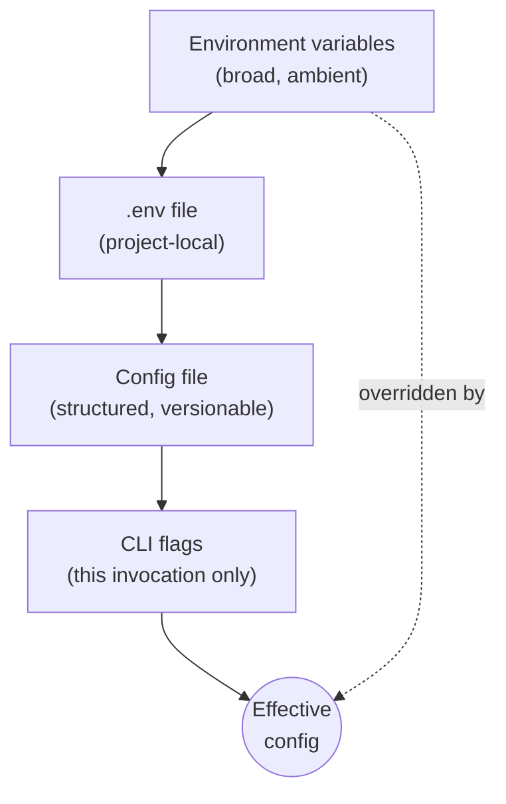
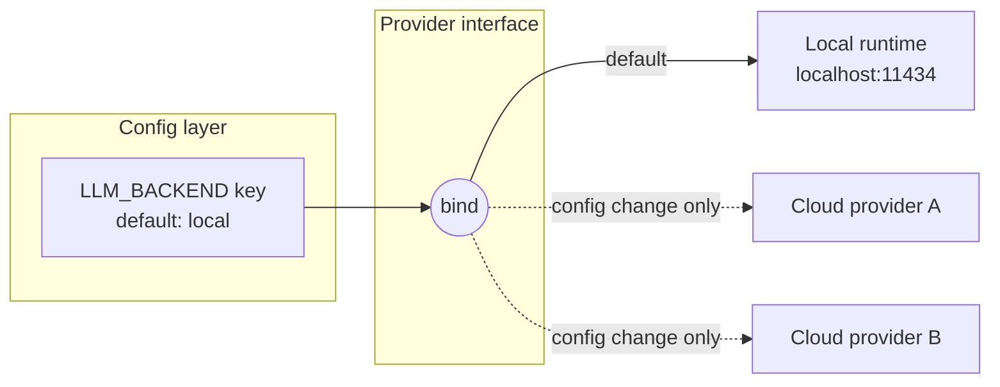
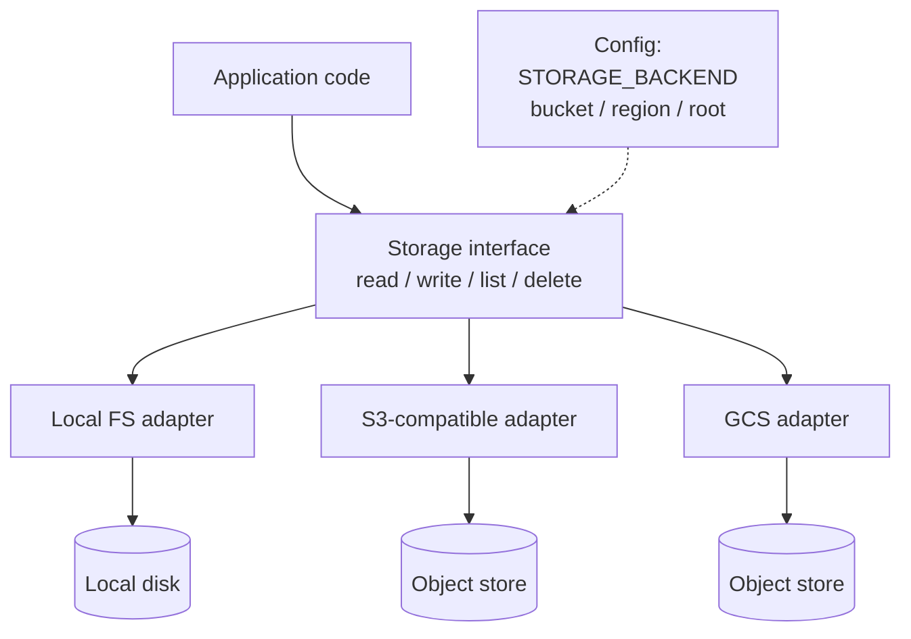

# Chapter 3 — Configuration Over Hardcoding

Every literal in your source code is a decision. The port number, the hostname, the model name, the timeout, the path to the data directory — each one was decided by somebody, at some moment, for some reason. The question that matters is not whether the decision was right. The question is: who gets to change it, and what does changing it cost?

When the value lives in a config layer, changing it costs an edit to an env file and a restart. When the value lives in the source, changing it costs a code change, a review, a test run, a commit, a build, and a deploy — and that's the *good* case, where you actually found it. The bad case is that the value is duplicated in four files, you found three of them, and the system now disagrees with itself in a way that surfaces three weeks later in somebody else's on-call shift.

I have been writing software since the era when "configuration" meant a deck of cards read in a specific order, and I will tell you the lesson that has held from mainframes through crypto gear to container platforms: **a hardcoded value is a decision hidden from the people who will need to change it.** The original author knew why the retry count was 3. The person staring at a production incident five years later does not, and worse, doesn't know it's even *there* to change. Every literal in the code is a config entry that never got promoted — it has all the consequences of configuration and none of the visibility.

The defense was the same in 1985 as it is now. Pull the decision out of the code, put it somewhere with a name, document the default, and validate it at startup. That's the whole chapter, really. The ten rules that follow are the load-bearing details: where config lives, in what precedence, how it's documented, what happens when it's wrong, and the two big payoffs you collect at the end — the same binary running on-prem or in the cloud, and storage you can repoint without touching a line of source.

AI agents made this more urgent, not less. An agent writing code will happily inline whatever value gets the test passing, and it will do so at a volume no human reviewer can chase. The rules below are how I stop that at the root.

## Rule 21: If it can change, it's config

**Zero hardcoded values for anything that could plausibly change: hosts, ports, model names, paths, timeouts, retry counts, feature flags, prompts.**

The test is the word *plausibly*. Not "will this change next sprint" — *could* this change, ever, for any deployment, any customer, any environment? Hostnames change. Ports collide. Model names change roughly every twenty minutes in the current AI economy. Paths differ between your laptop, the container, and the cluster. Timeouts that were generous on a LAN are absurd over a satellite link — I learned that one on a network where round trips were measured in geosynchronous orbits, and a hardcoded three-second timeout turned a working protocol into a brick.

Note what's on the list besides the obvious networking values: *prompts*. If you're building anything that talks to a language model, the prompt is the most-edited artifact in the system. Burying it in a string literal next to the HTTP call means every wording tweak is a code deploy. Promote it.

The counterargument is always the same: "it's faster to just put the value in." It is. It is faster the way not writing tests is faster. You're not saving the work; you're moving it to someone else's future, with interest, and removing the signpost that would have helped them find it.

A practical heuristic for code review — human or agent: every literal that isn't `0`, `1`, an empty string, or a genuine mathematical constant gets challenged. Either it graduates to a named constant (Rule 27) or a config entry (this rule), or its author explains why it can never, ever change. Most can't survive that conversation.

## Rule 22: One config layer, one precedence order

**All config flows through one layer — env vars → `.env` → config file → CLI flags, in increasing precedence. No environment reads scattered across modules.**

Configuration that arrives through one door can be reasoned about. Configuration that seeps in through forty scattered `os.environ` reads cannot — every module becomes its own little config system with its own defaults, its own parsing bugs, and its own opinion about what happens when the variable is missing. I've debugged systems where two modules read the same environment variable and disagreed about its default. Both authors were locally correct. The system was globally insane.

So: one config object, built once at startup, passed to everything that needs it (dependency injection, Chapter 4). And one precedence order, increasing from broad to specific:



*The config precedence stack: each layer overrides the one above it; the most specific, most deliberate setting wins.*

The logic of the ordering is scope. Environment variables are ambient — set by the platform, inherited by everything, easy to forget about. The `.env` file is project-local and explicit. The config file is structured and reviewable. CLI flags are the most deliberate act of all: a human typed them, for this run, right now. The more deliberate the act, the more it should win. A flag beats a file beats an env var, every time, no exceptions, and — critically — *documented*, so nobody has to read the merge code to predict the outcome.

One door. One order. Everything else is archaeology.

## Rule 23: Ship the `.env.example`

**Ship a `.env.example` documenting every required variable; gitignore the real `.env`.**

This rule is two safety mechanisms wearing one trench coat.

The first is documentation. A `.env.example` checked into the repo is the contract for what the software needs from its environment: every variable, a sane placeholder or default, and a one-line comment saying what it does and whether it's required. It's the configuration table from your README in executable form — `cp .env.example .env`, fill in the blanks, run. When someone new clones the repo (and "someone new" includes an AI agent starting a cold session, which has no memory of how you configured things last week), this file is how they learn what knobs exist without reading the source.

The second is secret hygiene, and it's the one with teeth. The real `.env` contains real credentials, which is precisely why it must be gitignored from day one — before the first commit, not after the first leak. The pattern in `.gitignore` is `.env` and `.env.*` with an explicit exception for `!.env.example`. The example file contains placeholders, never real values; the real file contains real values, never a path into version control. Keep the two roles strictly separated and a whole class of credential leaks — the most embarrassing class, the "it was right there in the repo" class — simply cannot happen.

Maintenance discipline: when you add a config variable, the `.env.example` update goes in the *same commit*. An example file that's three variables behind reality is worse than none, because people trust it.

## Rule 24: Zero-setup defaults

**Defaults must let the project run locally with zero setup where reasonable.**

Clone, install, run. That's the bar. If a new contributor — or an agent, or you on a new laptop — has to provision a cloud account, request credentials, and configure six services before the program prints its first log line, your project has a velocity tax that everyone pays on every fresh start, forever.

The fix is choosing defaults that resolve to things that exist on a developer machine: the database defaults to SQLite in a temp directory, the LLM backend defaults to a local runtime on its standard port, storage defaults to the local filesystem, the cache defaults to in-memory. Every one of these is swappable through the config layer — that's the entire point of Rules 21 and 22 — but the *default* posture is "runs here, now, with what's on this machine."

This rule pulls against an instinct I see constantly: defaulting to the production stack because "that's what we really run." Resist it. The production stack is what production config selects. Local defaults are what an empty config selects. Conflating the two means the empty config either fails mysteriously or — far worse — quietly touches production resources from a developer laptop. I have watched a "quick local test" write to a live system because the default connection string pointed somewhere real. The postmortem was not enjoyable for anyone, least of all the person who typed `run` and trusted the defaults.

The qualifier *where reasonable* is doing honest work — some systems genuinely cannot run without external hardware or services. Fine. Then the zero-setup default is a clearly-labeled fake or simulator, and the README says so in the first screen.

## Rule 25: Validate at startup, name the key

**Validate config at startup and fail with a message naming the missing or invalid key.**

There are two times a configuration error can surface: at startup, when a human is watching and the fix takes thirty seconds, or three hours into a run, when the half-finished state has to be cleaned up and the human watching is the on-call engineer. You get to pick. Pick startup.

Embedded systems taught me this with a stick. On a device with no console, no debugger, and a field technician at the end of a phone line, a config error that surfaced at startup with a clear code was a service call; one that surfaced mid-operation was a returned unit and an angry customer. The economics haven't changed just because we have terminals now — only the latency of the pain.

The second half of the rule is where most implementations fail: *name the key*. The error message is for the person fixing the problem, and the difference between these two lines is the difference between a thirty-second fix and a debugging session:

```
Error: invalid configuration
```

```
Error: STORAGE_BUCKET is not set (required when STORAGE_BACKEND=s3).
       See .env.example for documentation.
```

Name the key. State what's wrong with it — missing, malformed, out of range, mutually inconsistent with another key. Point at the documentation. If several keys are bad, report them *all* in one pass instead of failing one-at-a-time like a slot machine that pays out errors.

And validation means more than presence-checking. Parse the port as an integer and range-check it. Verify the URL scheme. Confirm the named backend is one you actually support. Fail fast, fail loud, fail *specific* — this is Rule 9 from the hard rules, applied to the config layer where it earns the most.

## Rule 26: No silent fallbacks

**Never silently fall back to a different backend.**

This is the rule in this chapter with the sharpest scar tissue behind it, so let me be blunt: the helpful fallback is a lie generator.

The temptation is always dressed as robustness. The cloud database is unreachable, so the code "gracefully degrades" to local SQLite. The configured model errors out, so the client "helpfully retries" with a different one. The object store rejects the credentials, so the writer "falls back" to the local disk. The process stays up, the logs look quiet, the demo proceeds. Everyone smiles.

Here's what actually happened: the system silently stopped doing what its operator believes it is doing. Data that should be in the durable store is on an ephemeral disk that vanishes with the container. Results that should have come from the evaluated, approved model came from whatever the fallback was. The dashboard is green and every number on it is wrong. When the truth surfaces — and it surfaces at the worst possible moment, that's not pessimism, that's selection bias, because the worst moment is when someone finally *needs* the data — nobody can even say when the lie started.

I spent years in environments where a system that failed visibly was an inconvenience and a system that failed *silently* was a catastrophe. The rule we lived by transfers exactly: **a loud crash is recoverable; a quiet lie is not.**

The configured backend is a contract. If it can't be honored, the correct behavior is Rule 25's: crash at startup or first use, name the backend, name the reason. If a fallback genuinely makes sense for your use case, make it *explicit* — a config flag the operator deliberately set, a startup log line in capital letters, a status endpoint that reports degraded mode. Chosen degradation is engineering. Silent degradation is fraud with good intentions.

## Rule 27: No magic numbers

**No magic numbers — named constants or config entries only.**

A magic number is a literal that appears in the logic with no name and no explanation. `86400`. `0.7`. `512`. `3`. The author knew what each one meant for about a week. After that, it's a fossil — evidence that a decision happened here, with the actual decision eroded away.

The cost is concrete. First, comprehension: `RETRY_BACKOFF_CEILING_SECONDS = 300` is documentation; a bare `300` in a loop is a riddle. Second, consistency: the same value pasted into four call sites isn't one decision, it's four decisions that happen to agree today. When someone updates three of them, you have a bug whose symptom is "the system is *mostly* consistent," which is among the most expensive phrases in this profession to debug. Third, reviewability: an agent or a junior dev changing `MAX_UPLOAD_MB` from 50 to 500 shows up in a diff as exactly what it is. The same change buried as `52428800` → `524288000` sails past tired eyes at 4 p.m. on a Friday.

The decision tree is short. Is it a genuine mathematical constant or a structural value (`0`, `1`, days-in-week)? Leave it, or name it if the name adds meaning. Could it plausibly change per environment or deployment? It's a config entry — Rule 21 owns it. Is it fixed but meaningful — a protocol constant, an algorithm parameter, a limit you chose? Named constant, declared at module scope, with a comment stating *why this value*. That comment is the part future-you will thank you for; the name says what it is, the comment says why it isn't something else.

If you can't think of a name for the number, that's not an exemption. That's the code telling you that you don't fully understand the decision you're hardcoding.

## Rule 28: "Use X locally" means default, not destiny

**"Use X locally" means configurable with X as the default, never hardcoded.**

This rule exists because of a specific, recurring failure mode in working with AI agents — and with literal-minded humans, but agents industrialized it. You say "use the local model runtime for this." The agent hears "hardcode the local endpoint into the client," and now the system *only* works against a developer-machine setup, and "deploy to staging" becomes a source-code change. The instruction was about the *default*; the implementation made it the *only option*. You asked for a preference and received a prison.

The correct reading is always the same: wire X through the config layer as the default value, behind whatever swappable interface that axis already has (Chapter 4 covers the interface; this rule covers the binding). "Use the local runtime" means the LLM-provider config key defaults to the local runtime. "Use SQLite for now" means the database backend defaults to SQLite. The words *for now* and *locally* are doing the work in those sentences — they're telling you this decision has a lifetime, and decisions with lifetimes belong in config.



*The "go local" rebinding: the instruction sets the default binding (solid line); every other backend stays one config edit away (dashed lines). No source changes on any path.*

The payoff compounds with Rule 18's "go local" crew rebinding: because every persona's model is a config binding, "go local" is an edit to one file, not a refactor. That's only possible because nobody ever took "use X" as license to weld X into the source. The default is a suggestion with authority. It is not a weld.

## Rule 29: On-prem and cloud are config values

**The same code runs on-prem or in the cloud with only config changes — never source changes.**

This rule is where the previous eight stop being hygiene and start being strategy.

I came up in industries where on-premise wasn't a preference, it was a requirement with armed guards — air-gapped networks, customer data that legally could not leave the building, latency budgets that ruled out a round trip to anyone's cloud. I now work in an industry that spent a decade assuming the cloud was the only place software lives, and is currently rediscovering — via egress bills, sovereignty laws, and AI workloads that want to sit next to private data — that on-prem never went away. Deployment target is not an architectural constant. It's a *parameter*, and parameters change on business timescales, not engineering timescales.

If your code can only run in one place, somewhere in the source there's a decision that should have been config: a hardcoded bucket name, an assumed metadata endpoint, a vendor SDK called directly from business logic, a path that only exists in one image. Each one is a Rule 21 violation that grew up and got a job holding your deployment options hostage.

The discipline is to treat "where does this run" as a profile — a set of config values selected per environment. The on-prem profile binds storage to the local volume or an internal object store, auth to the internal provider, the database to the cluster down the hall. The cloud profile binds the same interfaces to managed services. The *source* doesn't know which profile is loaded, and it must never need to. Practical enforcement: if you can't point at the config diff between your on-prem and cloud deployments — just config, nothing else — you don't have two deployments of one system. You have two systems, and one of them is unmaintained.

Test it before you need it. A backend swap that's never been exercised is a backend swap that doesn't work (integration tests across profiles — Chapter 8).

## Rule 30: Storage goes through the adapter

**Storage goes through an adapter: no `open("./data/...")` outside it, no hardcoded buckets, regions, or account IDs.**

Storage gets its own rule — separate from Rule 29's general principle — because storage is where the principle dies first. Every language makes opening a local file a one-liner, so local-file assumptions metastasize through a codebase faster than any other kind of hardcoding. By the time someone says "we need this on object storage," there are a hundred and forty call sites that each independently believe the filesystem is right there. I've supervised that migration. The estimate was a sprint. The reality was a quarter.

The adapter is the prevention: one interface owning read, write, list, delete, exists — and *every* storage touch in the codebase goes through it. No exceptions for "it's just a temp file" (the temp directory is the adapter's business too, per the cross-platform rules), no exceptions for "it's just a quick script" (quick scripts are where the next subsystem comes from).



*The storage-adapter seam: application code sees one interface; config (dashed) selects which adapter is bound behind it. No path, bucket, or region appears above the seam.*

The second clause has teeth of its own: no hardcoded buckets, regions, or account IDs. A bucket name in source is simultaneously a Rule 21 violation, a deployment landmine (Rule 29), and a reconnaissance gift to anyone reading your public repo. Bucket, region, prefix, credentials source — all of it arrives via config, validated at startup (Rule 25), with the local-FS adapter as the zero-setup default (Rule 24).

One seam, honestly enforced, and "move the data" becomes a config change. That's the whole chapter in one sentence.

### Chapter 3 card

- **Rule 21** — Anything that could plausibly change — hosts, ports, models, paths, timeouts, retries, flags, prompts — is config, never a literal.
- **Rule 22** — One config layer, one precedence: env vars → `.env` → config file → CLI flags, increasing; no scattered environment reads.
- **Rule 23** — Ship a `.env.example` documenting every variable; gitignore the real `.env` from day one.
- **Rule 24** — Empty config runs locally with zero setup where reasonable; production is what production config selects.
- **Rule 25** — Validate config at startup; fail naming the key, the problem, and the docs.
- **Rule 26** — Never silently fall back to a different backend; a loud crash beats a quiet lie.
- **Rule 27** — No magic numbers; named constants or config entries, with a comment saying why.
- **Rule 28** — "Use X locally" means X is the configurable default, never a hardcoded destiny.
- **Rule 29** — On-prem ↔ cloud is a config diff, never a source diff; deployment target is a parameter.
- **Rule 30** — Every storage touch goes through the adapter; no raw paths, buckets, regions, or account IDs outside it.
