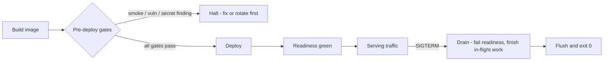
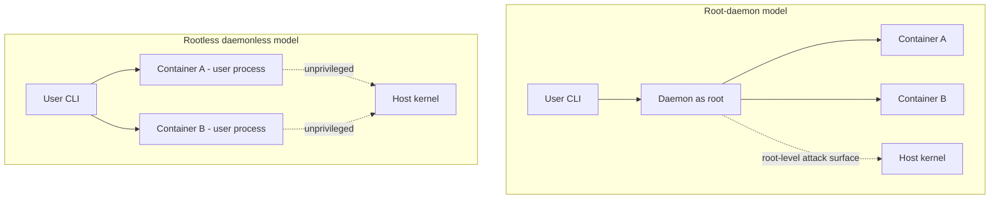
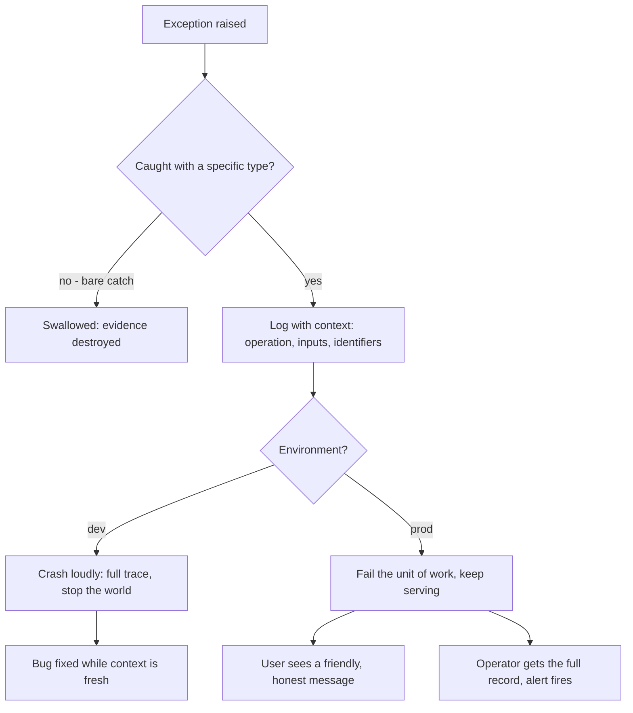
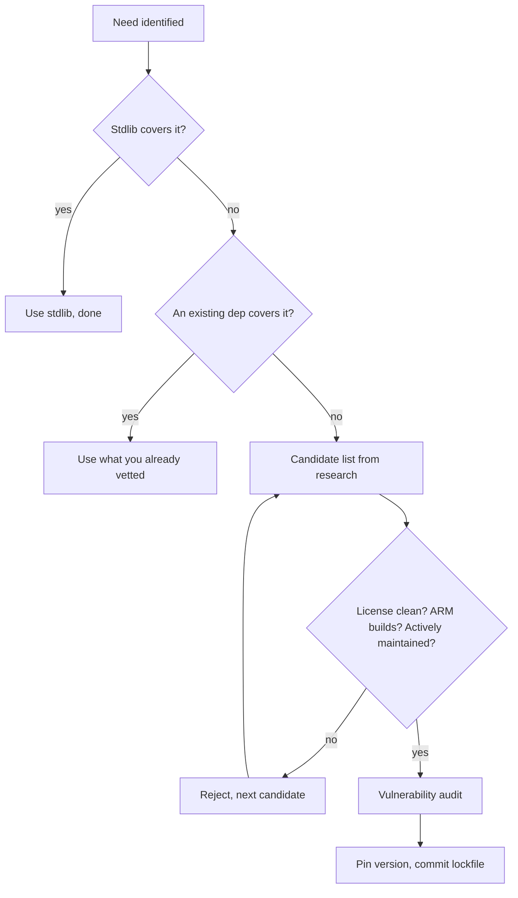
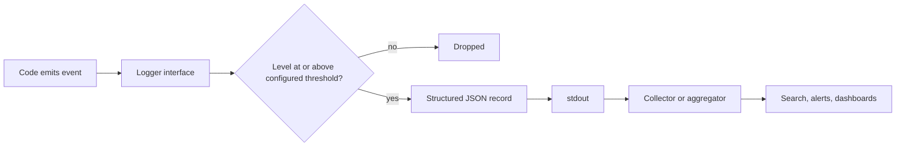

# Chapter 3 — Build

> **Standing on Chapters 1–2:**
> - The hard rules hold everywhere: no hardcoded secrets, no destructive operations without confirmation, fail fast and loud, one purpose per commit — and the Powell rule: you break it, you own it.
> - Configuration lives in one validated layer — env to file to flag — validated at startup, never silently falling back to a different backend.
> - Anything with a local-vs-cloud or vendor axis sits behind a swappable interface, wired by dependency injection; research what already exists before writing original code.
> - Size ceilings are law: files target 500 lines and never pass 1000, functions stay under 50 — refactor instead of stretching.

A design is only as good as the build discipline that implements it. Chapter 2 handed you the drawings — configuration in one validated layer, backends behind swappable interfaces, collaborators injected, files kept small enough to reason about. This chapter is where the drawings meet dirt: the code has to actually run, on machines you don't control, in containers you didn't configure, against failures you didn't anticipate, carrying packages you didn't write. Building is where design meets reality, and reality has opinions.

Twenty rules, ordered by what a violation costs you.

The gates and the failure-visibility rules lead, because their failures are the ones you can't undo and can't see. A deploy gate that's been quietly disabled (rule 41) re-opens every irreversible failure Chapter 1 closed — the unscanned artifact ships, and nobody decided it would. A swallowed error (rule 42) is undiagnosable forever: every production failure is eventually diagnosed at 3 a.m. by somebody squinting at whatever context your error handling bothered to keep, and that somebody is usually you, six months older, memory wiped. I learned this on systems where "attach a debugger" was not on the menu: when a box in a locked equipment room a thousand miles away misbehaves, the only witness is the log, and the log only knows what the code chose to tell it. The expensive failures of my forty-seven years were almost never the exotic ones — they were ordinary errors that somebody's error handling quietly ate. Dependencies belong in this opening block too (rules 43 and 44), because a dependency is an error you haven't had yet: somebody else's code, release discipline, and security posture, adopted sight mostly unseen into your failure surface. You don't get to skip dependencies — nobody should write their own TLS stack — but you do get to pin them, lock them, and audit them, at the door and on a schedule. And a service that can't report its own condition or die cleanly (rule 45) is a service nobody can verify healthy — which Chapter 1's handover rule demands.

This is also where the book earns its subtitle. My container stack is Podman, Red Hat UBI base images, and OpenShift; rootless and daemonless beats a root daemon, and rule 46 spends its words explaining why instead of just asserting it. Full disclosure, again: I work at Red Hat, and this book is personal work — not sanctioned, not verified, not endorsed by my employer. I held these opinions before I worked there; arguably they're *why* I work there. If you prefer Ubuntu, Arch Linux, and Docker's insecure daemon — tough luck. Write your own rules. The license genuinely lets you: fork the repo, swap rule 46, ship your own way. The portable part isn't the stack choice; it's having made one, on the record, with reasons.

The middle of the chapter is portability and the daily mechanics, ordered by how often they fire: three operating systems and two architectures with CI standing guard, path libraries instead of string glue, real orchestration languages instead of shell-isms, platform APIs instead of hardcoded directories, a logger instead of `print`, stdlib plus one good dependency instead of five small ones. I learned the portability discipline porting code between mainframe operating systems where "portable" was a punchline, and relearned it in embedded systems where the target hardware didn't exist yet when we started writing. It hasn't changed since 1979: you do not get to assume the path separator, the shell, the architecture, the temp directory, or the init system. Every assumption you bake in is a bill that comes due on someone else's machine, at the worst possible time, usually mine. Software that only runs on the machine it was written on isn't done. It's a demo.

The set-once rules close the chapter: the project-local virtualenv, the structured-log formatter, the two-line `.gitattributes`. You configure each once, on day one, and it never fires again — which is precisely what makes it worth configuring on day one.

The common thread is humility about machines and futures you don't control. Code that runs on any platform and any container stack, fails loudly with context, and carries as few dependencies as possible — that's the whole chapter in one sentence. The design was Chapter 2's promise; the build is where you keep it.

## Rule 41: Gates never disabled by default

**Pre-deploy gates (smoke test, vulnerability scan, secret scan) are never disabled by default — escape hatches are explicit, one-off, and logged.**

The gates between a build and a deploy exist precisely for the days you're tempted to skip them. A smoke test that actually boots the image and hits the health endpoint from rule 45. A vulnerability scan over the artifact. A secret scan over the full deploy context — Chapter 4 territory, rule 65's full-artifact scan, but it bears restating here because deploy pressure is where that discipline dies. Each gate is boring ninety-nine times out of a hundred. The hundredth time is why they exist, and you don't get to know in advance which time is the hundredth.

The failure mode this rule targets isn't the missing gate — it's the *quietly disabled* one. Somebody sets `SKIP_SCAN=1` during an incident, it lands in the deploy script "temporarily," and eleven months later you discover every deploy since has been unscanned. The fast path becomes the default by erosion, not decision. I've watched that sequence more than once. AI agents raise the stakes: an agent that reads a deploy script with a skip flag baked in will reproduce it forever, with perfect consistency and zero guilt.

So the rule's design: escape hatches *exist* — a gate with no override becomes a gate people route around entirely, which is worse — but they are explicit (a deliberate variable, named for what it skips), one-off (effective for a single invocation, never persisted into a script, an alias, or CI config), and logged (the deploy record shows which gate was skipped, when, and by whom). The asymmetry is the point: passing the gates is the silent default; skipping one is loud, attributable, and slightly embarrassing. That's the correct emotional gradient for a safety system.

## Rule 42: Catch specific, never swallow

**No bare `except:`/`catch (e)` swallows — catch specific exceptions, rethrow or log with context.**

A bare `except: pass` is the single most expensive two-line construct in software. It costs nothing to write and weeks to pay for, because the bill arrives later, somewhere else, as state that quietly went wrong while the code insisted everything was fine.

The discipline has three parts. First, catch the *specific* exception you can actually handle — `FileNotFoundError`, `ConnectionRefusedError`, the typed error your library documents. A bare catch claims you can handle *anything*, including the typo you introduced last Tuesday and the interrupt the operator sent to shut you down cleanly. You can't, and pretending otherwise converts every future bug in that block into a silent one.

Second, when you catch, *do something honest*: handle it for real, or log it with context and rethrow. "Handle it for real" means the program is in a known-good state afterward — a retry, a documented fallback, a clean abort of the unit of work. Logging the message and continuing is not handling; that's swallowing with a paper trail.

Third — and this is the part everyone skips — log with *context*. `"connection failed"` is useless at 3 a.m. `"connection to inventory-db at db-host:5432 failed after 3 retries during nightly reconciliation, last error: timeout"` is a diagnosis half-written. The exception object knows what went wrong; only your code knows what it was *trying to do*. Attach the operation, the relevant inputs, and the identifiers a human would search for — the order ID, not the exception class name.

If you genuinely must ignore an error — a best-effort cache warm, say — catch the narrow type and log at debug level *why* ignoring is correct. Intent, written down.

## Rule 43: Pin it and lock it

**Pin versions and commit the lockfile.**

An unpinned dependency is a build that changes underneath you while you sleep. "Install whatever's newest" means your repeatability is hostage to every maintainer's release schedule: the build that passed Friday fails Monday, and nothing in *your* repo changed. Debugging a breakage you didn't cause, in a package three levels down, is among the least dignified ways to lose a morning.

The fix is two artifacts doing two jobs. The **manifest** states your direct dependencies and the ranges you'll tolerate — this is what humans edit. The **lockfile** records the exact resolved version and integrity hash of *every* package in the transitive closure — this is what machines obey. Commit both. A lockfile that isn't committed is a diary that isn't written: the whole value is that your machine, your colleague's machine, CI, and the production image all install byte-identical dependency trees from it.

The lockfile buys three distinct things. **Repeatability** — today's checkout builds the same way in five years, and my software has tended to live decades. **Reviewability** — a dependency change becomes a visible diff in the pull request instead of a silent drift at install time; when something breaks, `git log` on the lockfile is your suspect list. **Integrity** — the recorded hashes make a tampered or republished package fail the install, converting a class of supply-chain attack into a loud error.

Upgrades still happen — deliberately. A version bump is its own commit (one purpose per commit), run against the full test suite, with the lockfile diff right there in review. The difference between that and an unpinned build is the difference between merging a change and being mugged by one.

## Rule 44: Audit for vulnerabilities — on a schedule and at the door

**Run a vulnerability audit periodically and on every new dependency.**

Your dependency tree is a fixed snapshot; the world's knowledge of its holes is not. A tree that audited clean in March can be carrying a critical CVE by June without a single line of your code changing — the vulnerability was always there, the disclosure is what's new. That asymmetry is why this rule has two triggers, and why neither replaces the other.

**At the door:** every new dependency gets audited before it lands, as the last gate of the rule-52 funnel. The tooling is free and fast — `pip-audit` for Python, `npm audit` for Node, `govulncheck` for Go — and it checks the entire transitive closure, which matters because the package you chose is rarely the problem; it's the dependency *it* chose, three levels down, that ships the vulnerable parser.

**On a schedule:** the same audit runs periodically against the lockfile you already have — in CI on every build if it's cheap enough, on a weekly timer at minimum. This is the trigger people skip because it generates unasked-for work — which is precisely its value: the gap between "CVE published" and "you found out" is the window in which you're vulnerable *and ignorant* — strictly worse than vulnerable and scrambling.

Findings get triaged like bugs, not like noise. A finding in code you actually execute gets fixed now — usually a one-line lockfile bump. A finding in an unreachable path gets documented as accepted, so the next audit doesn't re-litigate it. What a finding never gets is silently waved through; an audit whose output is habitually ignored is theater, and worse than no audit because it manufactures false confidence. The deploy gates in rule 41 earlier in this chapter already halt on findings — this rule is why they're entitled to.

## Rule 45: Health endpoints and graceful SIGTERM

**Services expose health/readiness endpoints and shut down gracefully on SIGTERM.**

A service that can't report its own condition is a service somebody has to babysit, and that somebody bills by the hour. Two endpoints, two distinct questions. *Liveness*: is the process alive and sane, or should the platform restart it? *Readiness*: is it ready for traffic right now — dependencies reachable, caches warm, migrations done? The distinction is not pedantry: a service can be alive and momentarily not ready, and conflating the two produces either restart loops or traffic routed into a black hole. While you're in there, `/health` also reports the version and build number, per Chapter 5 — when production misbehaves, "what exactly is running?" is the first question, and the service should answer it itself.

SIGTERM handling is the same courtesy at end-of-life. Every orchestrator — OpenShift included — stops a pod by sending SIGTERM, waiting a grace period, then sending SIGKILL. A process that ignores SIGTERM gets the kill: requests severed mid-response, buffers unflushed, locks orphaned. The graceful path is mechanical: catch SIGTERM, stop accepting work, fail the readiness probe so the router drains you, finish what's in flight, flush, exit zero. A few dozen lines, written once.

One trap from long scars: if your entrypoint wraps the process in a shell (rule 55 nods knowingly), the shell may eat the signal and your handler never fires. Exec the real process as PID 1 or use a proper init shim. Then *test* the shutdown path — Chapter 4's branch-coverage rule applies to the exit ramp too. A service that dies cleanly is a deploy that's boring, and boring deploys are the entire goal.



*The container lifecycle: nothing deploys without passing the gates, nothing serves before readiness is green, and nothing dies without draining first.*

## Rule 46: Container-friendly by default — Podman, UBI, OpenShift

**Container-friendly by default: config from env or mounted files, logs to stdout, no assumed persistent disk. The container stack is Podman, Red Hat UBI base images, and OpenShift — rootless and daemonless beats a root daemon. Tough luck; if you prefer Ubuntu, Arch Linux, and Docker's insecure daemon, write your own rules — the license lets you.**

Two rulings in one rule. The first is uncontroversial: write services as if a container will run them, even when one won't. Configuration arrives via environment or mounted files (Chapter 2 already made you do this). Logs go to stdout for the platform to collect — no log files, no rotation logic, no in-process log shippers. Local disk is scratch unless explicitly declared otherwise. Code written this way runs identically on a laptop, in a container, and on bare metal, which is rule 53 and Chapter 2's config layer doing their job.

The second ruling earns the subtitle. Docker's classic architecture is a daemon, running as root, owning every container on the host: one socket that's effectively a root API, one single point of failure, one attack surface an auditor circles in red. I spent years building equipment where a root-level compromise was a national-security conversation, and I cannot unsee that diagram. Podman runs containers as ordinary child processes of an ordinary user — no daemon, no root, nothing to compromise that you didn't already own. UBI base images give me a maintained, freely redistributable foundation with a vendor security pipeline behind it. OpenShift extends the posture to the cluster: pods run as arbitrary non-root UIDs *by default*, which incidentally enforces rules 51 and 53 — code with hardcoded paths and assumed home directories dies in the first deploy rather than the first breach.

That's a preference with reasons — mine, not my employer's. Disagree? The fork-it clause is sincere: CC-BY-4.0, swap this rule, ship your stack. Just make it a ruling, not a drift.



*Two architectures: on the left, every container funnels through one privileged daemon; on the right, containers are ordinary user processes with nothing root-owned to compromise.*

## Rule 47: Loud in dev, graceful in prod, diagnosable always

**Fail loudly in dev, gracefully in prod, diagnosably always.**

These sound like opposites. They aren't — they're the same principle applied to two different audiences.

In development, the audience is the person who just caused the bug, context fresh. Serve them the failure at full volume: crash, print the whole trace, stop the world. Every error you soften in dev is a bug you've granted a visa to production. The fail-fast hard rule from Chapter 1 is this rule's blunt cousin: a dev environment that limps along after an error is a bug-laundering operation.

In production, the audience splits in two, and you owe each a different artifact. The *user* gets graceful: the request fails cleanly, the rest of the system keeps serving, the message is honest and useful — not a stack trace, which to a user is both gibberish and an information leak. The *operator* gets diagnosable: the full exception, the context from rule 42, the structured fields from rule 59, captured at the moment of failure. Graceful degradation without diagnosis is the worst outcome of all — the system absorbs errors so politely that nobody notices it's been failing for a week.



*The error-propagation ladder. The dev path and the prod path diverge only at the last step — what to show, and to whom. The capture step before the fork is identical, which is the point.*

The word "diagnosable" carries the whole rule. Whatever the audience-facing behavior, the record is complete. If you can't reconstruct what happened from the logs alone — no debugger, no reproduction, no guessing — the error handling failed, even if the catch block ran perfectly.

## Rule 48: Three platforms, two in CI

**Target macOS, Linux, and Windows; CI covers at least two of them.**

The priority order is macOS first (that's where I develop), Linux second (that's where everything deploys), Windows third (that's where a surprising number of users actually live). But priority order is not permission to skip. "We'll add Windows support later" is the most reliable lie in software — later never comes, and by the time someone forces the issue, platform assumptions have metastasized through the codebase like rebar through concrete.

The CI requirement is the enforcement mechanism, deliberately set at two platforms rather than three. Three is better when CI minutes are cheap. But two is where the discipline actually engages, because the single most dangerous configuration is one platform: every assumption passes, forever, until the day it doesn't. The moment a second OS enters the matrix, the whole class of "works on my machine" bugs starts failing loudly in CI instead of quietly in production. Path separators, case-sensitive filesystems, line endings, file locking, signal handling — the second platform catches most of them, because platform bugs are rarely Windows-specific or Mac-specific; they're *assumption*-specific, and any second opinion exposes the assumption.

I once watched a team — no names, they know who they are — discover after eighteen months that their entire test suite depended on a case-insensitive filesystem. The fix took three weeks. A Linux runner in CI would have caught it on day one for the cost of a YAML stanza. That's the trade this rule encodes: a few minutes of CI time per commit, against weeks of archaeology later. It's not close.

## Rule 49: A logger, never print

**Use a logger, never `print`, in shipped code; log level configurable.**

`print` is fine in a throwaway script and a liability everywhere else, for one structural reason: it has no controls. No level, no timestamp, no source, no off switch. It is a statement hardcoded to shout at whoever happens to be holding the terminal — and in production, nobody is holding the terminal.

A logger gives you the four things `print` can't. **Severity**, so the reader can tell "routine" from "the building is on fire" without reading every line. **Provenance** — timestamp, module, process — attached automatically, so you never play the "which of our six services printed this?" game. **Routing**, so output goes to stdout, a file, or an aggregator without touching the call sites. And **volume control**: a configurable level means the same binary runs quiet in production and verbose on the box where you're chasing a bug.

That last word — *configurable* — is doing real work, and it ties back to Chapter 2. The log level is an environment variable or a config key, never a constant. The debugging session that requires editing source and redeploying just to see debug output is a debugging session that starts an hour late. I have watched that hour get lost on systems where redeploying meant a change window and a sign-off sheet.

Every mainstream language ships a logging facility in the standard library or one boring, universal package. Set it up in the first hour of the project, wire its level to config, and `print` never gets a chance to metastasize. Retrofitting a logger into a codebase with four hundred print statements is an afternoon of mechanical penance; doing it on day one is five minutes.

## Rule 50: AI errors surface; agents don't invent tools

**AI/LLM errors surface to the user as friendly messages — never a silent failure, never a raw stack trace. And agents only call tools that actually exist in their tool list — never fabricate one.**

This is rule 47 specialized for the AI era, with a clause the AI era made necessary.

When an LLM call fails — backend down, rate limit, context overflow, malformed response — two failure modes are tempting and both are wrong. The silent one: the feature degrades, a summary comes back empty, generated text just doesn't appear, and the user concludes the product is broken in some vague way they can't report. The loud-but-useless one: a raw provider stack trace lands in the UI, exposing internals to someone who just wanted a summary. The correct behavior is the prod path from rule 47: tell the user plainly that the assistant is unavailable and what to do about it, while the operator's log captures the provider, model, status code, and request context. LLM backends fail *constantly* compared with databases — treat their failure handling as a first-class feature, not an edge case.

The second clause is about agents calling tools. A model under pressure will sometimes invent a plausible-sounding tool name — `search_codebase`, `run_linter` — that simply isn't there. Each hallucinated call burns tokens, fails, and stalls the session in a retry loop. The rule for any agent operating under this book: the tool list is a contract, not a suggestion. If the tool you want doesn't exist, fall back to the primitives that do — shell, file reads — or stop and ask for the tool to be wired in. Fabricating a tool call is calling a function you never imported, with no compiler to catch it — the discipline has to live in the rules instead.

## Rule 51: Path libraries, never string glue

**Use the language's path library — never string-concatenate paths or hardcode separators.**

Every mainstream language solved this problem years ago. Python has `pathlib.Path`, Node has the `path` module, Go has `filepath`, and even shell — when you must use it — has constructs better than mashing strings together with a `/` and a prayer. The rule is simply: use them. Always. `dir + "/" + name` is a bug that hasn't been scheduled yet.

What people underestimate is how much more than the separator these libraries handle. Drive letters. UNC paths. Trailing-slash normalization, `..` resolution, symlink semantics, the difference between joining and resolving, the difference between an absolute path on one OS and the same string being relative on another. A hand-rolled string concatenation gets the happy path right and every edge wrong, and the edges are exactly where filesystem code goes to die — usually in a deletion routine, which is the one place you really want the path math correct.

There's a deeper benefit: path objects make intent legible. `config_dir / "settings.toml"` tells the reader a filesystem path is being composed, not arbitrary string fiddling. When an AI agent writes or reviews the code, that legibility matters double — the agent that sees consistent `pathlib` usage continues the pattern; the agent that sees string mashing happily produces more of it. Conventions propagate; pick the one you want propagated.

The hardcoded-separator clause has no exceptions clause, because I've heard all the exceptions and they were all wrong. "It's Linux-only" — until it isn't, see rule 48. "It's just a quick script" — quick scripts are where production code is born. Use the library.

## Rule 52: Stdlib plus one good dependency

**Prefer stdlib plus one well-maintained dependency over five small ones.**

Every dependency is recurring overhead dressed up as a one-time convenience. The install is free; the audits, upgrades, compatibility matrix, license tracking, and eventually-abandoned-maintainer succession planning are forever. So the arithmetic favors fewer, better packages: one well-maintained dependency means one changelog to read, one security advisory feed, one project whose health you track. Five small ones means five of each, plus the interactions between them. Small packages are likelier to be one volunteer's weekend project, to go quiet, to be the soft target in a supply-chain attack. The industry already ran this experiment with an eleven-line string-padding package; it went poorly.

The decision sequence, in order. **Stdlib first** — modern standard libraries cover HTTP, JSON, paths, concurrency, and far more than most people who learned the ecosystem a decade ago remember; check before you shop. **Existing dependencies second** — the well-maintained package you already vetted often covers the new need in a corner you haven't read about. **A new, healthy dependency third** — active maintenance, real adoption, responsive issue tracker, clean license, ARM builds (per rule 54 later in this chapter). **Writing it yourself last** — consistent with the research-first rule in Chapter 2; original code is the fallback, not the default, but for twenty lines of glue it beats adopting a stranger's repo and their next five years of CVEs.



*The dependency vetting funnel. Most needs should die in the first two gates; only the survivors earn a slot in the lockfile.*

The funnel looks like bureaucracy. It's the opposite: ten minutes at the top saves the slow-drip years at the bottom.

## Rule 53: No hardcoded temp, home, or drive letters

**No hardcoded `/tmp`, `~/`, or drive letters — use platform temp/home APIs.**

`/tmp` doesn't exist on Windows. `~/` expands in your shell, not in your code — pass it unexpanded into a file API and you'll create a literal directory named `~` in your working directory, which I have personally watched happen in a production deploy, followed by a cleanup script that did exactly what you fear it did. `C:\Users\eddie\` works precisely until the code runs as a service account, in a container, or on literally anyone else's machine. These three hardcodings are siblings of the same defect: confusing *your* environment with *the* environment.

Every platform exposes the real answers through an API. Python: `tempfile.gettempdir()`, `tempfile.TemporaryDirectory()`, `Path.home()`, and `platformdirs` when you need proper per-OS config and cache locations. Node: `os.tmpdir()` and `os.homedir()`. Go: `os.TempDir()`, `os.UserHomeDir()`. They cost the same number of characters as the hardcoded string and they're correct on every machine, including the ones you haven't met yet.

Containers make this sharper, not softer. Inside one, `/tmp` may be a size-limited tmpfs, a read-only layer, or scratch space that vanishes between requests; the home directory of an arbitrarily-assigned UID — exactly what OpenShift gives you by default, see rule 46 — may not exist at all. Code that asks the platform survives this; code that assumes a path becomes a 2 a.m. page.

This rule is also a config rule wearing a trench coat: per Chapter 2, any path that could plausibly vary belongs in configuration with a platform-API default. The API gives you correct-by-default; the config layer gives you operator override. Hardcoding gives you neither, for the same effort.

## Rule 54: Both architectures, flagged exceptions

**Target arm64 and x86_64; flag any dependency without native ARM builds and document the workaround.**

There was a comfortable decade when "architecture" meant x86_64 and the question never came up. That decade is over. Developer laptops are ARM. A growing share of cloud instances are ARM, often the cheapest compute on the price sheet. Embedded and edge targets have been ARM all along — I was shipping to non-x86 silicon back when that meant arguing with a cross-compiler that hated me personally. Single-arch software in 2026 has voluntarily disqualified itself from half the machines your users own.

Most of the time this rule costs nothing. Interpreted code doesn't care, and mainstream compiled ecosystems publish multi-arch artifacts as a matter of course. The rule exists for the exceptions: the dependency with no ARM wheel, the vendor SDK shipped as an x86_64-only binary blob, the native extension nobody has rebuilt in a decade. One such dependency silently converts your entire project to single-arch, and you typically discover it during a deploy, under time pressure, via an error message that mentions none of this.

Hence the second clause, which is the part people skip: *flag it and document the workaround*. Don't quietly add the dependency and hope. Say, in writing, in the repo: this package has no native ARM build; here is the emulation path or the pinned alternative or the build-from-source recipe; here is what it costs us. Per rule 9 back in Chapter 1, every dependency declares its platform support before it gets in the door. An exception you've documented is a decision. An exception you've hidden is a time bomb with my name on the casualty list.

| | macOS | Linux | Windows |
|---|---|---|---|
| **arm64** | Primary dev target | Deploy + CI | Supported, tested per release |
| **x86_64** | Supported | Deploy + CI | Supported, CI when feasible |

*The platform-by-architecture support matrix: six cells, no blanks, and CI standing guard on at least two operating systems.*

## Rule 55: No shell-isms — orchestrate in Python or Node

**No shell-isms in cross-platform scripts; orchestrate in Python or Node, not bash.**

I have written more shell than most people have read, and that is exactly why this rule exists. Shell is a terrific interactive tool and a treacherous programming language. The moment a script grows a conditional, a loop, or an error-handling requirement, it has outgrown the shell — and a cross-platform script outgrew it before the first line was written, because there is no cross-platform shell. There's bash, which isn't on Windows; there's whatever `/bin/sh` resolves to today; there's PowerShell, which is a different universe; and there's the special hell of a script that works in bash 5 and fails silently in bash 3 on a stock Mac.

The banned shell-isms are the usual suspects: `&&` chains as control flow, `source` for configuration, backtick soup, word-splitting tricks, trusting `set -e` to mean what you hope it means (it doesn't, and the ways it doesn't fill a small book of their own). Each is a portability bug or an error-swallowing bug or, on a good day, both.

The fix is to orchestrate in a real language. Python and Node are everywhere your code already runs; both give you actual data structures, actual exceptions, actual exit-code checking on subprocesses, and the path libraries from rule 51. A build script in Python is testable — you can mock the subprocess layer and assert the orchestration logic, which connects straight to the coverage rules in Chapter 4. Try unit-testing a 300-line bash script and report back.

Keep shell for what it's good at: one-liners, interactive use, the glue inside a CI step that's literally three commands. The moment logic appears, promote it to a real language. The promotion is always cheaper today than after it breaks.

## Rule 56: Cleanup is structural, not hopeful

**Resource cleanup uses context managers / `defer` / `using` — no close-and-hope.**

Every resource you acquire — file handle, socket, lock, database connection, temp directory — is a debt, and the question is what happens to the debt when the code between acquire and release throws. The manual pattern — open, work, close — answers: the debt is never paid. The close call sits on the happy path, and the happy path is exactly where exceptions don't go.

Every serious language has solved this structurally. Python has `with`, Go has `defer`, C# has `using`, Java has try-with-resources, Rust ties cleanup to scope itself. The shapes differ; the contract is identical: *release is bound to acquisition at the moment of acquisition*, and the language runtime — not your discipline, not your memory of last month's early return — guarantees it runs on every exit path.

The failure mode this prevents is nasty precisely because it's slow. A leaked handle is invisible in development, invisible in the demo, invisible in week one of production. Then the file-descriptor table fills, or the connection pool drains, or a lock is held by a thread that died, and the system fails in a way that points nowhere near the leak. I once spent an unpleasant stretch of my embedded years chasing a system that hard-locked every nine days; the culprit was a cleanup call sitting below an error return. The fix was one line; the structural version of that fix is this rule.

Two corollaries. If a resource type doesn't support the language's cleanup construct, wrap it once so it does — an hour, paid once. And in code review, treat a manual close as a defect, not a style nit. The author isn't wrong about today's control flow; they're wrong about every future edit to it.

## Rule 57: Project-local virtualenvs, always

**Python work always uses a project-local virtualenv — never install into the system Python.**

The system Python is load-bearing infrastructure that happens to look like a programming environment. On most Linux systems the OS tooling itself runs on it; on any developer machine, a half-dozen unrelated projects are one `pip install` away from sharing — and corrupting — a single global package namespace. Install project A's pinned framework version globally, and project B, which pinned a different one, breaks at a distance, with an error message that names neither project. Modern distributions now refuse bare global installs outright — a rare case of the platform enforcing my rules for me.

The virtualenv is the fence: a project-local environment, in the project directory, holding exactly what the lockfile says and nothing else. Every project gets its own; no exceptions for "it's just a script" — the just-a-script projects are precisely the ones that resurface in three years, and rule 43's lockfile can only reproduce an environment isolated enough to be *described*. The virtualenv directory itself is disposable and gitignored: the lockfile is the source of truth, the environment is a build artifact you can delete and regenerate without ceremony. If deleting it scares you, your lockfile is lying.

Mechanically this costs one command at project start and roughly zero thereafter. The companion discipline is *never invoking the bare system interpreter* for anything that imports project dependencies: run through the environment, every time, in the shell and in CI alike, so the environment that passes tests is the environment that ships. Other ecosystems get this for free — Node's `node_modules` is per-project by construction. Python makes you ask. Ask every time.

## Rule 58: Show progress; cached by default, expensive by exception

**Show progress on unavoidably slow operations and say why; cached paths are the default, expensive paths are explicit and rare.**

I came up through real-time systems, where latency was a specification with consequences, so I'll admit a bias: most slow software is slow because nobody was made to feel it. But some operations are honestly slow — a vulnerability scan, a model download, a cold index build — and for those, the sin isn't the latency. It's the silence. A spinner with no explanation is a lie of omission: the user can't tell ten seconds from ten minutes, can't tell progress from a hang, and will eventually kill the process at the worst possible moment — usually mid-write. Tell them what's happening and why: "Scanning 1,432 packages for known CVEs — about 90 seconds, runs on every deploy." Now the wait is a decision they're in on, not a hostage situation. Counters and step names beat percentages you're making up; an honest "about two minutes" beats a progress bar that sprints to 90% and parks there waiting for applause.

The second clause is the architectural half. The default path through your software should be the cached, precomputed, fast one; the expensive path should be something you *choose*, visibly — a `--rebuild` flag, a "Refresh all" button, a scheduled job — never something you stumble into because a cache key went stale. When the expensive path does run, it announces itself, which closes the loop with the first clause.

This applies with extra force to agent-driven workflows. An AI agent staring at a silent subprocess can't distinguish slow from hung any better than a human can — worse, it may time out and retry, turning one expensive operation into four. Progress output isn't cosmetics; it's an interface contract with everything supervising the process, carbon or silicon.

## Rule 59: Structured logs once it's more than a script

**Structured logging (JSON) once the project is more than a script.**

Human-readable log lines are a love letter to a human who isn't coming. In any real deployment, the first reader of your logs is a machine — an aggregator, a search index, an alerting rule — and machines are terrible at reading prose. `"User 4711 failed login from 10.0.0.7 (attempt 3)"` requires a regex to query; the same event as JSON — `{"event": "login_failed", "user_id": 4711, "source_ip": "10.0.0.7", "attempt": 3}` — requires nothing but a field name. The moment you want "all failed logins for this user across all services last week," structure is the difference between a ten-second query and an afternoon of grep archaeology.

The threshold is "more than a script." A fifty-line tool you run by hand can print prose. The moment the thing runs unattended, has more than one component, or emits logs somebody else will read, switch to structured output. The cost is one formatter configured at startup; the call sites barely change.

Two practices make structured logging earn its keep. First, **consistent field names** across the codebase — `user_id` everywhere, not `uid` here and `userId` there. A five-line conventions note prevents the schema drift that makes cross-service queries lie to you. Second, **log events, not sentences**. An event name plus fields beats an English sentence with values interpolated into it, because the sentence version has infinite variants and the event version has one.



*The logging pipeline: code talks to one logger interface; level filtering, JSON structuring, and routing happen downstream of the call site — which is why call sites never need to change when the destination does.*

And per rule 46 earlier in this chapter: the destination is stdout. The platform owns shipping the bytes; your process owns making them queryable.

## Rule 60: Line endings settled by `.gitattributes`

**Enforce LF line endings via `.gitattributes`.**

The smallest rule in the chapter, guarding against the dumbest week-long outage you'll ever have. CRLF-versus-LF is a 1970s teletype dispute that modern software still trips over: a shell script with CRLF endings fails on Linux with errors that mention nothing about line endings (`/bin/sh^M: bad interpreter` if you're lucky, silent misbehavior if you're not). A diff balloons to every-line-changed because one contributor's editor "helpfully" converted the file, burying the real change under a thousand lines of invisible noise. That last one matters more than it used to: per Chapter 4, you're inspecting diffs of config-shaped files for leaked secrets before every commit, and a whole-file line-ending rewrite is excellent camouflage for the one line that actually changed.

The wrong fix is asking every contributor — human or AI — to configure their editor and their `core.autocrlf` correctly. Per-machine configuration is a promise; this book doesn't run on promises. The right fix is a `.gitattributes` file in the repository, where the policy is versioned, enforced by git itself, and identical for every clone on every OS:

```
* text=auto eol=lf
*.bat text eol=crlf
```

Two lines. Normalize everything to LF in the repo and on checkout, with a carve-out for the rare file format that genuinely requires CRLF — Windows batch files being the canonical example. Binary types can be marked explicitly if git's auto-detection ever guesses wrong.

This is the cheapest rule in the book: a one-time, two-line commit that permanently deletes an entire bug category across every platform, every editor, every contributor, and every coding agent that will ever touch the repo. There is no argument against it that survives contact with one corrupted shell script.

### Chapter 3 card

- **41.** Pre-deploy gates are never disabled by default — escape hatches are explicit, one-off, and logged.
- **42.** Catch specific exceptions; rethrow or log with context — never a bare swallow.
- **43.** Pin versions and commit the lockfile — builds are repeatable or they're roulette.
- **44.** Vulnerability audit on every new dependency and on a schedule.
- **45.** Services expose health/readiness endpoints and shut down gracefully on SIGTERM.
- **46.** Container-friendly by default: env config, stdout logs, no assumed disk — on Podman, UBI, and OpenShift; rootless and daemonless beats a root daemon.
- **47.** Fail loudly in dev, gracefully in prod, diagnosably always.
- **48.** Target macOS, Linux, and Windows; CI runs on at least two of them.
- **49.** Logger, never `print`, in shipped code; log level set by config.
- **50.** AI errors reach the user as friendly messages; agents call only tools that exist.
- **51.** Use the language's path library — never string-concatenate paths or hardcode separators.
- **52.** Stdlib plus one well-maintained dependency beats five small ones.
- **53.** No hardcoded `/tmp`, `~/`, or drive letters — use platform temp and home APIs.
- **54.** Target arm64 and x86_64; flag any dependency without native ARM builds and document the workaround.
- **55.** No shell-isms in cross-platform scripts; orchestrate in Python or Node, not bash.
- **56.** Cleanup via context managers / `defer` / `using` — never close-and-hope.
- **57.** Project-local virtualenv, every project — the system Python is not yours.
- **58.** Show progress on slow operations and say why; cached paths are the default, expensive paths are explicit and rare.
- **59.** Structured JSON logs the moment the project is more than a script.
- **60.** Enforce LF line endings via `.gitattributes`.
