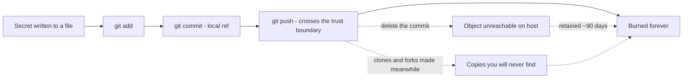
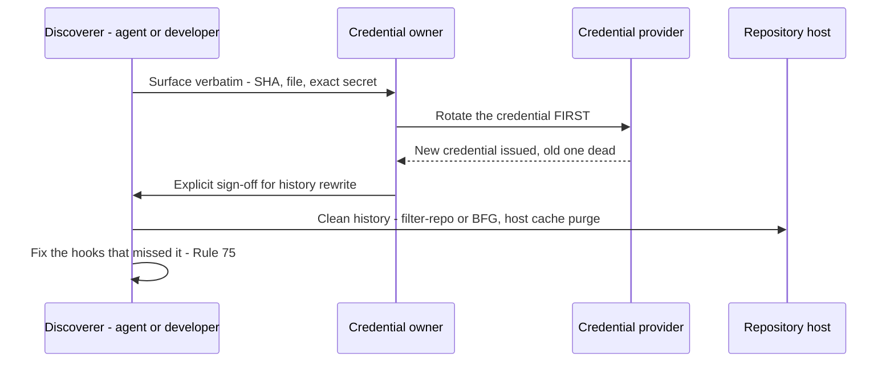
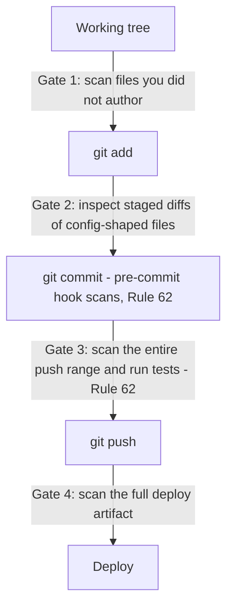
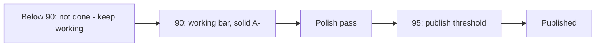
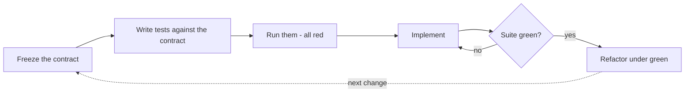
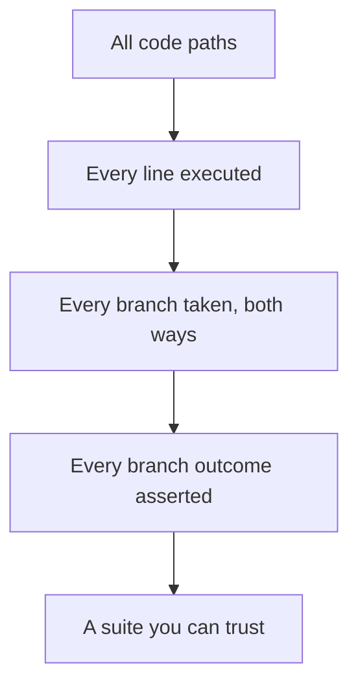

# Chapter 4 — Protect and Prove

> **Standing on Chapters 1–3:**
> - **Ch 1, First Principles** — the hard rules are absolute (no commit without a scan, no destruction without confirmation), and the Powell rule governs the whole crew, human and agent alike.
> - **Ch 2, Design** — everything that can change flows through one config layer; every backend hides behind a swappable interface, handed in by constructor injection, never reached for.
> - **Ch 3, Build** — builds are cross-platform on Podman, UBI, and OpenShift; errors fail loudly with context; dependencies are pinned, minimal, and audited.

Chapter 3 left you with software that builds — on every platform, in a UBI container, with errors that announce themselves and dependencies you can name and count. Built software is unproven software. A green build proves only that the compiler had no objections, and the compiler has never once been asked the two questions that matter before anything ships: is there something radioactive in this artifact, and does the thing actually work? Those are the two proofs you owe before any push, deploy, or demo, and this chapter is both of them.

The first proof is negative. Every other chapter in this book describes mistakes you can recover from — a bad merge reverts, a god class refactors, a broken deploy rolls forward. Git is a machine for undoing things, which is exactly why I trust it with so much autonomy elsewhere in these rules. A leaked credential is the one mistake the machine cannot undo, because it is not a state of the repository; it is a state of the world. The moment a key crosses a trust boundary — a remote, a registry, a cluster, a host you don't own — copies exist that you will never enumerate and never delete. The major hosts retain "deleted" objects for around ninety days; forks and clones retain them forever. And the leak never arrives in a file called `secrets.txt`. I once watched a competent team burn a production API key inside thirty harmless lines of deployment YAML — a port change, a memory limit, and one environment variable with a literal token pasted in during debugging. The reviewer saw "config churn" and approved it. The scanner that would have caught it was installed the following week.

The second proof is positive, and it rests on a line I first heard from a quality engineer decades ago: you get what you inspect, not what you expect. On that program the hardware got X-rayed and the software got a shrug and a demo — and the software is what came back from the field, on a branch of the retry logic that had never executed even once until a customer's flaky link executed it for us. For most of my career the honest objection to full inspection was cost: humans get bored writing the 400th test case, so we rationed, and every coverage target below 100% was a documented decision about which branches we'd rather discover in production. That economics is dead. A machine does not get bored writing the 4,000th test case. So I require total inspection — contract first, 100% line *and* branch coverage — and because coverage proves only that code was inspected, not that the software is good, I also require a grade: a written rubric where 90 is the working bar and nothing publishes below 95.

Two proofs, fourteen rules, one discipline — and the order runs by stakes, not by subject. Containment opens, because nothing else matters if the artifact is radioactive: the hooks that prevent the leak lead (Rule 62), and the rotation protocol and the no-copying rule follow (Rules 63 and 64), because those are the moments of maximum irreversibility — the ones where the right move has to be decided before the emergency. Rule 65 is the single scan-at-every-boundary gate; Rule 66 is the grade — the 90/95 rubric bar that decides whether anything ships at all. From there the testing structure takes its place, ranked like everything else here by how much each rule protects, and the post-leak hook-fixing rule closes the containment thread, exactly as promised above.

*The leak lifecycle: every solid arrow is reversible except the last. The dashed paths show why deletion is theater — unreachable objects linger on the host for about ninety days, and clones keep the secret forever.*

## Rule 62: Hooks Before the First Commit

**Secret-scanning hooks are mandatory in every repo, installed before the first commit, not after: a pre-commit hook (gitleaks + detect-secrets) and a pre-push hook that rescans and runs the tests. `.gitignore` covers `.env*`, keys, certs, and credential files from day one.**

The ordering clause is the whole rule. Everyone agrees secret scanning is a good idea; almost everyone installs it on day four, after the repo "settles down." But the first commits of a project are precisely the most dangerous ones. Day one is when you're wiring up the API client and the temptation to paste the key inline "just to see it work" is strongest. Day one is when there's no `.env` file yet, no config layer, no reviewer. Day one is when nobody is watching, including you.

So the sequence is fixed: `git init`, install the hooks and the `.gitignore`, *then* write code. In my repos this is a single bootstrap step — the pre-commit config in Appendix A drops in unmodified, gitleaks and detect-secrets included, and takes under a minute. A minute is a price; a rotation is a project.

Two hooks, not one, because the threat model changes between commit and push. The pre-commit hook is the first tripwire: it scans the change you think you're making. A commit is local — embarrassing, but recoverable. A push crosses the trust boundary, and per the lifecycle diagram above, what crosses doesn't come back. So the pre-push hook gets its own scan, even though every commit in it was supposedly scanned already — "supposedly" is doing heavy lifting in that sentence. Hooks get bypassed in moments of haste; commits arrive from rebases, cherry-picks, and other machines where the hooks weren't installed; an agent may have made commits in a different session under different rules. The pre-commit hook checks the change; the pre-push hook checks the *history* you're actually about to publish. They are different questions, and you want both answered. The tests ride along on push for the same boundary logic — Rule 8 already says green before commit, but the push is the moment your code stops being your problem and starts being the team's, so the suite runs once more against the branch you're publishing, not just the working tree you last looked at. Yes, this makes pushing slower. It's supposed to. The push is the last gate that runs on hardware you control; everything after it is incident response.

Underneath the scanners sits the dumber, sturdier layer: the `.gitignore`. Scanners are pattern-matchers, and pattern-matchers miss things; the ignore file excludes entire categories of files that have no business in version control before any scanner has to be clever about their contents — `.env` and every `.env.*` variant (with `!.env.example` carved back in), `*.pem`, `*.key`, `*.pfx`, `*.crt`, `id_rsa*`, `credentials.json`, `service-account*.json`, the cloud-CLI config directories. Appendix B has the full block; it pastes in as-is, on day one, for the same reason the hooks do. `git add .` is a reflex, and on a young repo it sweeps up whatever's lying around — including the service-account JSON you downloaded ten minutes ago to get the demo working. Ignore by category, not by incident: if a `deploy.key` slipped past once, the fix is `*.key`, not `deploy.key`, because the next leak always has a different filename. And treat the ignore file as a backstop, not a permission slip — a gitignored `.env` full of production credentials is still one `git add -f` or one screen-share away from trouble.

The rule also binds the AI agents that do an increasing share of my commits. An agent that finds a repo without scan hooks doesn't shrug and proceed on the grounds that "the repo doesn't have hooks yet" — it installs them before its first commit, the same as I would. Hooks are infrastructure the way a `.git` directory is infrastructure: their absence isn't a style choice, it's a repo that isn't finished being created. One pragmatic note: a hook you can casually bypass trains you to bypass it. `--no-verify` exists for genuine emergencies, and if you find yourself reaching for it twice in a month, the problem is your baseline file or your patterns — fix the configuration, don't develop the habit.

## Rule 63: Rotate First, Clean History Second

**A secret that ever touched a commit is burned. Rotate first, clean history second — pushed objects outlive deletion.**

This is the rule people most want to negotiate with, so let me close the exits. "It was only pushed for a minute." Scrapers watch public push events in real time; a minute is plenty. "It's a private repo." Private means a smaller audience, not a trustworthy one — and repos change visibility, get forked, get cloned to laptops that get stolen. "I force-pushed over it." You rewrote the refs, not the objects; on the major hosts, the unreachable objects remain fetchable by hash for around ninety days, and any clone or fork made before your cleanup keeps the secret with no expiration date at all. There is no sequence of git commands that un-publishes data. None.

Once you accept that, the ordering becomes obvious. Rotation is the only step that actually revokes access, so it goes first — before the history rewrite, before the post-mortem, before lunch. A burned key with a pretty history is still burned; a rotated key with an ugly history is harmless. Teams that clean history first are polishing the crime scene while the suspect drives away.

The full protocol: stop what you're doing. Surface the finding to the credential's owner verbatim — the SHA, the file, the secret itself, unredacted, because the owner needs to identify exactly which credential to kill (this disclosure to the owner is the one exception to Rule 64's no-copying rule, and it goes to the owner only). Rotate. *Then*, with explicit sign-off — history rewrites are destructive operations under Rule 5 — clean up with `git filter-repo` or BFG, and ask the host to purge its caches. Then proceed to Rule 75, because the incident isn't over until the hooks are smarter.

*The rotation protocol. The order is the point: nothing about history cleanup is urgent once the key is dead, and nothing about it helps while the key is alive.*

## Rule 64: Never Copy a Secret Anywhere

**Never copy a discovered secret anywhere — not into chat, not a scratch file, not "temporarily."**

The instinct, on finding a secret, is to grab it: paste it into the chat to ask "is this real?", drop it in a scratch file to deal with after lunch, quote it in the bug ticket, echo it to the terminal mid-debug. Every one of those copies feels free and is not. The chat transcript is stored on someone else's infrastructure and may feed a training pipeline. The scratch file outlives lunch, falls outside the `.gitignore`, and gets swept into the next `git add .`. The ticket is readable by everyone with project access, forever. The terminal echo lands in shell history and the session log. Each copy is a new leak site with its own retention policy, its own audience, and no scanner watching it — and ten rules of containment go down the drain at the speed of Ctrl-V.

This rule binds AI agents hardest, because copying text is what we're *built* to do. An agent that finds a key and helpfully reproduces it in its summary — "I found `sk-live-...` in config.yaml, you should rotate it" — has just written the secret into a conversation log it doesn't control. The correct report names the file, the line, and the shape: "config.yaml line 41 contains what appears to be a live provider API key." Location, not payload.

The one exception was stated in Rule 63: surfacing the exact secret verbatim *to its owner* during the rotation protocol, because the owner must identify precisely which credential to kill. That disclosure goes to the owner, through the most direct channel available, once. Everywhere else, the discipline I learned around radioactive key material applies unchanged: you handle it with tongs, you log that it exists, and you never, ever take it home in your pocket.

## Rule 65: Scan every boundary before you cross it

**Scan at every trust boundary before you cross it: the staged diff of every config-shaped file, the entire push range (not just the tip), any file you didn't author, and the full deploy artifact — image context, manifests, env bindings. Leaks hide best in "harmless" config nobody re-reads.**

The hooks from Rule 62 are the automated floor. This rule is the discipline that rides on top of them, because a secret can slip across any of four boundaries, and each one fails differently. Walk them in order.

*The staged diff, before commit.* The leak in my opening story didn't arrive in a file called `secrets.txt`. They almost never do. A file with a scary name gets scrutiny; a deployment YAML getting its third routine touch this week gets a skim. That's the camouflage: config files change constantly, their diffs are repetitive and dull, and a literal token sits comfortably among the ports and timeouts because syntactically it *is* just another string value. The most dangerous line in any diff is the one your eyes were trained by a hundred boring diffs to slide past. So config-shaped files get a mandatory close read at commit time — `git diff --cached --stat` for the overview, then the full staged diff of anything matching `.env*`, `*.yaml`, `*.yml`, `*.json`, `*.toml`, anything with `secret` or `credential` in the name, and anything under `infra/`, `deploy/`, `k8s/`, `terraform/`, `helm/`. Not the file — the *diff*, line by line, with one question: is any value here a literal credential instead of a reference to one? A healthy config diff names secrets — `secretKeyRef`, `${API_TOKEN}`, a vault path. The moment it contains the *value* of one, you've found the leak before it happened.

*The push range, before push.* A push doesn't publish a snapshot; it publishes *history*. Commit three adds a key for local debugging; commit five removes it because you noticed. The working tree is clean, the tip is clean, and a scan of `HEAD` waves the push through — but all five commits cross the boundary, and commit three crosses with the key fully retrievable by anyone who can run `git log -p`. "It was only there for two commits" is not a mitigation; it's a description of exactly where automated scrapers look first, because developers clean up tips and forget middles. So the pre-push scan runs over the full range — everything in `<upstream>..HEAD`, every commit, every version of every file. Gitleaks does this natively against a commit range. When it fires on an intermediate commit the push stops, full stop — and read Rule 63 before you reach for a rebase to scrub it: if the range was ever pushed anywhere before, even to a private fork, even briefly, the key is already burned and rotation comes first.

*The unauthored file, before `git add`.* Files you wrote are covered by Rule 3 — you never typed a secret in, so there's nothing to find. Files you *didn't* write are a different species: the vendor's sample config, the dataset a colleague handed you, the generated kubeconfig, the repo you're vendoring in, the file an agent produced in a previous session. You don't know their history, so you treat them the way customs treats an unaccompanied bag. The good news is that secrets are conspicuous once you look — provider key prefixes (`sk-`, `gsk_`, `ghp_`, `AKIA`, `AIza`, the Slack `xox` family), the three-part `eyJ...eyJ...` silhouette of a JWT, `-----BEGIN` private-key blocks, suspiciously long high-entropy base64 runs, plausible passwords in the `data`/`stringData` block of a Kubernetes secret manifest. This gate sits *before* `git add`, not before commit, because hooks check patterns while a reader checks *context*: a scanner sees a base64 string; a human sees it labeled `prod_db_password` in `values-staging.yaml` and asks the obviously necessary question.

*The full deploy artifact, before deploy.* Deploys have the biggest blast radius, because the artifact is assembled from more than the repo: the container image and everything `COPY` swept into it, the rendered manifests with values merged in, the environment bindings the platform injects, the chart defaults nobody has read since the chart was vendored, the `.env` mounted at runtime. Any one can carry a credential no git diff will ever show you, because it was never in git — or worse, was in git all along, before your scanners existed. So the scope is the *full artifact*, not the delta. "We only changed two files since the last deploy, scan those" silently assumes the last deploy was clean, and the one before it, all the way back to a first deploy that predates your hooks. Layered images and rendered configs inherit history the way commits do. Scan the image build context before the build, scan the rendered manifests after templating (the template is innocent; the *rendered* values are where literals appear), and check that the credential substrate the deploy reads from — the mounted env file, the referenced platform secret — isn't *also* embedded literally in some version-controlled file. Rule 41 already says pre-deploy gates are never disabled by default; this names the gate that matters most. "It's just a quick demo" deploys to someone else's machine all the same.

*The four scan gates, in order. Each gate assumes the previous ones failed — that redundancy is the design, not an inefficiency. Trust no prior commit blind; scan what you're about to cross.*

---

The heaviest containment calls are now made — prevention, rotation, non-propagation, and the four-boundary scan. The post-leak rule that hardens the gates after a miss waits at the end of the chapter, where it belongs. What comes first is the second proof: establishing that what ships actually works, by inspection rather than expectation. It opens with the bar that proof answers to — the grade — and the maxim is the same one that drove the scan gates, you get what you inspect, now pointed at the software itself.

## Rule 66: You get what you inspect — and it gets a grade

**You get what you inspect: test-driven, not test-after — and graded. Every project keeps a rubric scoring how good the software actually is. 90% is the working bar, polish to 95%, nothing publishes below 95%.**

Coverage proves the code does what its tests say. It is structurally incapable of telling you whether the software is any good — whether the CLI's errors help anyone, whether the latency is tolerable, whether the docs let a stranger start in five minutes. A fully covered product can still be a bad product. Different question, different instrument.

The instrument is a rubric: a written, project-specific scorecard of what "good" means for *this* software — correctness, robustness, performance, usability, documentation, whatever the project actually owes its users — with weights and a score. Writing it forces the conversation teams otherwise have implicitly and too late, usually in the form of an argument about whether the thing is "done." The rubric is the definition of done, decided in advance, in writing, where deadline pressure can't renegotiate it.

The grades have teeth. Ninety percent is the working bar — solid A− software, dependable, honest about its limits. Below 90, it isn't done; keep working. From 90 you run a polish pass — the error messages, the rough edges, the README — to 95. Nothing publishes below 95.

*The rubric gauge: 90 means it works; 95 means you'd put your name on it.*

Why 95 and not 100? Because the last five points cost more than the next project's first ninety, and chasing them is how perfectionists ship nothing. A− working, A at the door. Inspected, graded, and published with the grade on record.

## Rule 67: No test, no ship

**New logic ships with tests; bug fixes ship with a regression test written failing-first, before the fix.**

Two clauses, and the second one is where the discipline lives. Anyone can agree that new code needs tests. The failing-first regression test is the part people skip, and it's the part that pays.

Here's the failure mode. A bug comes in. You read the code, spot the off-by-one, fix it, and *then* write a test to memorialize the fix. The test passes. Wonderful. But you never saw it fail — so you have no evidence it detects the bug at all. I have watched a team carry a "regression test" for two years that asserted the behavior of a code path the bug never touched. The bug came back. The test stayed green. Both facts were discovered in the same incident review, which is the most expensive way to learn anything.

The order is the whole rule: reproduce the bug as a test, run it, watch it fail, *then* fix the code, then watch the test flip to green. That red-to-green transition is the only proof you'll ever have that the test and the bug are actually connected. Skip it and you're filing paperwork, not building a regression net.

For new logic, "ships with tests" means in the same commit — not a follow-up ticket, not "once things settle down." Things never settle down. A commit that adds behavior without adding the inspection of that behavior is half a commit, and the missing half is the half that protects you next quarter when somebody — possibly an AI agent, possibly you — refactors the module without remembering what it promised.

## Rule 68: Contract first, code second

**Define and freeze the API or interface, write the tests against the contract, then implement. Never the reverse.**

When you write the implementation first and the tests after, the tests inevitably describe what the code *does*, not what it *should do*. They pin the accidents along with the intent — that quirky null return, that undocumented ordering. Now the bugs have test coverage protecting them. I've inherited suites like that: hundreds of green checks, every one of them an affidavit swearing the mistakes were on purpose.

So invert it. First, decide what the thing promises — the function signatures, the endpoint shapes, the error behavior — and freeze that contract. Second, write the tests against the contract while the implementation doesn't exist yet, which guarantees the tests can't peek at internals, because there are no internals. Third, implement until the suite goes green. The contract is the specification, the tests are the specification made executable, and the implementation is merely the first thing that satisfies it.

This matters double when an AI is writing the implementation. An agent given a frozen contract and a failing test suite has a precise, machine-checkable target; it will iterate against the suite until everything passes. An agent told "build a user service, then add some tests" will happily build something and then certify its own guesses. Test-after with an AI isn't just weaker — it's circular.

*The contract-first loop: the specification exists and is executable before the first line of implementation does.*

## Rule 69: 100% — lines and branches

**100% line and branch coverage — every branch exercised and asserted. Yes, 100%; configure the runner to fail under it.**

Every time I say this out loud, somebody quotes me the conventional wisdom: 100% coverage has diminishing returns, 80% is the pragmatic sweet spot, chasing the last fifth is vanity. That wisdom was correct — when humans wrote the tests. The last 20% of branches are the tedious ones: the error handlers, the empty-input guards, the else-arms of defensive checks. Tedium is precisely the cost that no longer applies. The machine writes those tests without complaint, so the old cost-benefit math is obsolete, and I've updated my answer accordingly.

Note the rule says *branch* coverage, and then it says more than that: exercised *and asserted*. Line coverage is the weakest signal there is — a line "covered" by a test that asserts nothing has merely been executed, not inspected. Branch coverage is stronger: both arms of every `if`, every loop's zero-iteration case, every early return. But even an exercised branch proves nothing unless the test asserts what happened on that path. The funnel narrows from "it ran" to "it ran both ways" to "we checked the result both ways," and only the bottom of the funnel is inspection.

*The coverage funnel: each stage is necessary; only the last one is sufficient.*

Make the threshold mechanical. The runner fails under 100% — `--cov-branch --cov-fail-under=100` or your stack's equivalent — so the bar is enforced by tooling, not by whoever feels strict that week. A threshold that requires a human to defend it will eventually meet a deadline that outranks the human.

## Rule 70: Correctness over speed

**The delay to reach full coverage and verified behavior is acceptable and expected.**

This rule exists because every other rule in this chapter will, at some point, be standing between you and a deadline, and somebody will propose the obvious trade: ship now, test later. This rule is the pre-written answer, agreed to in calm weather so it doesn't have to be litigated in a storm: no. The delay is not a regrettable cost overrun. It is the budgeted price of knowing the thing works, and it was approved when the project started.

I spent years in environments where the software shipped inside hardware — burned into devices that went places no patch could follow. Nobody in that world asked whether verification was worth the schedule slip, because everyone could picture the alternative: a recall, a field failure, a very quiet meeting. The web era taught a generation that shipping broken is fine because patching is cheap. Patching is cheap. Burned trust, corrupted data, and 2 a.m. incident bridges are not, and those are what "ship now, test later" actually purchases.

The AI twist cuts both ways here, and it's worth being honest about it. Agents have made the *delay* smaller — full coverage costs hours now, not weeks, which makes the trade easier to refuse. But agents have also made it cheaper than ever to generate plausible, confident, untested code at volume. Speed of production without speed of verification just means you can now be wrong at scale. The machine's patience for writing tests is only an advantage if you spend it.

So when the estimate includes the testing time and someone asks if there's a faster version: there is, and we're not shipping it.

## Rule 71: Coverage never goes down

**Coverage going down is a stop-and-fix, not a "justify it."**

Most coverage policies I've seen have a ratchet with a release lever: coverage shouldn't drop, but if it does, write a paragraph explaining why and carry on. I've watched that lever get pulled so many times the paragraph became a template. "Coverage temporarily reduced pending follow-up" — there's a phrase that has outlived several of the companies it was written at.

The problem with "justify it" is that justification is a negotiation, and negotiations get won by whoever has the deadline. Stop-and-fix is not a negotiation. The number went down; the work stops until it goes back up. That's the entire policy, and its strength is that it has no second sentence.

Mechanically, a coverage drop means one of two things happened. Either new branches arrived without tests — which is a Rule 67 violation wearing a trench coat — or a refactor orphaned some tests and the paths they used to inspect are now dark. Both are defects in the change that's in front of you right now, while the context is loaded in your head and the diff is small. Fixing them today costs minutes. Fixing them in six months costs an archaeology project: which commit dropped it, what was that branch for, does anyone remember what this error path was supposed to do?

If you hold the line at 100% (Rule 69), this rule enforces itself — the runner simply fails. Rule 71 exists for the transition period, the legacy repo you're ratcheting upward, the project you inherited at 60%. Whatever today's number is, it is the floor. The ratchet only turns one way, and there is no lever.

## Rule 72: Full regression, every feature, with the numbers

**Run the full regression suite after every feature; report the test count and any failures.**

The first half is mechanical: after every feature lands, the entire suite runs. Not the tests near the change — all of them. The whole point of a regression suite is catching the breakage you didn't predict, and selecting "relevant" tests by hand is predicting it. When suites are fast — and offline-by-construction suites (Rule 74) are fast — running everything is cheap enough that selectivity is pure risk with no payoff.

The second half is the part people leave out, and it's the part I actually insist on: *report the count*. Not "tests pass" — "412 tests, 0 failures." The habit looks like bureaucracy until the day it catches something. "Tests pass" and "tests pass — all 9 of them, because the collector silently skipped the other 400 after an import error" produce identical green checkmarks. I've seen a misconfigured runner report success on a fraction of the suite for weeks; everyone read green and moved on. A human who'd been typing "412 tests" all month would have noticed "9 tests" instantly. The count is a heartbeat: cheap to take, and its absence is diagnostic.

This rule matters more with AI agents in the loop, not less. An agent reporting on its own work has every incentive — structural, not malicious — to summarize happily. Requiring the number forces the report to carry evidence instead of vibes, and it gives the human a one-glance sanity check that the inspection actually happened at the scale claimed. "All green" is an opinion. "All 412 green" is a measurement. We ship on measurements.

## Rule 73: Set a latency budget and gate it

**Declare a latency and throughput budget, then gate regressions against it the way you gate coverage. Determinism and latency are features: set the ceiling explicitly and fail the build when a change blows past it — a silent slowdown is a defect that ships.**

Functional tests answer "is it correct?" They are silent on "is it fast enough?", and that silence is where performance rots — never in one catastrophic commit, but in a hundred small ones, each adding three milliseconds nobody measured. Six months later the endpoint that returned in 40ms returns in 400, every step of the decay was green, and the bug report that finally surfaces it is a user saying the app "feels slow." There is no failing test to point at, because nobody ever wrote down what fast meant.

I spent years building systems where latency wasn't a nice-to-have — a network encryptor that added measurable delay to every packet, an RTOS where a missed deadline was a defect by definition, not a degradation. In that world you stated the budget up front — this path completes in under N microseconds, this throughput holds at M packets per second — and a build that violated it failed, exactly like a build that returned the wrong answer. The discipline transfers directly: pick the paths that matter, write the number down, and put a gate on it. A benchmark in CI that asserts p99 stays under the ceiling. A throughput check that fails the build when it drops below the floor. The number is a contract, the same as a coverage threshold, and it is enforced by tooling rather than by whoever remembers to profile.

The AI era makes this sharper, not softer. An agent optimizing for "tests pass" will cheerfully add an N+1 query, an unbounded retry, or a synchronous call in a hot loop — every one of them green, every one of them slower. The agent has no instinct for latency; the gate is the instinct, externalized. A slowdown nobody asserted against is a slowdown that ships, and the budget is the only thing standing between "correct" and "correct but unusable."

## Rule 74: No network in unit tests

**No network calls in unit tests — fakes, mocks, and fixtures.**

A unit test that touches the network is not a unit test. It is an integration test with a unit test's name tag, and it will betray you on exactly the schedule networks fail: intermittently, unreproducibly, and always during the release build.

The damage compounds in a specific way. The first time the suite fails because some staging endpoint hiccuped, somebody reruns it and it passes. The third time, "rerun the suite" becomes standard advice. By the tenth time, a red build means nothing — maybe a bug, maybe the Wi-Fi — and a test suite whose red can't be trusted is worse than no suite, because it still costs maintenance while providing alibis instead of information. Flakiness isn't a nuisance; it's how a suite dies.

The fix is the seam you already built if you've been following Chapter 2: dependencies arrive through interfaces via constructor injection, so the test hands in a fake. The fake returns canned responses in microseconds, simulates the timeout and the 500 and the malformed payload on command — failure modes you could wait weeks for a real endpoint to produce, served deterministically and on demand. Unit tests get fakes; the offline-by-construction suite runs in seconds, anywhere, including on a plane and in a CI runner with no egress.

Real-network testing still happens — in the integration tier, clearly labeled, running on its own cadence, allowed its own failure modes. The rule isn't "never test the network." It's that the fast suite — the one gating every commit under Rule 72 — depends on nothing but the code under test. That suite must be incapable of lying about whose fault a failure is.

## Rule 75: Fix the Hook That Missed It

**After any leak, document what scan would have caught it and fix the hooks so it can't recur.**

The chapter closes where it opened — on containment, because the last word on a leak isn't the rotation, it's the gate. Every leak is two failures: a secret got loose, and a gate that should have stopped it didn't. Rotation (Rule 63) handles the first. Most teams stop there, which is how the same leak happens twice — same shape, same gap, eighteen months apart, with only the key prefix changed. The second failure deserves the same rigor as the first.

The post-incident question is narrow and answerable: *which gate, configured how, would have caught this?* Walk the gate map from this chapter. Was there no pre-commit hook (Rule 62)? Did the hook exist but lack a pattern for this provider's key format? Was the file gitignore-able by category and not ignored (Rule 62)? Did a stale detect-secrets baseline whitelist the very line that leaked? Did the tip get scanned but not the range (Rule 65)? Was the artifact assembled from something outside the repo that no gate ever saw (Rule 65)? The answer is rarely "no tool could have caught this." It is almost always "the tool was missing, misconfigured, or scoped too narrowly."

Then fix it, and make the fix verifiable: add the missing pattern and a test case with a defanged dummy secret that proves the hook now fires. Write the incident down — date, what leaked, which gate failed, what changed — in the bug log, where the next maintainer will find it. And audit sideways: the habit or session that produced this leak probably touched other repos the same week. Carelessness patterns; check its other haunts.

A leak that buys you a permanently better gate was expensive tuition. A leak that buys you nothing is just a rehearsal for the next one.

### Chapter 4 card

- **62.** Secret-scanning hooks before the first commit — pre-commit (gitleaks + detect-secrets), pre-push that rescans and runs the tests, and a `.gitignore` covering `.env*`, keys, certs, and credential files from day one.
- **63.** A secret that ever touched a commit is burned: rotate first, clean history second; pushed objects outlive deletion.
- **64.** Never copy a discovered secret anywhere — not chat, not a scratch file, not "temporarily." Report location, not payload.
- **65.** Scan at every boundary before you cross it — staged config diffs, the full push range (not the tip), files you didn't author, and the whole deploy artifact. Leaks hide best in "harmless" config.
- **66.** You get what you inspect: keep a rubric and grade the software — 90 is the working bar, polish to 95, publish at 95+.
- **67.** New logic ships with tests; bug fixes ship with a regression test that failed first.
- **68.** Freeze the contract, write tests against it, then implement — never the reverse.
- **69.** 100% line *and* branch coverage, every branch asserted; the runner fails under it.
- **70.** Correctness over speed — the verification delay is budgeted and expected.
- **71.** Coverage going down is stop-and-fix, not "justify it."
- **72.** Full regression after every feature; report the test count, not just "green."
- **73.** Declare a latency and throughput budget and gate regressions against it — a silent slowdown is a defect that ships.
- **74.** No network in unit tests; fakes, mocks, and fixtures only.
- **75.** After any leak, identify the scan that would have caught it and fix the hooks so it can't recur.
