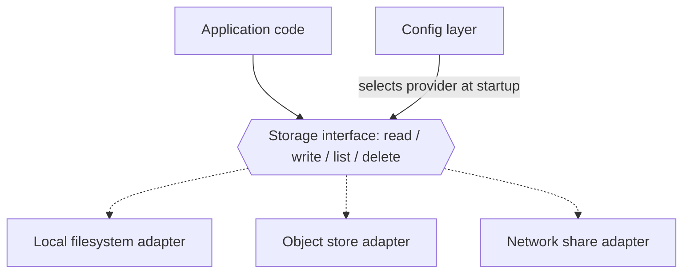
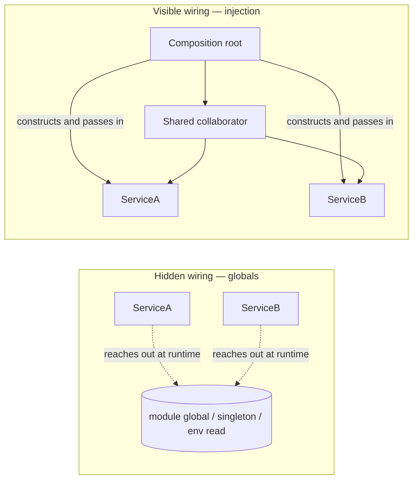
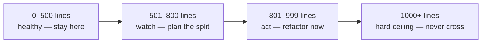

# Chapter 4 — Architecture

I have written production code in assembly, C, Ada, Java, Python, Go, and a few languages that no longer have working compilers. The most valuable thing I learned across all of them: the language never saved a project, and the language never killed one. Architecture did both, repeatedly.

The most successful system I ever worked on was written in C. No classes, no interfaces keyword, no garbage collector — a language that hands you a pointer and wishes you luck. And yet that system was object-oriented in every way that matters. Each module owned one responsibility and a private data structure nobody else touched. Function pointers in structs gave us swappable implementations behind a fixed contract. Initialization passed collaborators in explicitly; nothing reached out and grabbed a global. We didn't have a compiler enforcing any of it. We had discipline, a design document, and code review with teeth. That system shipped, passed certifications that would make your auditor weep, and ran for decades.

I have also watched a beautifully fashionable codebase — latest framework, latest language, conference-talk-grade tooling — collapse under its own weight in eighteen months because nobody could say what any given module was *for*. Every class knew about every other class. Configuration was sprayed across forty files. The team didn't have an architecture; they had a pile with naming conventions.

So when someone tells me the next language will fix their problems, I smile and check their module boundaries. Architecture is the set of decisions about responsibility, dependency, and size — who owns what, who talks to whom, and how big anything is allowed to get. Those decisions are language-independent, they are made (deliberately or by accident) on day one, and they are nearly impossible to retrofit once a hundred thousand lines have calcified around them.

This chapter holds ten rules about those decisions. They are not academic. Each one is a scar with a number on it. AI agents make them *more* important, not less: an agent generating code at machine speed will happily produce a god class by Friday if you let it, and it will just as happily produce clean, composed, injected modules — if the rules demand it. The agent doesn't care. The rules have to.

## Rule 31: Objects with one job each

**Default to object-oriented design with clear responsibilities; prefer composition, use inheritance sparingly.**

Object-oriented here does not mean "uses the `class` keyword." It means each unit of the system has one responsibility, owns its own state, and exposes a deliberate surface. You can do that in C with structs and function pointers — I spent years doing exactly that — and you can fail to do it in Java while drowning in classes.

The operative phrase is *clear responsibilities*. When I review a design, my first question for every component is: what is this thing's job, in one sentence, without the word "and"? If the answer needs a paragraph, the design is wrong. A component with a one-sentence job is testable in isolation, replaceable without surgery, and explainable to the next engineer — or agent — in seconds.

Composition over inheritance is the second half, and it earns its place in the rule because inheritance is the most abused tool in the OO toolbox. An inheritance hierarchy is a promise that the child *is* a kind of the parent, forever, including all behavior you haven't read yet. Three levels deep, a change to a base class becomes a game of minesweeper. Composition makes the same relationship explicit and severable: the object *has* a collaborator, the collaborator arrives through the constructor, and you can swap it without archaeology.

Inheritance still has its uses — a genuinely stable is-a relationship, a framework that demands it. Use it there, sparingly, like a spice. If you find yourself overriding a parent method to neuter it, you didn't want inheritance; you wanted a smaller interface and a composed part.

## Rule 32: Every vendor axis gets an interface

**Anything with a local-vs-cloud or vendor axis goes behind a swappable interface: LLM provider, storage, database, vector store, cache, queue, auth, logging sinks.**

Any time your system touches something that comes in more than one flavor — and today, everything does — the flavor decision goes behind an interface. One contract, N providers, selected by configuration at startup. The application code knows the contract and nothing else.

*One contract, many providers: application code depends on the solid line; the dashed implementations are interchangeable at configuration time.*

The payoff list is long. Local development runs against the filesystem adapter with zero cloud credentials. Unit tests run against an in-memory fake satisfying the same contract — no network, no flakes. The on-prem customer gets their deployment with a config change instead of a fork. And when the vendor you chose triples its prices — they do this; I've watched it happen more than once — migration is one new adapter and one config line, not a six-month rewrite with a project codename.

This rule has teeth in the AI era specifically. Model providers are the most volatile vendor axis in computing right now: pricing, capability, and availability shift quarterly. A codebase with provider calls inlined at fifty call sites is married to that provider. A codebase with one `LLMProvider` interface dates them.

The interface itself should be boring: the minimal set of operations your application actually needs, not the union of every feature every vendor offers. Design the contract from the consumer's side. If only one provider supports a feature, that feature is not in the contract — it's a reason to reconsider the feature.

## Rule 33: Collaborators come through the front door

**Dependency injection over module-level globals and singletons — collaborators arrive via the constructor.**

Dependency injection has an enterprise-framework reputation it does not deserve. Strip away the XML and the annotations and it is one sentence: an object is *given* the things it needs, instead of going out and finding them. The constructor is the front door. Everything an object collaborates with walks through it, visibly, at construction time.

The alternative — module-level globals, singletons, classes that read the environment from inside a method — is hidden wiring. The object's true dependencies are invisible in its signature and discoverable only by reading every line of its implementation. You can't test it without recreating its ambient world. You can't run two configurations in one process. And when something misbehaves in production, you get to play "who mutated the global" at 2 a.m. I once played that game on a system where the global was a hardware register map shared across interrupt contexts — a layer where the crash takes the whole box with it. I do not recommend the experience.

*Globals hide the wiring inside the boxes; injection puts every dependency on the diagram — and in the constructor signature.*

There should be exactly one place in the program — call it the composition root, usually `main` — where concrete objects are built and snapped together. Everything below that point receives its collaborators and asks no questions. This pairs directly with Rule 32: the interface defines what can be swapped; injection is the mechanism that does the swapping. You rarely need a framework for it. A constructor and some discipline cover ninety percent of real systems.

## Rule 34: SOLID where it earns its keep

**Apply SOLID where it earns its keep, especially Single Responsibility and Dependency Inversion.**

SOLID is five principles, and I'll be honest with you the way the acronym's fan club usually isn't: they do not pull equal weight.

Single Responsibility is the workhorse. One reason to change per module. It's Rule 31 restated at every scale — function, class, file, service — and it's the principle whose violation I can spot from across the room: the class named `Manager` or `Processor` that does parsing, validation, persistence, and notification, and that everyone is afraid to touch.

Dependency Inversion is the other load-bearer: depend on abstractions, not concretions; let the stable core define interfaces that the volatile edges implement. Rules 32 and 33 are Dependency Inversion wearing work clothes. Get these two principles right and the architecture mostly takes care of itself.

The other three are situational. Open/Closed is useful at genuine extension points and a license to over-abstract everywhere else. Liskov Substitution matters exactly as often as you use inheritance — which, per Rule 31, should be sparingly. Interface Segregation is real but usually falls out for free once you design contracts from the consumer's side.

The phrase that matters in this rule is *where it earns its keep*. Principles are tools, not virtues. I have seen codebases wrecked by under-engineering, and I have seen just as many wrecked by engineers applying all five principles to a 2,000-line utility, producing a cathedral of interfaces with one implementation each. Every abstraction has a carrying cost: another file to read, another indirection to trace. An abstraction that doesn't pay rent — doesn't enable a real swap, a real test, a real boundary — is debt with good posture. Evict it.

## Rule 35: One non-trivial class per file

**One non-trivial class per file; small helpers and DTOs may share.**

This rule sounds like pedantry until you've spent a week inside a 3,000-line file containing eleven classes that "seemed related at the time." Then it sounds like wisdom.

One non-trivial class per file makes the filesystem your architecture diagram. `ls src/storage/` tells you what storage components exist before you've opened anything. The file name and the class name agree, so search works, navigation works, and — increasingly important — an AI agent can find the thing it needs to change without slurping half the repository into its context window. Code organization used to be a courtesy to human readers; now it's also an efficiency multiplier for machine ones. A well-factored repo is one an agent can edit surgically. A heap is one it can only edit approximately.

The rule also enforces honesty about coupling. When two classes live in one file, they tend to grow informal intimacies — reaching into each other's internals, sharing module-level state — that nobody ever decided to allow. Move them to separate files and every dependency between them must become an explicit import. Explicit dependencies can be reviewed. Ambient ones just accrete.

The escape clause is deliberate: *small helpers and DTOs may share*. A dataclass with four fields does not deserve its own file, and a module that exports one real class plus its two-line exception type is fine. The test is the word "non-trivial." If a class has behavior — logic worth testing on its own — it gets its own file. If it's a named bag of fields or a five-line helper that exists to serve the main class, it can ride along. Don't let the escape clause become the rule; the eleventh dataclass in a file is usually a class with ambitions.

## Rule 36: Architecture beats language

**Architecture matters more than language or framework.**

I told the story in the opener; here is the principle distilled. The system I'm proudest of was written in C — a language with no native objects, no interfaces, no memory safety — and it had an object-oriented architecture so disciplined that we swapped hardware platforms underneath it without touching the core logic. The architecture was the asset. The language was a detail.

Run the experiment mentally. Take a great team and a clean architecture, and force them to use a boring, unfashionable language: you get a solid system with some verbose patches. Now take a muddled architecture — no boundaries, global state, everything coupled to everything — and hand it the most elegant language of the decade: you get an elegant-looking mess, and the elegance makes it worse, because expressive languages let you build tangles faster and with fewer keystrokes.

This is why language and framework debates are the most overweighted conversations in software, dorm-room arguments wearing business casual. Languages are mostly interchangeable for mainstream work; choose for ecosystem, team fluency, and platform fit, then stop talking about it. The decisions that will determine whether the system is alive in ten years are the ones this chapter is about — responsibilities, interfaces, dependency direction, size — and every one of them can be made well or badly in any language.

Frameworks deserve one extra warning: a framework is a set of architectural decisions someone else made, on a schedule someone else controls. Sometimes that trade is worth it. But keep the framework at the edges and the core logic framework-free, because frameworks have a half-life and your domain logic shouldn't share it. I've outlived a lot of frameworks. Architecture is the part that travels.

## Rule 37: Search before you build

**Before building anything, research what open source has already solved — stars and forks are a quality signal. Check the codebase for something to adapt before inventing.**

The most expensive code in any system is the code you didn't need to write. It costs the writing, then the testing, then the documenting, then the maintaining, forever — and it usually re-solves a problem that a thousand-star open-source project solved years ago, complete with the edge cases you haven't hit yet.

So the standing order, for humans and agents alike: before writing original code, search. First the world — is there a maintained open-source project that does this? Stars and forks aren't a popularity contest; they're a proxy for battle-testing. A project with thousands of stars, recent commits, and a real issue tracker has had its corner cases found by other people, on other people's schedules, at other people's expense. That is a gift. Take it. (Vet the license and the maintenance pulse first — Chapter 9 covers the vetting funnel.)

Then search your own repository — the codebase you're standing in probably solved a similar problem last quarter. Adapt the existing pattern instead of inventing a rival one. Two retry mechanisms, two config loaders, two date-formatting helpers: that's how codebases develop dialects, and dialects are where bugs breed.

Original code is the last resort, reserved for the parts that make your system *yours* — the domain logic, the secret sauce. Everything else is plumbing, bought off the shelf. I learned this slowly, because early in my career there was no shelf: if you wanted a protocol stack, you wrote a protocol stack. That world is gone. The engineer who spends a week hand-rolling what a library does better isn't being rigorous; they're being expensive. The lazy engineer who searches first — in the best sense of lazy — ships sooner and maintains less.

## Rule 38: The file-size gauge

**Source files target ≤500 lines, never exceed 1000; past 800, actively refactor.**

File size is the cheapest architecture metric there is. It needs no tooling, no judgment, no meeting — `wc -l` is the whole audit — and yet it correlates with almost everything that matters. A file that has grown past a thousand lines is almost never one responsibility anymore; it's three or four responsibilities that moved in together and stopped paying rent separately. The line count isn't the disease. It's the fever.

*The file-size gauge: 500 is the target, 800 is the alarm, 1000 is the wall.*

The three numbers have three different jobs. **500** is the target — the size at which a file is still readable in one sitting and still fits comfortably in a reviewer's head or an agent's context window. Some files will exceed it for honest reasons; that's why it's a target, not a wall. **800** is the alarm: you don't have to split today, but you must be actively looking for the seam, because files don't shrink on their own and the next feature is coming. **1000** is the wall. Not a guideline, not a strong suggestion — a ceiling the linter enforces and the commit gate rejects.

Why a hard number rather than trusting judgment? Because judgment erodes one line at a time. Nobody ever decides to write a 2,400-line file; they decide, four hundred separate times, that *this* six-line addition isn't the right moment to refactor. A hard ceiling converts that slow erosion into a discrete event with a clear required response. And the split itself is rarely hard — a file that big almost always contains two or three classes already, just without the file boundaries that would have kept them honest. Which is Rule 35, arriving from the other direction.

## Rule 39: No god classes

**No god classes: more than ~7–10 public methods means a collaborator is missing.**

Every aging codebase has one. It's named `Manager`, `Engine`, `Controller`, or — when all pretense is gone — `Utils`. It has forty public methods, it imports half the project, every feature touches it, and every developer fears it. It is the load-bearing wall everyone leans new shelves against, and the diff to any given feature runs through it like a river through a canyon.

God classes don't arrive; they accrete. Each individual addition was reasonable — "the engine already has the connection, I'll just add the lookup here" — and each one made the next addition slightly more reasonable, until the class became the path of least resistance for everything. That's the trap: god classes are *convenient* right up until they're catastrophic. Convenient to add to, catastrophic to test (the fixture setup recreates the universe), to review (every diff touches it), and to parallelize work on (every branch conflicts in it).

The 7–10 public method threshold is a tripwire, not a law of nature. Public methods are promises — things the rest of the system is allowed to ask this class to do. When a class is making more than ten promises, it almost certainly has more than one responsibility, which means there's a class *inside* it trying to get out. The fix is named in the rule: a collaborator is missing. Don't shave methods off; identify the second responsibility, give it a name, extract it as its own class, and compose it back in via the constructor (Rule 33). The method count drops on its own.

Count public methods, not lines — a god class can be skinny. And when an agent is doing the writing, watch this rule closely: agents love adding "just one more method" to the class they're already editing.

## Rule 40: Refactors are mechanical commits

**Size refactors are separate, mechanical commits so the diff is reviewable.**

You've hit the 800-line alarm, found the seam, and you're splitting the file. Here is the rule that keeps the cure from being worse than the disease: the refactor is its own commit, and it is *mechanical* — code moves, nothing changes behavior. No "while I'm in here" fixes, no renamed variables that bothered you, no improved error message on line 412. Move the furniture; don't reupholster it in the same truck.

The reason is reviewability, and reviewability is safety. A pure move is verifiable almost structurally: the reviewer — human or agent — confirms that what left file A arrived in file B, imports updated, tests still green, done. Ten minutes, high confidence. Mix one behavior change into that move and the whole diff becomes unreviewable, because now every relocated line must be read as a *possibly modified* line. Three thousand lines of "probably just moved" is exactly where a real bug hides best — and where a leaked credential hides best too, which is why this rule shakes hands with the secret-hygiene chapter.

The discipline also gives you a clean revert story. If the refactor broke something subtle, you revert one commit and lose nothing else. If it was entangled with a feature, reverting the breakage takes the feature down with it, and now you're cherry-picking hunks at midnight.

So the sequence is always: mechanical commit ("refactor: split storage.py into adapter/cache/manifest — no behavior change"), full regression run, *then* the behavior change you actually wanted, as its own commit. Two commits, each reviewable in minutes, instead of one commit reviewable never. This is Rule 8 — one purpose per commit — applied to the moment it's most tempting to violate. The temptation is precisely why it gets its own number.

### Chapter 4 card

- **Rule 31** — Object-oriented design, one clear responsibility each; compose, inherit sparingly.
- **Rule 32** — Every vendor or local-vs-cloud axis goes behind a swappable interface.
- **Rule 33** — Dependencies arrive via the constructor — no globals, no singletons.
- **Rule 34** — Apply SOLID where it earns its keep, especially SRP and Dependency Inversion.
- **Rule 35** — One non-trivial class per file; small helpers and DTOs may share.
- **Rule 36** — Architecture matters more than language or framework.
- **Rule 37** — Search open source and your own codebase before writing original code; stars and forks are a quality signal.
- **Rule 38** — Files target ≤500 lines, refactor past 800, never exceed 1000.
- **Rule 39** — No god classes: more than ~7–10 public methods means a collaborator is missing.
- **Rule 40** — Size refactors are separate, mechanical commits — moves only, reviewable in minutes.
