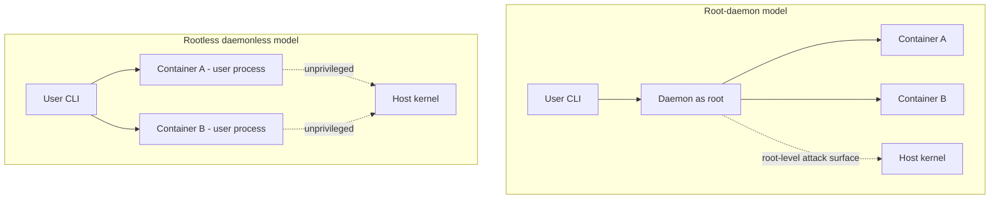
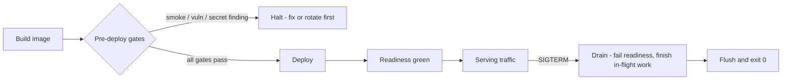

# Chapter 5 — Cross-Platform and Deployment

Software that only runs on the machine it was written on isn't done. It's a demo. I learned this before most of today's developers were born, porting code between mainframe operating systems where "portable" was a punchline, and relearned it in embedded systems where the target hardware didn't exist yet when we started writing. The discipline is the same in 2026 as in 1979: you do not get to assume the path separator, the shell, the architecture, the temp directory, or the init system. Every assumption you bake in is a bill that comes due on someone else's machine, at the worst possible time, usually mine.

This chapter covers ten rules in two movements. The first six are about writing code that runs anywhere: three operating systems, two architectures, path libraries instead of string glue, real orchestration languages instead of shell-isms, platform APIs instead of hardcoded directories, and line endings settled by the repository instead of by whoever committed last. The last four are about getting that code deployed and keeping it alive: container-friendly defaults, health endpoints and graceful shutdown, deploy gates that never silently turn off, and honesty about slow operations.

And yes — this is the chapter that earns the book's subtitle. My container stack is Podman, Red Hat UBI base images, and OpenShift. Rootless and daemonless beats a root daemon, and I'll spend a few hundred words explaining why instead of just asserting it. Full disclosure, again: I work at Red Hat. This book is personal work — not sanctioned, not verified, not endorsed by my employer. I held these opinions before I worked there; arguably they're *why* I work there. I spent decades in defense networking, where "the daemon runs as root" is not a convenience, it's a finding in an audit report with your name on it.

If you read the stack ruling and bristle — if you prefer Ubuntu, Arch Linux, and Docker's insecure daemon — tough luck. Write your own rules. The license genuinely lets you: the rules repo is CC-BY-4.0, fork it, swap rule 47, ship your own way. I mean that without sarcasm. A rules document you disagree with and follow anyway is worse than no rules at all, because it teaches you that rules are decoration. These are *my* rules for *my* software. The portable part isn't the stack choice; it's having made one, on the record, with reasons.

## Rule 41: Three platforms, two in CI

**Target macOS, Linux, and Windows; CI covers at least two of them.**

The priority order is macOS first (that's where I develop), Linux second (that's where everything deploys), Windows third (that's where a surprising number of users actually live). But priority order is not permission to skip. "We'll add Windows support later" is the most reliable lie in software — later never comes, and by the time someone forces the issue, platform assumptions have metastasized through the codebase like rebar through concrete.

The CI requirement is the enforcement mechanism, deliberately set at two platforms rather than three. Three is better when CI minutes are cheap. But two is where the discipline actually engages, because the single most dangerous configuration is one platform: every assumption passes, forever, until the day it doesn't. The moment a second OS enters the matrix, the whole class of "works on my machine" bugs starts failing loudly in CI instead of quietly in production. Path separators, case-sensitive filesystems, line endings, file locking, signal handling — the second platform catches most of them, because platform bugs are rarely Windows-specific or Mac-specific; they're *assumption*-specific, and any second opinion exposes the assumption.

I once watched a team — no names, they know who they are — discover after eighteen months that their entire test suite depended on a case-insensitive filesystem. The fix took three weeks. A Linux runner in CI would have caught it on day one for the cost of a YAML stanza. That's the trade this rule encodes: a few minutes of CI time per commit, against weeks of archaeology later. It's not close.

## Rule 42: Both architectures, flagged exceptions

**Target arm64 and x86_64; flag any dependency without native ARM builds and document the workaround.**

There was a comfortable decade when "architecture" meant x86_64 and the question never came up. That decade is over. Developer laptops are ARM. A growing share of cloud instances are ARM, often the cheapest compute on the price sheet. Embedded and edge targets have been ARM all along — I was shipping to non-x86 silicon back when that meant arguing with a cross-compiler that hated me personally. Single-arch software in 2026 has voluntarily disqualified itself from half the machines your users own.

Most of the time this rule costs nothing. Interpreted code doesn't care, and mainstream compiled ecosystems publish multi-arch artifacts as a matter of course. The rule exists for the exceptions: the dependency with no ARM wheel, the vendor SDK shipped as an x86_64-only binary blob, the native extension nobody has rebuilt in a decade. One such dependency silently converts your entire project to single-arch, and you typically discover it during a deploy, under time pressure, via an error message that mentions none of this.

Hence the second clause, which is the part people skip: *flag it and document the workaround*. Don't quietly add the dependency and hope. Say, in writing, in the repo: this package has no native ARM build; here is the emulation path or the pinned alternative or the build-from-source recipe; here is what it costs us. Per rule 4 back in Chapter 1, every dependency declares its platform support before it gets in the door. An exception you've documented is a decision. An exception you've hidden is a time bomb with my name on the casualty list.

| | macOS | Linux | Windows |
|---|---|---|---|
| **arm64** | Primary dev target | Deploy + CI | Supported, tested per release |
| **x86_64** | Supported | Deploy + CI | Supported, CI when feasible |

*The platform-by-architecture support matrix: six cells, no blanks, and CI standing guard on at least two operating systems.*

## Rule 43: Path libraries, never string glue

**Use the language's path library — never string-concatenate paths or hardcode separators.**

Every mainstream language solved this problem years ago. Python has `pathlib.Path`, Node has the `path` module, Go has `filepath`, and even shell — when you must use it — has constructs better than mashing strings together with a `/` and a prayer. The rule is simply: use them. Always. `dir + "/" + name` is a bug that hasn't been scheduled yet.

What people underestimate is how much more than the separator these libraries handle. Drive letters. UNC paths. Trailing-slash normalization, `..` resolution, symlink semantics, the difference between joining and resolving, the difference between an absolute path on one OS and the same string being relative on another. A hand-rolled string concatenation gets the happy path right and every edge wrong, and the edges are exactly where filesystem code goes to die — usually in a deletion routine, which is the one place you really want the path math correct.

There's a deeper benefit: path objects make intent legible. `config_dir / "settings.toml"` tells the reader a filesystem path is being composed, not arbitrary string fiddling. When an AI agent writes or reviews the code, that legibility matters double — the agent that sees consistent `pathlib` usage continues the pattern; the agent that sees string mashing happily produces more of it. Conventions propagate; pick the one you want propagated.

The hardcoded-separator clause has no exceptions clause, because I've heard all the exceptions and they were all wrong. "It's Linux-only" — until it isn't, see rule 41. "It's just a quick script" — quick scripts are where production code is born. Use the library.

## Rule 44: No shell-isms — orchestrate in Python or Node

**No shell-isms in cross-platform scripts; orchestrate in Python or Node, not bash.**

I have written more shell than most people have read, and that is exactly why this rule exists. Shell is a terrific interactive tool and a treacherous programming language. The moment a script grows a conditional, a loop, or an error-handling requirement, it has outgrown the shell — and a cross-platform script outgrew it before the first line was written, because there is no cross-platform shell. There's bash, which isn't on Windows; there's whatever `/bin/sh` resolves to today; there's PowerShell, which is a different universe; and there's the special hell of a script that works in bash 5 and fails silently in bash 3 on a stock Mac.

The banned shell-isms are the usual suspects: `&&` chains as control flow, `source` for configuration, backtick soup, word-splitting tricks, trusting `set -e` to mean what you hope it means (it doesn't, and the ways it doesn't fill a small book of their own). Each is a portability bug or an error-swallowing bug or, on a good day, both.

The fix is to orchestrate in a real language. Python and Node are everywhere your code already runs; both give you actual data structures, actual exceptions, actual exit-code checking on subprocesses, and the path libraries from rule 43. A build script in Python is testable — you can mock the subprocess layer and assert the orchestration logic, which connects straight to the coverage rules in Chapter 8. Try unit-testing a 300-line bash script and report back.

Keep shell for what it's good at: one-liners, interactive use, the glue inside a CI step that's literally three commands. The moment logic appears, promote it to a real language. The promotion is always cheaper today than after it breaks.

## Rule 45: No hardcoded temp, home, or drive letters

**No hardcoded `/tmp`, `~/`, or drive letters — use platform temp/home APIs.**

`/tmp` doesn't exist on Windows. `~/` expands in your shell, not in your code — pass it unexpanded into a file API and you'll create a literal directory named `~` in your working directory, which I have personally watched happen in a production deploy, followed by a cleanup script that did exactly what you fear it did. `C:\Users\eddie\` works precisely until the code runs as a service account, in a container, or on literally anyone else's machine. These three hardcodings are siblings of the same defect: confusing *your* environment with *the* environment.

Every platform exposes the real answers through an API. Python: `tempfile.gettempdir()`, `tempfile.TemporaryDirectory()`, `Path.home()`, and `platformdirs` when you need proper per-OS config and cache locations. Node: `os.tmpdir()` and `os.homedir()`. Go: `os.TempDir()`, `os.UserHomeDir()`. They cost the same number of characters as the hardcoded string and they're correct on every machine, including the ones you haven't met yet.

Containers make this sharper, not softer. Inside one, `/tmp` may be a size-limited tmpfs, a read-only layer, or scratch space that vanishes between requests; the home directory of an arbitrarily-assigned UID — exactly what OpenShift gives you by default, see rule 47 — may not exist at all. Code that asks the platform survives this; code that assumes a path becomes a 2 a.m. page.

This rule is also a config rule wearing a trench coat: per Chapter 3, any path that could plausibly vary belongs in configuration with a platform-API default. The API gives you correct-by-default; the config layer gives you operator override. Hardcoding gives you neither, for the same effort.

## Rule 46: Line endings settled by `.gitattributes`

**Enforce LF line endings via `.gitattributes`.**

The smallest rule in the chapter, guarding against the dumbest week-long outage you'll ever have. CRLF-versus-LF is a 1970s teletype dispute that modern software still trips over: a shell script with CRLF endings fails on Linux with errors that mention nothing about line endings (`/bin/sh^M: bad interpreter` if you're lucky, silent misbehavior if you're not). A diff balloons to every-line-changed because one contributor's editor "helpfully" converted the file, burying the real change under a thousand lines of invisible noise. That last one matters more than it used to: per Chapter 6, you're inspecting diffs of config-shaped files for leaked secrets before every commit, and a whole-file line-ending rewrite is excellent camouflage for the one line that actually changed.

The wrong fix is asking every contributor — human or AI — to configure their editor and their `core.autocrlf` correctly. Per-machine configuration is a promise; this book doesn't run on promises. The right fix is a `.gitattributes` file in the repository, where the policy is versioned, enforced by git itself, and identical for every clone on every OS:

```
* text=auto eol=lf
*.bat text eol=crlf
```

Two lines. Normalize everything to LF in the repo and on checkout, with a carve-out for the rare file format that genuinely requires CRLF — Windows batch files being the canonical example. Binary types can be marked explicitly if git's auto-detection ever guesses wrong.

This is the cheapest rule in the book: a one-time, two-line commit that permanently deletes an entire bug category across every platform, every editor, every contributor, and every coding agent that will ever touch the repo. There is no argument against it that survives contact with one corrupted shell script.

## Rule 47: Container-friendly by default — Podman, UBI, OpenShift

**Container-friendly by default: config from env or mounted files, logs to stdout, no assumed persistent disk. The container stack is Podman, Red Hat UBI base images, and OpenShift — rootless and daemonless beats a root daemon. Tough luck; if you prefer Ubuntu, Arch Linux, and Docker's insecure daemon, write your own rules — the license lets you.**

Two rulings in one rule. The first is uncontroversial: write services as if a container will run them, even when one won't. Configuration arrives via environment or mounted files (Chapter 3 already made you do this). Logs go to stdout for the platform to collect — no log files, no rotation logic, no in-process log shippers. Local disk is scratch unless explicitly declared otherwise. Code written this way runs identically on a laptop, in a container, and on bare metal, which is rule 45 from the configuration chapter doing its job.

The second ruling earns the subtitle. Docker's classic architecture is a daemon, running as root, owning every container on the host: one socket that's effectively a root API, one single point of failure, one attack surface an auditor circles in red. I spent years building equipment where a root-level compromise was a national-security conversation, and I cannot unsee that diagram. Podman runs containers as ordinary child processes of an ordinary user — no daemon, no root, nothing to compromise that you didn't already own. UBI base images give me a maintained, freely redistributable foundation with a vendor security pipeline behind it. OpenShift extends the posture to the cluster: pods run as arbitrary non-root UIDs *by default*, which incidentally enforces rules 43 and 45 — code with hardcoded paths and assumed home directories dies in the first deploy rather than the first breach.

That's a preference with reasons — mine, not my employer's. Disagree? The fork-it clause is sincere: CC-BY-4.0, swap this rule, ship your stack. Just make it a ruling, not a drift.



*Two architectures: on the left, every container funnels through one privileged daemon; on the right, containers are ordinary user processes with nothing root-owned to compromise.*

## Rule 48: Health endpoints and graceful SIGTERM

**Services expose health/readiness endpoints and shut down gracefully on SIGTERM.**

A service that can't report its own condition is a service somebody has to babysit, and that somebody bills by the hour. Two endpoints, two distinct questions. *Liveness*: is the process alive and sane, or should the platform restart it? *Readiness*: is it ready for traffic right now — dependencies reachable, caches warm, migrations done? The distinction is not pedantry: a service can be alive and momentarily not ready, and conflating the two produces either restart loops or traffic routed into a black hole. While you're in there, `/health` also reports the version and build number, per Chapter 7 — when production misbehaves, "what exactly is running?" is the first question, and the service should answer it itself.

SIGTERM handling is the same courtesy at end-of-life. Every orchestrator — OpenShift included — stops a pod by sending SIGTERM, waiting a grace period, then sending SIGKILL. A process that ignores SIGTERM gets the kill: requests severed mid-response, buffers unflushed, locks orphaned. The graceful path is mechanical: catch SIGTERM, stop accepting work, fail the readiness probe so the router drains you, finish what's in flight, flush, exit zero. A few dozen lines, written once.

One trap from long scars: if your entrypoint wraps the process in a shell (rule 44 nods knowingly), the shell may eat the signal and your handler never fires. Exec the real process as PID 1 or use a proper init shim. Then *test* the shutdown path — Chapter 8's branch-coverage rule applies to the exit ramp too. A service that dies cleanly is a deploy that's boring, and boring deploys are the entire goal.



*The container lifecycle: nothing deploys without passing the gates, nothing serves before readiness is green, and nothing dies without draining first.*

## Rule 49: Gates never disabled by default

**Pre-deploy gates (smoke test, vulnerability scan, secret scan) are never disabled by default — escape hatches are explicit, one-off, and logged.**

The gates between a build and a deploy exist precisely for the days you're tempted to skip them. A smoke test that actually boots the image and hits the health endpoint from rule 48. A vulnerability scan over the artifact. A secret scan over the full deploy context — Chapter 6 territory, rule 57's full-artifact scan, but it bears restating here because deploy pressure is where that discipline dies. Each gate is boring ninety-nine times out of a hundred. The hundredth time is why they exist, and you don't get to know in advance which time is the hundredth.

The failure mode this rule targets isn't the missing gate — it's the *quietly disabled* one. Somebody sets `SKIP_SCAN=1` during an incident, it lands in the deploy script "temporarily," and eleven months later you discover every deploy since has been unscanned. The fast path becomes the default by erosion, not decision. I've watched that sequence more than once. AI agents raise the stakes: an agent that reads a deploy script with a skip flag baked in will reproduce it forever, with perfect consistency and zero guilt.

So the rule's design: escape hatches *exist* — a gate with no override becomes a gate people route around entirely, which is worse — but they are explicit (a deliberate variable, named for what it skips), one-off (effective for a single invocation, never persisted into a script, an alias, or CI config), and logged (the deploy record shows which gate was skipped, when, and by whom). The asymmetry is the point: passing the gates is the silent default; skipping one is loud, attributable, and slightly embarrassing. That's the correct emotional gradient for a safety system.

## Rule 50: Show progress; cached by default, expensive by exception

**Show progress on unavoidably slow operations and say why; cached paths are the default, expensive paths are explicit and rare.**

I came up through real-time systems, where latency was a specification with consequences, so I'll admit a bias: most slow software is slow because nobody was made to feel it. But some operations are honestly slow — a vulnerability scan, a model download, a cold index build — and for those, the sin isn't the latency. It's the silence. A spinner with no explanation is a lie of omission: the user can't tell ten seconds from ten minutes, can't tell progress from a hang, and will eventually kill the process at the worst possible moment — usually mid-write. Tell them what's happening and why: "Scanning 1,432 packages for known CVEs — about 90 seconds, runs on every deploy." Now the wait is a decision they're in on, not a hostage situation. Counters and step names beat percentages you're making up; an honest "about two minutes" beats a progress bar that sprints to 90% and parks there waiting for applause.

The second clause is the architectural half. The default path through your software should be the cached, precomputed, fast one; the expensive path should be something you *choose*, visibly — a `--rebuild` flag, a "Refresh all" button, a scheduled job — never something you stumble into because a cache key went stale. When the expensive path does run, it announces itself, which closes the loop with the first clause.

This applies with extra force to agent-driven workflows. An AI agent staring at a silent subprocess can't distinguish slow from hung any better than a human can — worse, it may time out and retry, turning one expensive operation into four. Progress output isn't cosmetics; it's an interface contract with everything supervising the process, carbon or silicon.

### Chapter 5 card

- **41.** Target macOS, Linux, and Windows; CI runs on at least two of them.
- **42.** Target arm64 and x86_64; flag any dependency without native ARM builds and document the workaround.
- **43.** Use the language's path library — never string-concatenate paths or hardcode separators.
- **44.** No shell-isms in cross-platform scripts; orchestrate in Python or Node, not bash.
- **45.** No hardcoded `/tmp`, `~/`, or drive letters — use platform temp and home APIs.
- **46.** Enforce LF line endings via `.gitattributes`.
- **47.** Container-friendly by default: env config, stdout logs, no assumed disk — on Podman, UBI, and OpenShift; rootless and daemonless beats a root daemon.
- **48.** Services expose health/readiness endpoints and shut down gracefully on SIGTERM.
- **49.** Pre-deploy gates are never disabled by default — escape hatches are explicit, one-off, and logged.
- **50.** Show progress on slow operations and say why; cached paths are the default, expensive paths are explicit and rare.
