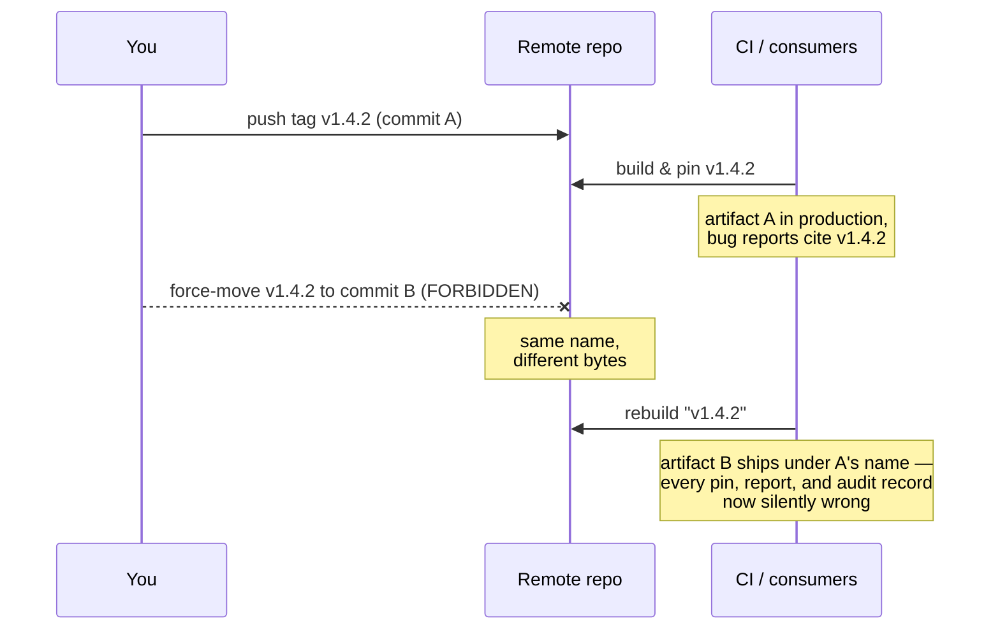
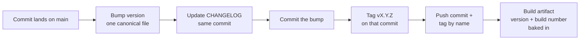
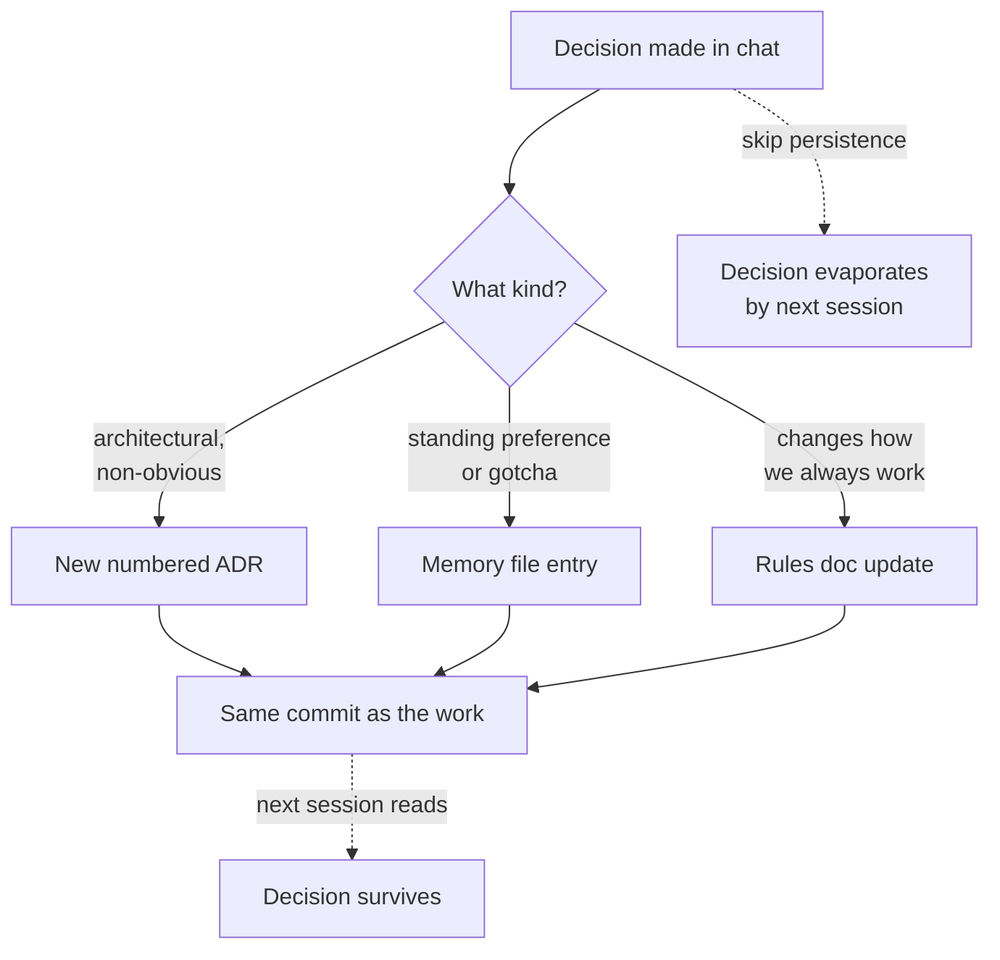
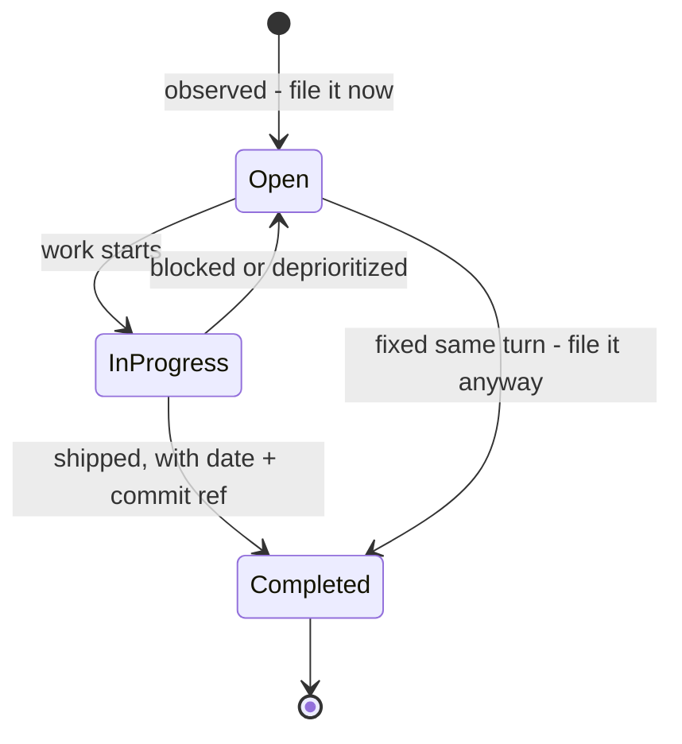
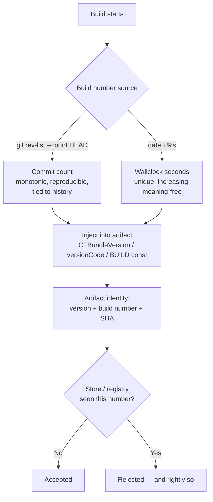
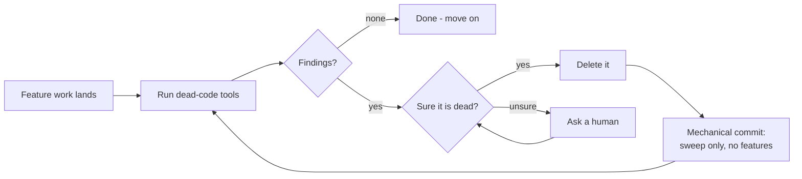

# Chapter 5 — Ship and Remember

> **Standing on Chapters 1–4:**
> - The hard rules never bend, and the Powell rule holds: gather 90% of the information, then decide — below 90%, ask the human (Chapter 1).
> - Nothing is hardcoded; everything that can change flows through config, and every backend lives behind an interface (Chapter 2).
> - Builds are portable, fail loudly at startup, and carry the fewest dependencies that do the job (Chapter 3).
> - Every artifact is scanned clean for secrets and proven against the 90/95 rubric with 100% branch coverage before it goes anywhere (Chapter 4).

Chapter 4 left you with software that's proven — scanned clean, covered to the last branch — but proven software still has to be shipped honestly, and that's a different discipline. A version number is a promise. The moment you publish `v1.4.2`, somebody — a container build, a deploy script, a downstream team, your own future self at 2 a.m. — pins to it. From that moment forward, `v1.4.2` means one thing: a specific set of bytes that behaves a specific way. Break that promise once and every consumer of your software learns the same lesson: your version numbers are decorative. They will start pinning to commit SHAs, vendoring your code, or worse, freezing on an old release forever because upgrading you is a gamble.

And one act in this chapter can never be taken back. Almost every other failure in this book is recoverable — a bad commit reverts, a stale README regenerates, a missed sweep runs late. A pushed tag that gets moved is different. Every container build, every deploy manifest, every bug report, every audit record that pinned that tag is silently wrong from that moment on, and nothing notifies any of them; the name keeps working while its meaning changes underneath. That is why tag immutability leads the chapter — rule 76 is the one irreversible act in it — with the rest of the version-integrity rules close behind.

I spent the formative years of my career in embedded systems, where the question "what exactly is running on that box?" had to have an exact answer. Not "probably the March build." An exact answer, down to the build, because when a unit misbehaved in the field, the firmware image was the first variable to eliminate — and you can't eliminate what you can't identify. That discipline never left me. The deployment substrate changed; the question didn't. So the version-integrity rules run right behind the tag: the version only moves forward, lives in exactly one place, every build carries a unique serial number, every artifact answers "what are you?" at the front door, and the changelog travels in the same commit as the bump so the version and its story can never drift apart.

But a promise is only as good as your ability to remember why you made it. Every piece of unwritten knowledge has a half-life, and it is shorter than you think. The reason we chose the message queue over the database trigger; the gotcha in the vendor's auth flow that cost us a week — if it lives only in a chat scroll or somebody's head, it is already decaying. I have watched teams re-litigate the same architectural decision three times in two years, each round burning a week, because nobody wrote down the verdict the first time. The code remembered what was decided. Nothing remembered why.

For most of my career that was a chronic, low-grade tax. Then the AI teammates showed up and turned a chronic condition into an acute one. An AI coding agent forgets everything between sessions. Everything. It starts every morning as the smartest amnesiac you've ever hired. If your project's memory lives in heads and scrollback, your AI teammate's effective memory is zero — and it will cheerfully undo last month's decisions because nothing on disk says otherwise. Written memory used to be a nicety. Now it is the load-bearing wall. The ledgers in this chapter — changelogs, ADRs, bug and feature files, decisions persisted in the same commit that ships the work — are not documentation in the old "write it for the auditors" sense. They are the persistent state of a system whose most productive workers are stateless. Which is why the memory rules rank just behind versioning integrity here, shoulder to shoulder with the tags and the bumps, instead of trailing at the back the way documentation always has.

Shipping is the promise; memory is what keeps the promise keepable; and the hygiene sweeps close the chapter — and the book — by keeping both legible. Seventeen rules, and then you're on your own.

## Rule 76: Tags are carved in stone

**Tags are immutable: never move, delete, reuse, or force-overwrite a pushed tag. Fetch the remote's tags and compare before creating one — local is not the truth — and push tags by name, never `--tags` reflexively.**

A pushed tag is a published fact: "`v1.4.2` is commit `a3f9c01`." People build on published facts. A container image was built from that tag. A deploy manifest pins it. A colleague's bug report says "reproduced on v1.4.2." An auditor's record says that's what was certified. Every one of those references assumes the tag still points where it pointed when they looked.

Move the tag — delete it and recreate it on a different commit — and every one of those references silently rots. The container built last month and the container built today are different software wearing the same name badge. The bug report now describes code that "v1.4.2" no longer contains. Nobody gets an error. Nobody gets a notification. The references just quietly stop meaning what their authors meant, and you find out during an incident, which is the most expensive possible time to find out.

This is why git itself makes you force-push to move a tag. That `--force` flag is the version-control equivalent of a lockwired bolt: the friction is the point. If you tagged the wrong commit, the fix is the same as rule 77: a *new* tag. `v1.4.2` was wrong? Ship `v1.4.3`. The bad tag stays in history as a record that the mistake happened — which is itself valuable information.

Immutability has two guards on either side of it, and both are about not acting on a stale view of shared state. **Fetch before you tag.** Your local clone is a cache, and like every cache it goes stale: another contributor tagged yesterday, a CI job auto-tagged this morning, an agent — and there may be several working the same repo — tagged twenty minutes ago, and none of it is in your clone until you ask:

```
git fetch --tags origin
git ls-remote --tags origin
```

Then confirm the tag you're about to cut is strictly greater, under SemVer ordering, than the latest in the *union* of local and remote — not just absent locally, absent and greater remotely. Skip it and you either get a rejected push and ten lost minutes, or the quiet failure: you cut `v1.6.0` not knowing the remote already has a `v1.7.0` someone else shipped, your "new release" sorts behind the current one, and every consumer resolving "latest" keeps ignoring you. And if the fetch reveals an existing tag pointing at a different SHA than you expected — stop. Don't "fix" it by retagging. Surface both SHAs and let a human decide, because one of two histories is wrong and you don't know which.

**Push by name.** `git push --tags` shoves *every* local tag at the remote — the release you intended plus every experimental, fat-fingered, half-baked local marker. Name the ref instead: `git push origin v1.4.2`, exactly that, nothing else along for the ride. This is the cheap insurance that makes immutability hard to violate by accident: if some tool rewrote a local tag so it points somewhere the remote's copy doesn't, a named push leaves it sitting harmless, where `--tags` would attempt to clobber the published tag. A reflexive `--tags` is how tags get moved by someone who would swear, honestly, they'd never move a tag. Make publication intentional: name what you publish and mean it.

In my embedded days we had a phrase for shipped firmware: it's in the field now. You can ship a new image; you cannot reach out and change the bytes already burned into a thousand devices. Treat pushed tags with the same finality. The tag namespace is append-only. Write carefully, because there's no eraser.



*A moved tag fails nobody loudly. Every consumer who pinned the old commit keeps trusting a name that changed meaning underneath them.*

## Rule 77: Versions only move forward

**Bump on every release; versions only move forward. Roll back by rolling forward to a new patch.**

Every release gets a new number — even a trivial one, even a "we just rebuilt it" one. If the bytes can differ, the number must differ. Two artifacts with the same version and different contents is the release-engineering equivalent of two parts with the same serial number: now nothing about either one can be trusted.

The second half is where people flinch: you never roll *back* a version. Production is on `1.5.3`, it's on fire, and the instinct is to redeploy `1.5.2` and call it restored. Don't. Cut `1.5.4` — even if its entire content is "revert to the state of 1.5.2" — and deploy that.

Why insist on the ceremony? Because "we're running 1.5.2" becomes a lie the moment you roll back. You're running 1.5.2 *again*, after 1.5.3, with whatever migrations, cache state, config changes, and side effects 1.5.3 left behind. The timeline matters. A version history that reads `1.5.2 → 1.5.3 → 1.5.4 (reverts 1.5.3)` tells the whole story to anyone reading the changelog in six months. A history that reads `1.5.2 → 1.5.3 → 1.5.2` tells them nothing except that someone panicked, and your monitoring, your logs, and your incident timeline now contain two different deployments that both claim to be 1.5.2.

Time moves one direction. Your version numbers are a clock. Clocks that run backward aren't clocks anymore; they're props. Roll forward, always — the revert is a *new event* in the system's history, and it deserves a new number that says so.



*The release pipeline: the bump and the changelog travel in one commit, the tag marks it, and the artifact carries its identity baked in.*

## Rule 78: Persist decisions in the same commit

**When a standing decision is made in chat, persist it the same commit — chat history is not memory. Non-obvious decisions go in numbered ADRs, immutable after acceptance; a later ADR supersedes, never edits.**

Chat is where decisions get made now. A question comes up mid-session, you work through the options with the agent, you make the call: "from now on, default to the streaming API; the batch path is legacy." That decision now exists in exactly one place — a conversation buffer that will be gone by morning. The next session starts cold, picks the batch path because nothing says otherwise, and you make the same call again, slightly differently, building a fog of almost-consistent precedents.

The fix is a timing rule, and the timing is the whole rule: *the same commit.* Not "I'll write it up later" — later is where decisions go to die; the moment the conversation moves on, the writing-up has lost its slot. The decision and its persistence travel together: chat produces the verdict, the verdict lands in the right file, and the commit that ships the work carries the memory with it.



*The decision flow. The solid path is the rule; the dashed path to evaporation is what happens by default.*

Routing is easy: architectural and non-obvious goes to an ADR; standing preferences and gotchas to the memory file; anything that changes how you always work amends the rules doc itself. The test for what needs persisting: *would I want the next session to know this without being told?* If yes, it goes in a file, now, in this commit. With teammates that forget everything overnight, an unwritten decision isn't a decision. It's a mood.

The ADR path carries one extra discipline, and it's the part people resist: once accepted, the record never changes. An Architecture Decision Record is a small, numbered file with a boring shape — context (what was true when we decided), decision (what we chose), consequences (what it costs), alternatives considered — and a decision record you can edit is a decision record you can't trust. Was this the reasoning at the time, or the reasoning someone retrofitted after the outcome was known? An immutable record is testimony: when ADR-0014 says "we chose the embedded store because we had two ops people and no cluster budget," you know that was true *then*, even if it's false now. When the world changes you don't edit ADR-0014 — you write ADR-0031, state the new context, and mark the old one superseded with a pointer. The chain of supersessions *is* the history of your architecture's reasoning, and it's the most honest document your project owns precisely because nobody can launder it. AI teammates read the ADR titles at session start and stop re-proposing the migration you rejected, with reasons, eighteen months ago — the most common failure of a stateless collaborator is re-deciding settled questions, and a scan of ADR titles is the cheapest vaccine. Keep them short. Keep them numbered. Never touch them after acceptance.

## Rule 79: One version, one home

**Semantic versioning, with the version in exactly one canonical place — everything else reads from it.**

Two parts to this rule, and people usually nod at the first and violate the second.

SemVer first: `MAJOR.MINOR.PATCH`. Breaking change bumps major. New capability bumps minor. Fix bumps patch. This isn't aesthetics — it's a machine-readable contract about compatibility. A consumer pinned to `^1.4` is trusting you that `1.5.0` won't break them. SemVer is the grammar of the version-number promise; the rest of these rules are the enforcement.

Now the part that actually bites: the version string lives in *exactly one* file. `pyproject.toml`, `package.json`, a `VERSION` file, a single constant in the package root — pick one per project and make everything else read from it at build time. The README badge, the CLI banner, the Dockerfile label, the `/health` payload, the installer metadata: all derived, none hand-maintained.

The failure mode is so common it's almost a rite of passage. The version is in the build manifest, and also in a constant in the source, and also in the docs header, and also in the install script. They agree on day one. Then a release goes out in a hurry, three of the four get bumped, and now your `--version` flag says `2.1.0` while the package metadata says `2.2.0`. Which one is lying? Both, sort of. Neither answers the only question that matters — what is this artifact? — because the artifact now disagrees with itself.

I think of it the way I think of any redundant state in a system: two copies of the same fact is one copy too many, because the copies *will* diverge, and they'll diverge on the worst possible day. One register, one writer, many readers. Everything else is a derivation, generated at build time, never edited by hand.

## Rule 80: File it the moment you see it

**Track every bug and every requested feature in `bugs.md` and `features.md` the moment it's observed — even if it's fixed the same turn. Open questions are filed inline with the entry; filing never blocks on answers.**

The cheapest moment to record a bug is the moment you're looking at it. You have the symptom, the context, the reproduction in your head — the entry takes ninety seconds. Every hour after that, the knowledge evaporates: by tomorrow it's "something was weird with the export," by next month a user finds it for you. Same for features: the half-formed "we should let people batch this" dies in the chat scroll unless it lands in a file before the conversation moves on.

So the rule is mechanical: observed means filed. Even — *especially* — if it's fixed in the same turn, because the pattern across filed-and-fixed entries is how you notice the module that produces a regression every month. And filing never waits for completeness. Unclear scope, missing repro steps, contested approach? File the entry anyway with the questions inline under it; they get answered when the entry is picked up, not before. A tracker that demands fully-specified entries trains people to not file things, which is the failure mode the tracker exists to prevent.



*The entry state machine. Note both paths into Completed: even a same-turn fix passes through the file.*

Entries update in place — status, resolution date, commit reference — so the file stays a live ledger, not a graveyard. For AI teammates this file is working memory: it's how the bug noticed in Tuesday's session survives to be fixed in Thursday's.

## Rule 81: Every build wears a serial number

**Every build gets a unique, monotonically increasing build number (`git rev-list --count HEAD` works) — stores reject reused ones.**

The version is the *marketing* identity: what changed for the user. The build number is the *manufacturing* identity: which artifact this is, exactly. You need both, because one version can produce many builds — you build `1.4.2`, the upload fails, you fix the signing config and build `1.4.2` again. Same version, different bytes. Without a build number, those two artifacts are indistinguishable, and "indistinguishable artifacts" is a phrase that should make your skin crawl.

The app stores enforce this at the door: upload an artifact with a build number they've seen before and it bounces, full stop, regardless of what changed. Apple's `CFBundleVersion`, Android's `versionCode` — unique per upload, no exceptions, no appeals. They learned this lesson at planetary scale so you don't have to relearn it locally.

The trap is leaving the bump to a human. Humans forget, exactly once per release cycle, at the most annoying possible moment — usually discovered after the twenty-minute archive-and-upload dance completes and *then* rejects. So don't let a human touch it. Generate the number at build time, deterministically:

- `git rev-list --count HEAD` — the number of commits in history. Monotonic, survives clones, identical on every machine building the same commit. My preference, because it ties the artifact back to a point in history.
- `date +%s` — wallclock seconds. Trivially unique and always increasing, at the cost of meaning nothing.

Either way, bake it into the build script or a pre-build phase so the bump physically cannot be forgotten. A serial number that depends on someone remembering isn't a serial number; it's a suggestion.



*Build-number generation belongs to the build, not to human memory. Derive it, inject it, and the uniqueness check becomes a formality.*

## Rule 82: Verbatim errors, diffs not prose, assumptions out loud

**Quote errors verbatim — never paraphrase a stack trace. Show diffs, not prose, when the question is "what changed?" Surface assumptions explicitly.**

This rule is about the quality of the signal between collaborators, and it has three clauses that are really one principle: *transmit evidence, not interpretation.*

Errors, verbatim. A paraphrased error is interpretation wearing the costume of evidence. "It couldn't connect to the database" might be a refused connection, an auth failure, a DNS miss, a timeout, or a TLS mismatch — five different bugs flattened into one sentence by a helpful summarizer. The raw text carries the error code, the hostname, the line number, the one weird detail that cracks the case. I have lost entire days to debugging the paraphrase instead of the error. Paste the real thing.

Diffs, not prose. When the question is "what changed?", a description is a secondhand account from a witness with an incentive to look good. The diff is the change: prose says "refactored the retry logic"; the diff shows the timeout that also quietly went from 30 to 5. Reviewers approve prose. They catch things in diffs.

Assumptions, out loud. Every nontrivial task runs on unstated assumptions — what the user meant, which environment matters, what's in scope. Stated, an assumption is a checkpoint: "I'm assuming you want this configurable with the local backend as default — confirm?" costs one line and catches the wrong turn before the work, not after. Unstated, it's a landmine with a delay fuse — and the AI's wrong assumptions are the expensive ones, executed at machine speed.

Evidence over interpretation, in every channel. That's the rule the other ninety-nine ride on.

## Rule 83: The changelog rides in the bump commit

**Maintain a changelog in the same commit as the version bump.**

A version number says *that* something changed. The changelog says *what*. Rule 83 is about keeping those two facts physically inseparable: the commit that bumps the version is the commit that updates `CHANGELOG.md`. One commit, atomic, no exceptions.

The reasoning is the same as rule 79's: redundant state diverges unless it's written in one motion. Let the changelog lag "just until after the release," and you've created a window where `v1.5.0` exists but its story doesn't. Windows like that don't close; they accumulate. Three releases later someone is reverse-engineering the changelog from `git log`, guessing which commits mattered, and the document quietly transitions from "record" to "historical fiction." I've watched changelogs die this way more times than I can count, and it's always the same cause of death: the update was a separate step, and separate steps get skipped.

When the changelog and the bump share a commit, the tag from rule 76 pins both at once. Check out `v1.5.0` and the changelog at that ref describes exactly what `v1.5.0` is — guaranteed, mechanically, forever. The release notes write themselves: they're the top section of the file at the tagged commit.

Format-wise, follow Keep a Changelog or something near it: human-written entries grouped under Added, Changed, Fixed, Removed — written for the *user* of the software, not the author. A raw commit-log dump is not a changelog; nobody pinning your package cares that you "refactored the thing, again, properly this time." Tooling like `commitizen` or `release-please` can automate the mechanics of the bump-plus-changelog commit, and automation is welcome here precisely because it makes the atomicity unforgettable.

## Rule 84: Plans tell you their own status

**Plans live in a `plans/` directory with a first-line `Status:` kept current — stale status on shipped work is a process violation.**

This is the version-number discipline applied to intent instead of artifacts. A plan document is a promise about future work the same way a tag is a record of past work — and like any published fact, it's only useful if it's true *right now*.

The mechanics are deliberately minimal. Plans live in `plans/`. The first line of every plan is its status: `Status: Not Implemented`, `Status: In Progress`, `Status: Implemented, <date>`, or `Status: Partial — Remaining: <items>`. When work starts against a plan, the status changes in the same motion. When work finishes, same thing. The first line is the one place a reader — human or agent — looks, and it never lies. Retired plans move to an `archive/` subdirectory and drop out of the accounting entirely.

Why be strict enough to call stale status a *violation* rather than untidiness? Because a plan whose status lies is worse than no plan. A new contributor reads `Status: Not Implemented` and starts building something that shipped in March — duplicated effort. An agent reads it and re-plans solved work — wasted tokens and a confused session. And this matters double in AI-assisted development: the agents resume from the written state of the repo, not from anyone's recollection of last Tuesday. Documents *are* the project's memory. Memory that's wrong is worse than memory that's absent, because absent memory at least sends you to go look.

The status line is your release ledger for intent: one canonical place, kept current, never trusted stale. Which is, you'll notice, the same rule this chapter has been repeating in different costumes. What's running in production, what a tag points to, what was decided, what a plan's state is — publish the fact in one place, keep it true, and never make anyone guess.

## Rule 85: The version answers the door

**Display the version everywhere it matters: splash screen, `--version`, `/health`.**

The most common question in any debugging session involving deployed software is some variant of "what version are you running?" — and the answer should never require archaeology. Not "let me check the deploy logs." Not "whatever CI pushed Tuesday." The running artifact itself answers, immediately, through whatever front door it has:

- A CLI answers `--version`.
- A service answers on `/health` or `/version`.
- A GUI shows it on the splash screen or the about box.
- A log stream prints it in the first line at startup.

And the answer is the full identity, not just the marketing number: `v1.4.2 (build 1847, sha a3f9c01, built 2026-06-11)`. Version for the humans, build number for uniqueness, SHA for the precise commit, date for the sanity check. All of it embedded *at build time* — generated into a constant or stamped via the build environment — never read at runtime from some file that might not exist inside the container. An artifact that has to phone home or go spelunking on disk to learn its own name doesn't reliably know its own name.

Why so insistent? Because half of all "impossible" bug reports dissolve the moment you can see what's actually running. The fix that "didn't work" was never deployed. The two environments behaving differently are two different builds. Each is a five-second diagnosis *if* the artifact self-identifies, and a half-day goose chase if it doesn't.

Field rule from the embedded years: a unit that can't report its own firmware revision goes back on the bench until it can. Same rule here. Identification before diagnosis — always.

---

That's the release machinery and its ledgers: every artifact identified, every tag immutable, every decision and plan telling the truth about itself in writing. What remains is keeping the workshop clean enough that all of it stays legible — to the next human reader and to the amnesiac machine that ingests the whole repo as its working memory. The last seven rules are the closing sweeps: the recurring hygiene that keeps the codebase readable, the trackers honest, and everyone — human or agent — accountable for what they install and what they leave behind.

## Rule 86: Lint and format every commit

**Lint and format on every commit; CI stays green.**

Formatting arguments are the most expensive zero-stakes arguments in software. Nobody's product ever shipped late because the braces were on the wrong line, but plenty of teams have burned real hours relitigating style in review — and plenty of diffs have hidden real bugs inside a blizzard of whitespace churn. The fix has been settled for years: pick a formatter, wire it into a pre-commit hook, and never discuss style with a human again. The formatter is not the best style; it's the *agreed* style, which is worth more.

Linting is the same bargain at one level up. The linter catches the unused variable, the shadowed name, the suspicious comparison — the whole class of bug that's trivial when caught at commit time and embarrassing when caught in production. Running it on every commit means findings arrive in batches of one or two, attached to fresh context. Running it "before release" means a four-hundred-finding cleanup that everyone defers.

The second clause is the one with teeth: **CI stays green.** Green-before-commit was Rule 7's hard line; this rule extends it to the shared pipeline. A red main branch is a broken contract with everyone downstream, and tolerance for red is cumulative: a "flaky" test gets shrugged at on Monday, masks a real regression on Wednesday, and by Friday nobody can say which of the nine failures matters. Red means stop. Fix it or revert it; never wave at it.

For AI agents this rule is load-bearing in both directions. The hooks catch the agent's style drift mechanically, and a green CI signal is the one verification an agent can't talk itself out of.

## Rule 87: Sweep the dead code

**After meaningful feature work, run a dead-code pass — vulture and ruff for Python, ts-prune and knip for TypeScript, staticcheck for Go. Remove unused imports, parameters, branches, and files. Ask before deleting anything you're unsure about.**

Feature work sheds debris. You refactor a function and the old helper goes quiet; you swap a backend and the previous adapter sits unused; you delete a call site and three imports go stale. None of it breaks anything, which is exactly the problem: dead code doesn't announce itself. It just sits there, getting read by every future maintainer — and ingested into the context window of every future AI session — as if it mattered. With AI teammates it literally costs tokens: the agent reads the corpse, reasons about the corpse, and sometimes resurrects the corpse.

So the sweep is scheduled, not aspirational. After meaningful feature work — not every commit, but every time the dust settles on something real — run the tools. They're fast, they're free, and they find what eyes skip.



*The dead-code sweep cycle: tools find candidates, certainty gates deletion, the sweep lands as its own mechanical commit.*

Two qualifiers carry the weight. First: *ask before deleting anything you're unsure about*. Static analysis can't see reflection, dynamic dispatch, plugin discovery, or the entry point that only the cron job calls. "Looks dead" and "is dead" are different claims, and the difference is a production incident. Second, per Rule 8: the sweep is its own commit, mechanical and reviewable, never smuggled into a feature. A pure-deletion diff is the easiest review in the world. A deletion folded into a feature is where mistakes hide.

## Rule 88: After the release, take out the trash

**After a stable release, the first task is a cleanup sweep — before any new feature.**

The release just shipped, everyone's energy is pointed at the next shiny feature, and this rule plants itself in the doorway: not yet. First, the sweep. Dead code, unused imports, orphaned files, stale TODO entries, experiments that didn't make the cut, docs that describe the previous architecture — all of it gets hunted down and removed before any new feature work begins.

There are two reasons this lives *here*, attached to the release cadence, instead of floating as a vague "keep things tidy" aspiration.

First, a stable release is the one moment cleanup is genuinely safe and honest. The suite is green, the behavior is pinned by a tag, production is calm. Anything that survives the sweep visibly earns its keep against a known-good baseline; anything deleted can be checked against that same baseline. Mid-feature cleanup, by contrast, mixes "I deleted dead code" with "I changed behavior" in the same diff — and per the one-purpose-per-commit hard rule, that's exactly what we don't do.

Second, scheduled cleanup is the only cleanup that happens. "We'll tidy up when things slow down" is a sentence that has preceded more rotted codebases than any architectural mistake I've seen, because things never slow down — features arrive faster than discipline. Binding the sweep to the release makes it a recurring appointment instead of an aspiration. Run the dead-code tools (`vulture`, `ruff`, `ts-prune`, `knip`, `staticcheck` — whatever fits the stack), surface the findings as a reviewable list before deleting, and land the deletions as their own mechanical commits.

A release is a finish line. Cross it, take a breath, sweep the shop floor. *Then* build the next thing — on a clean floor.

## Rule 89: Regenerate the README

**After every major change, regenerate the README from scratch rather than patching it. It answers, in order: what this is and who it's for, quick start, configuration table, how to test, architecture, deployment, troubleshooting.**

READMEs don't fail by being wrong all at once. They fail by being patched — a sentence appended here, a flag renamed there, a quick-start step that survived the refactor it described. Each patch is locally true and globally corrosive, and after a year the document is an archaeological dig: four eras of the project visible in its strata, with no indication which layer is current. A README the reader can't trust is worse than no README, because it costs them the failed attempt before they fall back to reading the code.

Hence: don't patch. After a major change — new subsystem, dependency swap, deployment change, breaking interface — regenerate from scratch. Stale claims don't survive regeneration because nothing survives regeneration. This used to be an unreasonable demand on human time, which is why nobody did it. With an AI teammate it's twenty minutes: the agent reads the current codebase and writes the current document, and your job shrinks to review.

The fixed section order is sequenced by reader need: **what is this and who is it for**, **quick start** (prove it runs, copy-pasteable), **configuration table** (every variable, default, required-or-not), **how to test**, **architecture overview**, **deployment notes**, **troubleshooting** (the top issues you actually hit, not the ones you imagine). A reader should be able to stop at any section boundary with their question answered. And the first audience for the regenerated README is the next AI session — which reads it before the code, believes what it says, and acts on every stale claim you left in it.

## Rule 90: No commented-out code

**No commented-out code in the repository — git history is the archive.**

Commented-out code is a question mark with no answer attached. Every reader who encounters that gray block has to stop and wonder: Is this coming back? Was it broken? Does the author know something I don't? The block can't answer, the author is long gone, and so it survives — too scary to delete, too dead to run. I've seen functions where the commented-out carcass outweighed the living code three to one, and the living code had been edited so many times the carcass no longer corresponded to anything.

The reason this habit exists is rational fear from a pre-version-control world: *I might need this again, and if I delete it, it's gone.* That fear has been obsolete for decades. Git is the archive. Every line you delete is recoverable, with its full context, its author, its date, and the commit message explaining why it died. `git log -S "the_function_name"` will find it faster than you can scroll through the file looking for the right gray block. Deletion in a version-controlled repo is not destruction; it's filing.

There's an AI angle here too, and it's not hypothetical. Commented-out code sits in the agent's context window looking almost exactly like live code. Agents pattern-match; a big block of plausible-looking logic is a big attractor. I have watched an agent "fix" a bug by un-commenting an obsolete implementation, because the carcass looked more like the training data than the living replacement did. Clean code isn't just for human readers anymore — it's prompt hygiene.

If it might come back, delete it anyway and say so in the commit message. That's what the message is for.

## Rule 91: No orphan TODOs

**No TODO without a tracker link. Otherwise it's a dated FIXME with a named owner.**

A bare `TODO: handle the error case` is a wish, not a plan. It has no owner, no deadline, no priority, and no presence in any list anyone actually reads. Nobody triages the codebase's comment strings, so the bare TODO does the one thing it's good at: it survives. Grep any codebase more than a few years old and you'll find TODOs older than some of the people working on it.

The rule splits the cases. If the work is real, it gets a tracker entry — an issue, a `bugs.md` or `features.md` line (Rule 80) — and the comment carries the link: `TODO(#412): handle the partial-write case`. The tracker entry says *what and why*; the comment marks *where*. When the entry closes, grep for the ID and clear the markers. If the work is *not* tracker-worthy — a note to a near-future self in mid-flight work — it's a `FIXME` with a date and an owner: `FIXME(eddie, 2026-06-11): brittle, revisit after the adapter lands`. The date makes staleness self-evidencing: a dated FIXME from two years ago is a confession, and the next sweep (Rule 87) deletes it or promotes it.

This also disciplines the AI teammates, which scatter TODOs the way they scatter apologies. An agent that must attach a tracker link has to actually *file the item* — which means the gap it noticed gets recorded somewhere durable instead of buried in a comment the next session will never see. The comment string is the worst database you own. Stop writing to it.

## Rule 92: A living state file so a cold agent can start

**Maintain a living state file so a memoryless agent can start cold: a per-repo `STATE.md` (≤1024 words) ingested at session start and regenerated at the end of every commit, plus a one-line-per-repo index at the projects root. It points to the ADRs and trackers — never a log; when it overflows, prune detail outward.**

Every rule in this chapter has been chipping at the same problem from a different side: your most productive collaborator forgets everything overnight. The changelog, the ADRs, the trackers, the plan statuses — each is one ledger the amnesiac can read. This rule is the front page that ties them together: the one file an agent opens *first*, before it touches a line of code, to answer "where am I and what was I doing?"

`STATE.md` lives at the root of each repo and has a hard budget — a thousand words, no more — because a state file that grows without bound stops being read, by the agent and by you. It says what the project is, what's in flight right now, what the next move is, and where to look for the rest: *the decisions live in `docs/adr/`, the open work in `bugs.md` and `features.md`, the plan statuses in `plans/`.* It points; it does not duplicate. And it is emphatically **not a log** — no dated narration of everything that ever happened, which is what `git log` and the changelog are for. It's a snapshot of *now*, regenerated at the end of every commit so it never drifts behind the code the way a hand-patched status line does.

When the snapshot overflows its budget, you don't raise the budget — you prune detail *outward*, pushing the specifics down into the ADR or tracker they belong to and leaving a pointer behind. Above the repos, a one-line-per-repo index at the projects root tells a cold agent which repo even to enter.

I learned the cost of not having this the hard way: a fresh session, a capable agent, and twenty minutes of it re-reading the entire tree to reconstruct a context that a thousand words would have handed it in one read — then making a confident wrong move because it had reconstructed the context slightly off. The state file is the difference between an agent that resumes and an agent that re-derives. Write the front page. Keep it short. Keep it current.

### Chapter 5 card

- **76.** Pushed tags are immutable: never move, delete, reuse, or force-overwrite one. Fetch and compare before tagging; push tags by name, never `--tags`.
- **77.** Bump every release; versions only move forward. Roll back by rolling forward.
- **78.** Persist standing decisions in the same commit — chat history is not memory. Non-obvious ones go in numbered ADRs, immutable after acceptance; supersede, never edit.
- **79.** SemVer, in exactly one canonical place; everything else reads from it.
- **80.** File every bug and feature the moment it's observed, even if fixed the same turn; questions go inline.
- **81.** Every build gets a unique, monotonic build number, generated by the build itself.
- **82.** Quote errors verbatim, show diffs not prose, surface assumptions explicitly.
- **83.** The changelog updates in the same commit as the version bump.
- **84.** Plans carry a first-line `Status:` kept current; stale status on shipped work is a violation.
- **85.** The version (plus build, SHA, date) shows on the splash, `--version`, and `/health`.
- **86.** Lint and format on every commit; CI stays green.
- **87.** Run a dead-code pass after meaningful feature work; ask before deleting anything uncertain.
- **88.** After a stable release, the first task is a cleanup sweep — before any new feature.
- **89.** Regenerate the README from scratch after major changes — never patch it.
- **90.** No commented-out code — git history is the archive.
- **91.** No TODO without a tracker link; otherwise a dated FIXME with an owner.
- **92.** A living `STATE.md` (≤1024 words) so a cold agent starts: regenerated each commit, points to ADRs and trackers, never a log.

---

That's the ship-and-remember discipline: every artifact identified, every tag immutable, every decision, plan, and project state telling the truth about itself in writing, and the workshop swept clean enough that all of it stays legible — to the next human reader and to the amnesiac machine that ingests the whole repo as its working memory.

Every rule to this point makes *one* agent good — careful, scanned, covered, honest about what it shipped and what it decided. But the way I actually work now isn't one careful agent. It's a fleet of them, most of them cheap and forgetful, and a system that has to be good even when no single worker in it is. That's a different discipline, and it's the last one. Turn the page.
