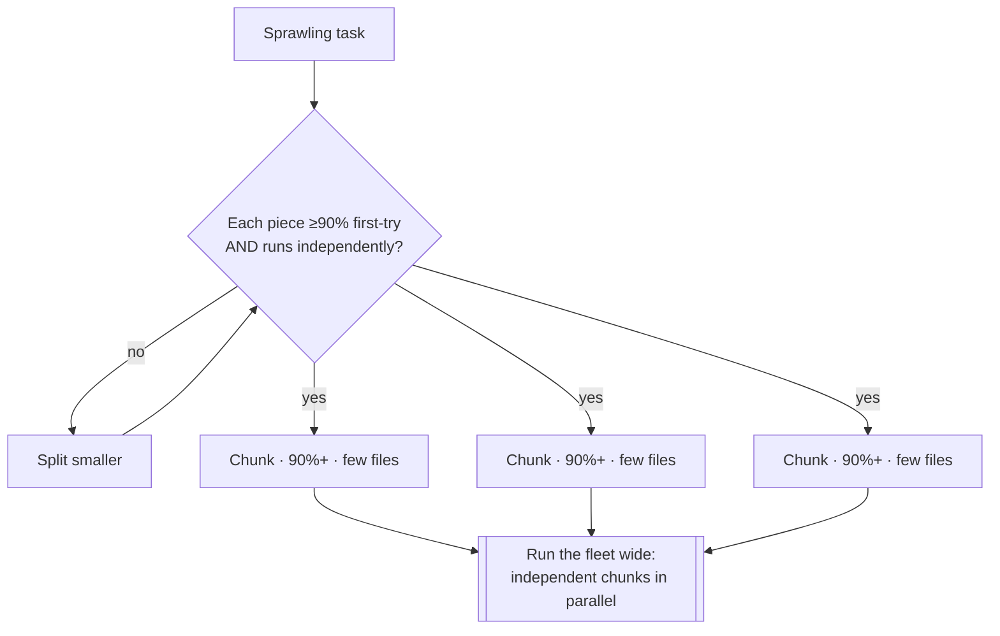
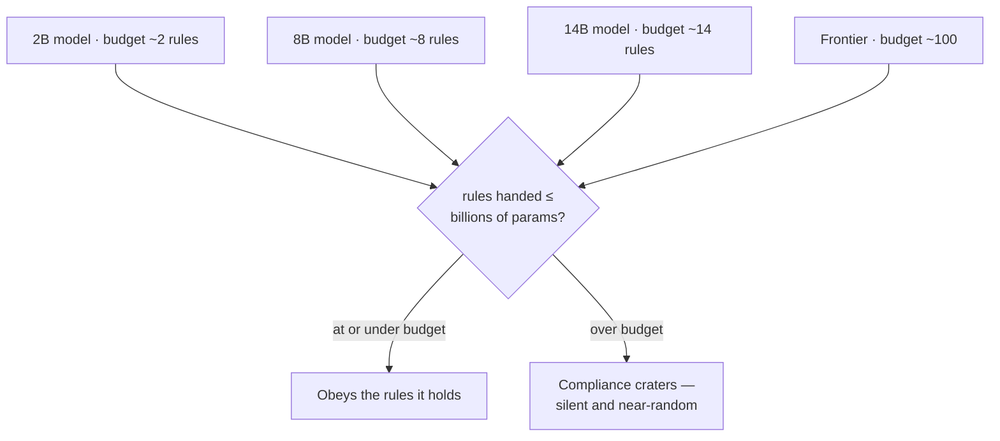
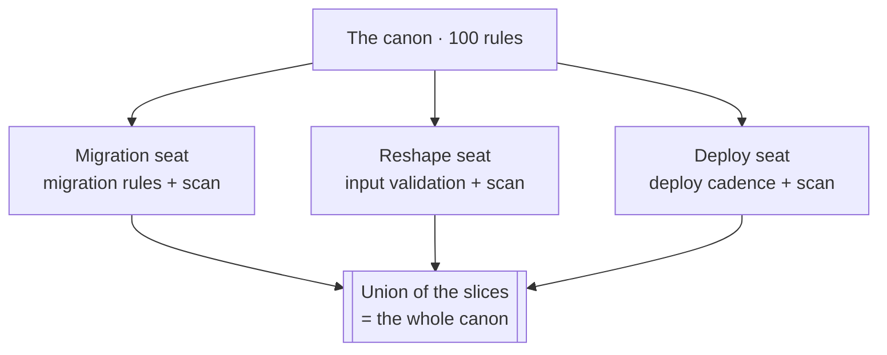
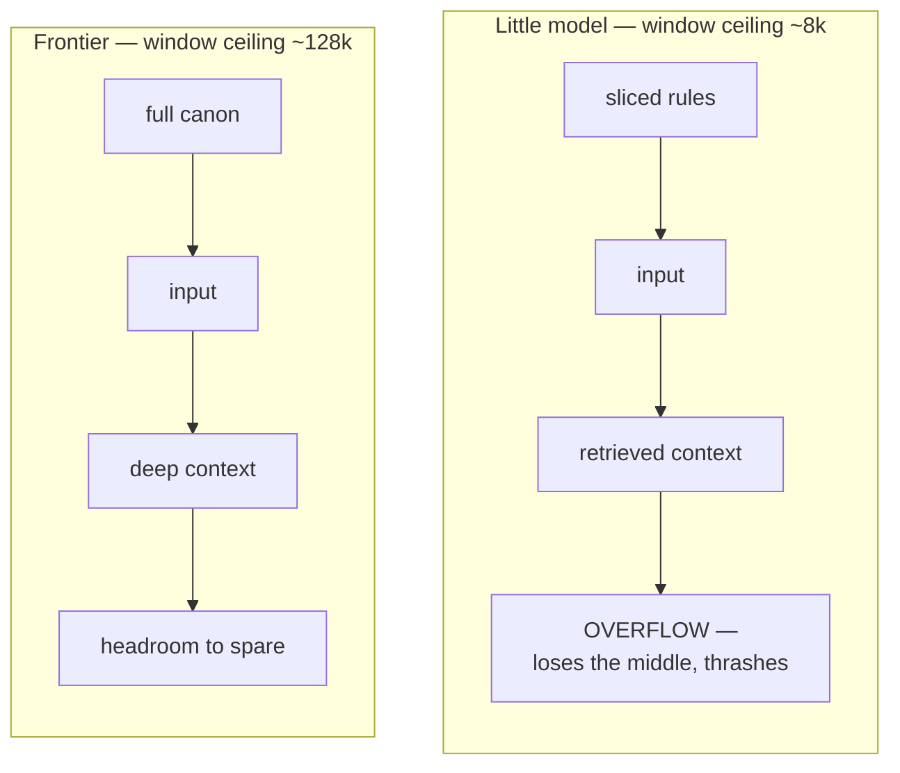
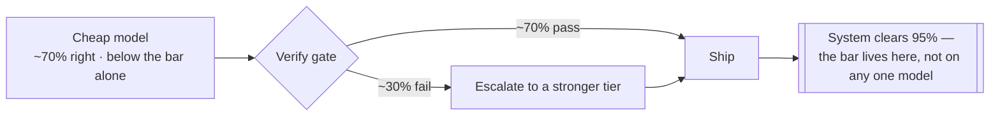
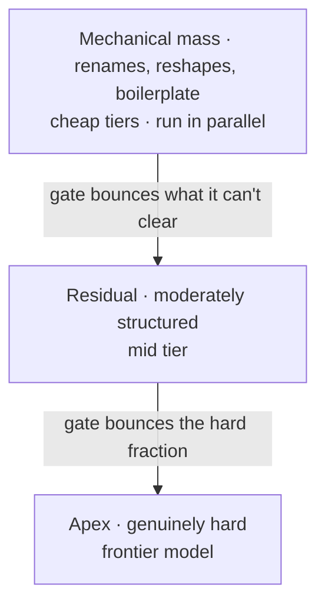
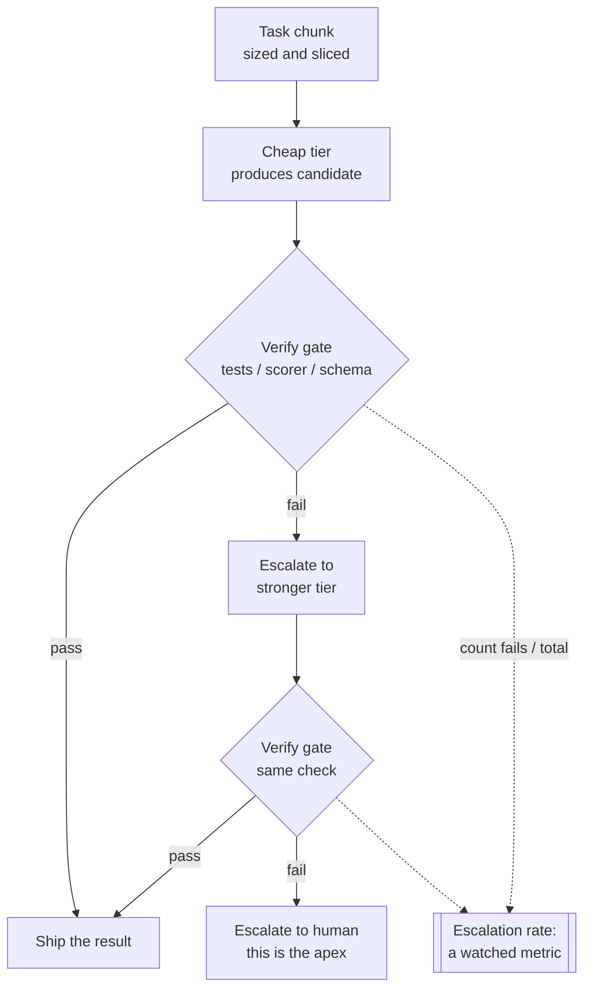
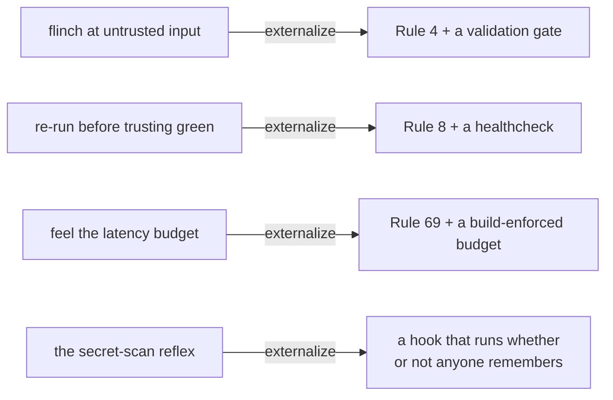

# Chapter 6 — Operating an AI Fleet

> **Standing on Chapters 1–5:**
> - The hard rules never bend, and the Powell rule holds: gather 90% of the information, then decide (Chapter 1).
> - Nothing is hardcoded; everything that can change flows through config, behind an interface (Chapter 2).
> - Builds are portable, fail loudly, and carry the fewest dependencies that do the job (Chapter 3).
> - Every artifact is scanned clean and proven against the rubric with 100% branch coverage (Chapter 4).
> - Every artifact is identified, every tag immutable, every decision and plan written down for the amnesiac who reads next (Chapter 5).

Everything before this chapter makes *one* agent good. Pick the right model, hand it the rules, gate its output, and a single capable assistant produces work you can ship. That's the whole book up to here, and it's enough to get real software out the door.

This chapter is about the next thing, and it's a different thing. The economics of running one frontier model on every task are bad and getting worse — most of what an agent does is mechanical, and paying top-tier rates to rename a variable or reshape a JSON blob is like flying a principal architect out to change a lightbulb. The obvious fix is to use cheaper, smaller models for the cheap, small work. The non-obvious problem is that a small model is genuinely worse: it forgets rules, it loses the thread past a few thousand tokens, it confidently produces output that almost works. Hand a 2-billion-parameter model the same hundred rules you'd hand a frontier model and it doesn't follow ten of them — it follows none of them, because the instructions themselves overflowed whatever it could hold.

So the move that makes a fleet pay isn't "trust a cheaper model." A cheaper model, trusted, is a liability. The move is to stop trusting the *model* and start trusting the *pipeline*: a cheap model that only has to be good enough to try first, an automated gate that catches what it got wrong, and an escalation path that sends the residual — the genuinely hard fraction — up to a stronger tier. The quality bar moves off the model and onto the system. A small model that's right 70% of the time, behind a verify gate that bounces the other 30% up a tier, beats a single expensive call on cost and — this is the part that surprised me — often on reliability too, because the gate catches the frontier model's bad days as well.

This is the one chapter where the book's claims are receipts, not anecdotes. The rules here came out of experiments run in this very repo: a size ladder that handed the same task to models from 2B to frontier with rule-counts from 2 to 16 and measured exactly where each one fell off; a verify-then-escalate harness that ran the cheap-tier-plus-gate pattern end to end. The numbers are blunt. A 2B model holds about two rules. An 8B model holds about eight. Past its ceiling, every model's score doesn't gently decline — it falls off a cliff, because an overloaded model isn't a worse model, it's a different and unpredictable one. The eight rules in this chapter are what those numbers taught me, stated as discipline.

One framing before the rules. A senior engineer carries a thousand unwritten reflexes — the flinch at an unvalidated input, the instinct to re-run before trusting a green, the latency budget felt in the gut. A small model carries none of them, and even a frontier model carries them inconsistently. The whole architecture of a fleet is a machine for converting that tacit senior expertise into explicit rules, slices, gates, and escalations that a model with no instincts can still be held to. That conversion is the last rule in the book, and it's the closing argument for all hundred.

## Rule 93: Chunk it so the model nails it

**Chunk every task into bite-size, parallel-capable units, each sized so the AI nails it first try ≥90% of the time. Anything with a >10% chance of first-try failure, or that can't run independently of its siblings, gets split smaller.**

This is Rule 90's "plan first" turned into a sizing law for a fleet. Planning tells you *what* the work is; chunking decides how *big* each piece handed to a model gets to be. And the unit of measurement isn't lines of code or hours — it's first-try success probability. A chunk is correctly sized when the model assigned to it succeeds on the first attempt at least nine times in ten. Anything below that bar isn't a chunk yet; it's two chunks pretending to be one.

The reason this matters more for AI than it ever did for humans is that a model's reliability collapses non-linearly with ambiguity and scope. A human handed a vague, sprawling task muddles through at reduced quality — a B-minus instead of an A. A model handed the same task doesn't degrade gracefully; it confabulates. The tenth step of a sweeping ten-step plan isn't done slightly worse, it's done wrong, with total confidence, in a way that reads exactly like done right. So you don't hand a model a sprawling task. You decompose until every piece has a binary done-signal — the build passes, the test goes green, the schema validates — and a failure probability under 10%.

*Chunking is a loop, not a single cut. A piece under the 90% bar, or one that waits on a sibling, goes back through the splitter. What comes out the bottom runs six-wide, not six-deep.*

The second clause is what turns chunking into *fleet* discipline: parallel-capable. Chunks sized this way come out independent more often than not — few files each, one clear output each — and independent chunks run simultaneously across the fleet. That's the throughput multiplier. A task split into six independent 90%-chunks doesn't take six times one chunk; it takes about one, run six-wide. Split anything that can't run free of its siblings smaller until the seam is clean, or the dependency forces you back into serial and you've lost the multiplier.

*A correctly sized chunk has two properties: a model nails it first try, and it doesn't wait on its neighbors. Miss either and split again.*

## Rule 94: The sizing law — one rule per billion

**A model reliably holds about one rule per billion parameters at the 90% bar (2B→~2, 8B→~8, 14B→~14). Never hand a model more rules than it has billions of parameters.**

This is the most concrete claim in the book, so let me show the work. I ran a ladder: the same coding task, handed to models from 2 billion parameters up through frontier, each tested against rule-sets of growing size — 2 rules, then 8, then 14, then 16. I measured how many of the supplied rules each model actually honored. The pattern was clean enough to be a little eerie. A model holds roughly as many rules as it has billions of parameters, and past that line its compliance doesn't taper — it craters. An 8B model riding eight rules scored well; the same 8B model handed sixteen rules didn't follow eight of them, it followed a near-random handful, because the surplus instructions crowded out the ones it could have kept.

*One rule per billion parameters, and the line is a cliff, not a slope. One rule past the ceiling and the model doesn't follow fewer rules — it follows them at random, and never says so.*

The mechanism, as best I can reason about it: rule-following is itself a capacity cost. Every rule the model must hold in working attention competes with every other rule and with the task. Below the ceiling, the model has headroom and obeys. At the ceiling, it's saturated. Past it, adding a rule doesn't add a constraint — it *removes* one at random, because the model is now thrashing. The 2B model that perfectly honored its two rules became useless at eight not because the eight were hard but because two was its whole budget.

So the law is a budget, and you spend it deliberately: never hand a model more rules than it has billions of parameters. A 2B model gets your two most load-bearing rules and nothing else. A 14B model gets fourteen. The frontier model gets the full hundred. This is not a suggestion to round up hopefully — the cliff is real and the far side is worthless. When a task genuinely needs more rules than the cheap tier can hold, that's not a reason to overload the cheap tier; it's the signal to slice (Rule 95) or escalate (Rule 99).

*One rule per billion parameters. Past the ceiling a model doesn't bend — it breaks, and it breaks silently.*

## Rule 95: Slice the rules to the seat

**Give each model or task only the rules its job needs — a *view* of the canon, not the whole book. The canon is the union of all slices; no single seat holds all of it.**

Rule 94 sets the budget; this rule is how you live within it. If a 2B model can hold two rules, the question isn't "which ninety-eight rules do I drop?" — it's "which two does *this seat* actually need?" A model writing a database migration needs the migration rules, the secret-scan rule, and almost nothing about frontend cross-platform layout. A model reshaping a JSON payload needs the input-validation rule and the schema, not the deploy-cadence rules. Each seat gets a *view* — the slice of the canon its job touches — and the slice fits its budget by construction.

*Each seat carries a view sized to its budget, not the whole book. The scan rule rides in every slice because it's universal; stitch the slices across the fleet and every rule is enforced somewhere — by the seat that needs it.*

This inverts how people instinctively deploy rules. The instinct is to hand every agent the whole rulebook, on the theory that more guidance is more safety. For a frontier model with room to spare, fine. For everything below it, the full rulebook is actively harmful: it blows the budget, triggers the Rule 94 cliff, and you get *less* compliance by giving *more* rules. The slice isn't a compromise forced by small models — it's the correct design even when you could afford not to, because a focused model on a focused rule-set outperforms a saturated one every time.

The load-bearing half is the second sentence. No single seat holds the whole canon — but the canon still governs the whole system, because it's the *union* of the slices. The migration seat carries the migration rules; the deploy seat carries the deploy rules; the secret-scan rule rides in every slice because it's universal. Stitch the slices across the fleet and every rule is enforced somewhere, by the seat that needs it, within the budget that seat can hold. The book exists whole; no one model has to.

*Distribute the canon, don't replicate it. Each seat carries its view; the fleet carries the book.*

## Rule 96: Mind the context ceiling

**Context ceiling by tier: a little model never deals with more than ~8k of context (it degrades past ~8–10k); a frontier model is safe to ~128k. Bound every cheap-tier task — input as well as rules — to its ceiling.**

Rule 94 budgets the *rules*; this rule budgets *everything else in the window* — the input, the surrounding code, the prior turns, the retrieved context. They draw on the same pool, and a small model's pool is shallow. A little model degrades sharply past roughly eight to ten thousand tokens: not "answers get a bit worse," but the same cliff Rule 94 describes, where the model loses the middle of its own context and starts answering from fragments. A frontier model stays coherent out to around 128k. These are different machines with different ceilings, and a task that's trivial for one overflows the other.

*Rules and input draw on one window. Pile a sliced model's two rules on top of a 30k-token file and you've blown the ceiling on input alone. Bound the whole prompt to the tier, or the tier degrades into a different, unreliable machine.*

I learned to feel this as a second budget that has to clear alongside the rule budget. It's no use slicing a 2B model down to its two rules if you then paste in a 30k-token file for it to edit — you blew the ceiling on input and the model is thrashing again, rules or no rules. So bounding a cheap-tier task means bounding the *whole* prompt: the sliced rules, plus the input, plus whatever context the work needs, all of it under the tier's ceiling. If the input alone won't fit, the task is mis-assigned — either chunk the input smaller (Rule 93), retrieve only the relevant span instead of the whole file, or escalate to a tier whose ceiling holds it (Rule 98).

This is also why "just give the small model more context to compensate for being small" is exactly backwards. More context doesn't help a model that's already near its ceiling — it pushes it over. The cheap tiers earn their keep on *small, bounded* tasks: a focused input, a focused rule-slice, a clear output. Keep them in the zone where they're reliable, and route anything that needs to hold a lot at once to the tier built to hold it.

*Rules and input share one window. Bound the whole prompt to the tier's ceiling, or the tier degrades into a different, unreliable model.*

## Rule 97: Good enough at the model, 90% at the system

**A cheap model only has to be good enough to try first. The quality bar belongs to the pipeline — cheap model + a verify gate + escalate-the-residual to a stronger tier — not to any one model.**

This is the hinge rule of the whole chapter, the one that makes a fleet of mediocre models produce excellent work. Chapter 4 set the quality bar: 90% on the rubric to work, 95% to publish. The trap is to read that as a requirement on *each model*. It isn't. It's a requirement on the *system*. A single model never has to clear the bar alone — the pipeline clears it.

*Seventy-percent-right is unusable as a final answer and a bargain as a first attempt behind a gate. Pull the model, the gate, or the escalation and the whole thing drops below the bar.*

Here's the reframe that took me a while to trust. A cheap model's job is not to be right. Its job is to be *good enough to try first* — to produce a candidate cheaply, fast, and often enough that catching its mistakes downstream is still cheaper than doing the work at frontier rates from the start. A model that's right 70% of the time sounds unusable as a final answer. As a first attempt behind a gate that bounces the 30% it got wrong, it's a bargain: you paid cheap-tier rates for seven of every ten results, and frontier rates for only the three the gate kicked up.

The quality, then, lives in three components, not one: the cheap model that tries, the verify gate that grades the attempt (Rule 99), and the escalation path that sends failures to a stronger tier. Pull any one and the system collapses — a cheap model with no gate ships its 30% of garbage; a gate with no escalation just rejects work without producing the answer; escalation with no cheap first tier is just the expensive single-model setup you were trying to escape. Together they hit the system bar at a fraction of the cost.

The experiments bear this out and add a twist I didn't expect: the gate catches the *frontier* model's failures too. No model is right every time. A verify gate that exists to catch the cheap tier's misses also catches the expensive tier's bad days — so the pipeline is often *more* reliable than a single frontier call, not just cheaper. Quality you build into the system survives any single model's off day. Quality you rest on one model's brilliance fails exactly when that model does.

*Stop asking "is this model good enough?" Ask "is the pipeline good enough?" The model only has to try; the system has to be right.*

## Rule 98: Match the work to the model

**Size, rule-count, and context all scale together. Send mechanical work to the smallest tier that clears it, escalate only the residual, and reserve the frontier model for the genuinely hard fraction.**

The three budgets of this chapter — parameter count (Rule 94), rule-count (it's the same number), and context ceiling (Rule 96) — are not independent dials. They scale together, and they describe a *tier*. A 2B model is a tier: two rules, a few thousand tokens of context, mechanical work only. A 14B model is a tier: fourteen rules, more headroom, moderately structured work. The frontier model is a tier: the whole canon, deep context, genuinely hard reasoning. Matching work to a model means picking the tier whose three budgets all clear the task — not just one of them.

*The work is a pyramid: the broad base runs cheap and parallel, only the residual escalates, and the frontier model handles the narrow apex — affordable precisely because it's narrow. Cheapest tier that clears the task, not cheapest available.*

The economic instinct is "use the cheapest model that works," and that's right, but the operative word is *works*. Cheapest-that-clears, not cheapest-available. A task needing ten rules does not go to an 8B model to save money — it goes to the 14B tier or it gets sliced (Rule 95) until each piece fits the 8B budget. Underprovisioning is not thrift; it's the Rule 94 cliff with a cost-savings rationalization on top, and the bounced work plus the cleanup costs more than running the right tier the first time.

The shape this produces is a pyramid of work. The broad base — the mechanical mass, the renames and reshapes and boilerplate — runs on the cheap tiers, in parallel, fast and nearly free. Above it, the residual that the base tier couldn't clear escalates to a middle tier. And at the narrow apex, the genuinely hard fraction — the load-bearing architecture, the subtle reasoning, the work where being wrong is expensive — gets the frontier model, which is now affordable precisely because it's only handling the apex instead of the whole pyramid. Reserve the expensive thinking for the decisions that are expensive to get wrong. The fleet's whole economic argument is that the apex is small.

*Pick the smallest tier whose every budget clears the work. Escalate the residual upward. Keep the frontier model for the apex, where it earns its rate.*

## Rule 99: Verify, then escalate

**Gate cheap-tier output with a fast automated check — tests, a scorer, a schema. Ship what passes, bounce what fails up a tier. The escalation rate is a metric to watch, not a surprise.**

This is the rule that makes Rule 97 mechanical instead of aspirational, and it's the heart of the pipeline. The cheap model produces a candidate; before that candidate goes anywhere, an *automated* gate grades it; passes ship, failures escalate to a stronger tier. The word that carries the rule is *automated*. A human verifying every cheap-tier output is just expensive review with extra steps — you've moved the cost, not removed it. The gate has to be a program: a test suite, a schema validator, a rubric-scorer, a linter, a compile step. Something that runs in milliseconds and returns pass or fail without an opinion.

*The pipeline. Solid edges are the work path: cheap tier, gate, ship-or-escalate, gate again, human at the apex. The dashed edges feed the escalation-rate metric — the gate's verdicts, counted.*

The escalation rate is the instrument on the dashboard. It's the fraction of cheap-tier outputs the gate bounces upward, and you watch it the way you watch any health metric. Stable and low means the tiering is well-tuned — the cheap tier is clearing most of its assigned work and the gate is catching the rest. A *rising* escalation rate is an early warning: the cheap tier is being handed work above its budget, or the chunks have grown too big (Rule 93), or a model changed underneath you. Either way the system tells you before the cost blows out, because the metric moves before the bill does. A pipeline whose escalation rate you don't measure is a pipeline that can silently degrade into "frontier model on everything" — the exact cost structure you built the fleet to escape — and nobody notices until accounting does.

One caution the experiments made vivid: the gate is only as good as its check. A weak gate — one that passes output it shouldn't — ships the cheap tier's garbage with a green stamp on it, which is worse than no gate, because now the failures look verified. The gate inherits Chapter 4's whole discipline: real tests, real coverage, a real scorer. Verify, then escalate — but verify for real.

## Rule 100: Externalize the reflex

**The expertise a senior carries tacitly — the latency instinct, the re-run check, the untrusted-input flinch — must become an explicit rule, test, or gate, because the agent at the keyboard has none of it.**

Here at the end, the rule that the other ninety-nine were quietly building toward.

A senior engineer is mostly reflexes. Forty-seven years in, the things that keep my software alive aren't the things I think about — they're the things I no longer have to. I flinch at a string concatenated into a query before I've consciously read it as SQL injection. I re-run the build instead of trusting the green, because some scar from a piped exit code taught my hands to. I feel a latency budget in my gut and wince when a change blows past it. None of that is knowledge I could hand you on a page. It's tacit — worn smooth by enough failures that it became instinct, the kind of thing a senior can do but can't fully explain.

The agent at the keyboard has none of it. Not the small model — the small model obviously has none. But not the frontier model either, not reliably. A model's instincts are an average of its training data, which means they're a B-minus engineer's instincts on a good day and absent on a bad one. You cannot wait for the flinch, because there is no flinch. The reflex that fires automatically in a senior's nervous system has to fire *somewhere else* in a fleet — and the only somewhere else is the system itself.

So that is what this whole book has been: a machine for externalizing the reflex. Every rule in it is a tacit senior instinct dragged into the open and welded to the pipeline where a model with no instincts can still be held to it. The flinch at untrusted input became Rule 4 and a validation gate. The re-run-before-trusting-green became Rule 8 and a healthcheck. The latency instinct became Rule 69 and a budget the build enforces. The secret-scan reflex became a hook that runs whether anyone remembers to or not.

*Tacit on the left, executable on the right. Every rule in the book is a senior's instinct dragged into the open and welded to the pipeline — so a C-grade model with no instincts is structurally unable to ship below the bar.* None of these depend on the agent being wise. They depend on the wisdom having already been extracted, written down, numbered, and turned into something that executes — a rule sliced to a seat, a test that must pass, a gate that bounces failures up a tier.

That's the closing argument, and it holds for the whole fleet at once. The machine's default output is C-grade — functional, average, instinct-free, exactly what an average of all code would predict. You do not get A-grade work by hoping for a better model; the better model has the same gap, just smaller. You get A-grade work by externalizing enough senior reflex into the system that a C-grade model, sliced and gated and escalated, is *structurally unable* to ship below the bar. The discipline doesn't live in the model. It lives in the rules, the tests, the gates, and the tiers — in everything that keeps firing after the human who knew better has left the room. Build that, and the fleet produces work better than any single model in it. That is the entire point. That is why you write the rules down.

### Chapter 6 card

1. **Chunk it so the model nails it** — bite-size, parallel-capable units, each ≥90% first-try; split anything >10% fail-risk or non-independent.
2. **The sizing law: one rule per billion** — ~1 rule per billion params (2B→~2, 8B→~8, 14B→~14); past the ceiling, compliance craters silently.
3. **Slice the rules to the seat** — each seat gets a *view* of the canon, not the whole book; the fleet's union is the canon.
4. **Mind the context ceiling** — little model ≤~8k, frontier safe to ~128k; bound the whole prompt, rules and input, to the tier.
5. **Good enough at the model, 90% at the system** — the cheap model only has to try first; the quality bar lives in the pipeline.
6. **Match the work to the model** — size, rules, and context scale together; smallest tier that clears it, frontier for the apex.
7. **Verify, then escalate** — automated gate grades cheap output; pass ships, fail goes up a tier; watch the escalation rate.
8. **Externalize the reflex** — the senior's tacit instinct becomes an explicit rule, test, or gate, because the agent has none of its own.

---

That's the fleet, and that's the hundredth rule. The thread that runs from the first scan-before-ship to this last externalized reflex is a single claim: software is built by collaborators who forget, misremember, and have no instincts of their own — and written, enforced, externalized discipline is the only thing that makes their C-grade defaults produce A-grade work. The models will change. The ceilings will rise, the tiers will shuffle, the parameter counts in Rule 94 will look quaint in a year. The discipline of extracting your expertise into rules a memoryless, instinct-free agent can be held to — that survives every model you'll ever bind to a seat. Write it down, slice it, gate it, and let the machine fire the reflex you no longer have to.
