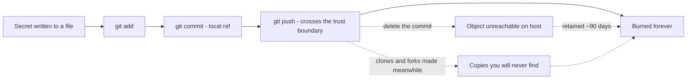
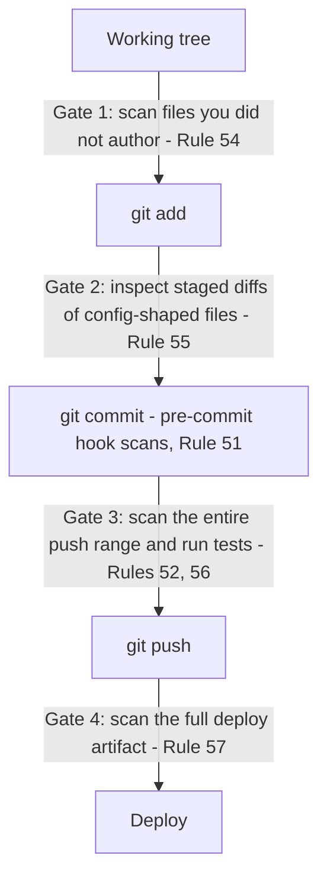
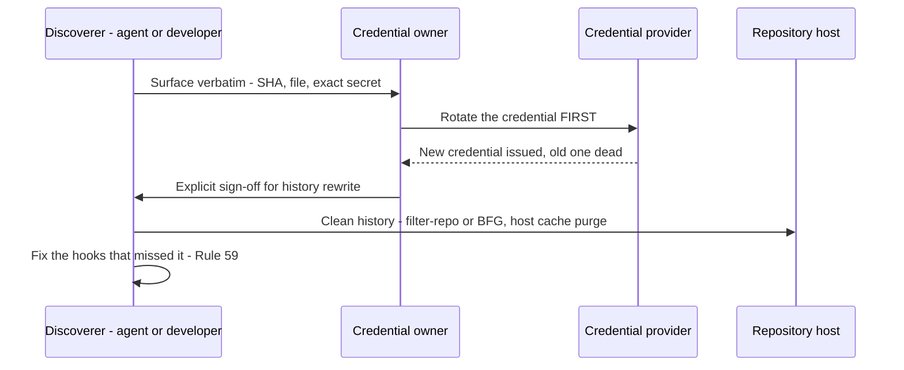

# Chapter 6 — Secret Hygiene

Every other chapter in this book describes mistakes you can recover from. A bad merge can be reverted. A god class can be refactored. A broken deploy can be rolled forward. Git is, at its heart, a machine for undoing things — that's why I trust it with so much autonomy elsewhere in these rules. This chapter is about the one mistake the machine cannot undo.

A leaked credential is not a state of the repository. It is a state of the world. The moment a key crosses a trust boundary — a remote, a registry, a cluster, a host you don't own — copies exist that you will never enumerate and never delete. You can rewrite history until the commit graph is spotless, and somewhere a clone made on a Tuesday afternoon still holds the key in plain text. The major hosting providers retain unreachable objects for around ninety days after you "delete" them; forks and mirrors retain them forever. Git forgives everything except this.

I spent a good stretch of my career in places where key material was handled the way a reactor crew handles fuel rods: dedicated custody, two-person rules, destruction logs. It left a mark. So when, years later, I watched a perfectly competent team burn a production API key through the most boring commit imaginable, I wasn't surprised by the mechanism — only by how ordinary it was. Nobody committed a file called `secrets.txt`. Someone updated a deployment YAML, and tucked in among thirty harmless lines — a port change, a memory limit, a replica count — was an environment variable with a literal token in it, pasted in during local debugging and never taken back out. The reviewer skimmed the diff, saw "config churn," and approved it. The scanner that would have caught it was on the to-do list. It was installed the following week, which is the secret-hygiene equivalent of buying a smoke detector at the estate sale.

The ten rules in this chapter exist because every link in that chain was preventable, and none of them was prevented. They are mechanical, they are cheap, and they are mandatory. Every other rule in this book protects your code. These ten protect everything your code can touch — your accounts, your customers' data, your bill, your name. Code can be fixed. Trust gets rotated, at best.

*The leak lifecycle: every solid arrow is reversible except the last. The dashed paths show why deletion is theater — unreachable objects linger on the host for about ninety days, and clones keep the secret forever.*

## Rule 51: Hooks Before the First Commit

**Pre-commit hooks with secret scanning (gitleaks + detect-secrets) are mandatory in every repo — installed before the first commit, not after.**

The ordering clause is the whole rule. Everyone agrees secret scanning is a good idea; almost everyone installs it on day four, after the repo "settles down." But the first commits of a project are precisely the most dangerous ones. Day one is when you're wiring up the API client and the temptation to paste the key inline "just to see it work" is strongest. Day one is when there's no `.env` file yet, no config layer, no reviewer. Day one is when nobody is watching, including you.

So the sequence is fixed: `git init`, install the hooks, *then* write code. In my repos this is a single bootstrap step — the pre-commit config in Appendix A drops in unmodified, gitleaks and detect-secrets included, and takes under a minute. A minute is a price; a rotation is a project.

The rule also binds the AI agents that do an increasing share of my commits. An agent that finds a repo without scan hooks doesn't shrug and proceed on the grounds that "the repo doesn't have hooks yet" — it installs them before its first commit, the same as I would. Hooks are infrastructure the way a `.git` directory is infrastructure: their absence isn't a style choice, it's a repo that isn't finished being created.

One pragmatic note: a hook you can casually bypass trains you to bypass it. `--no-verify` exists for genuine emergencies, and if you find yourself reaching for it twice in a month, the problem is your baseline file or your patterns — fix the configuration, don't develop the habit.

## Rule 52: Rescan on Push, and Bring the Tests

**Pre-push hooks rescan for secrets and run the tests.**

The pre-commit hook is the first tripwire, not the last. The pre-push hook exists because the threat model changes between commit and push. A commit is local — embarrassing, but recoverable. A push crosses the trust boundary, and per the lifecycle diagram above, what crosses doesn't come back. So the push gets its own scan, even though every commit in it was supposedly scanned already.

Why rescan something already scanned? Because "supposedly" is doing heavy lifting in that sentence. Hooks get bypassed in moments of haste. Commits arrive from rebases, cherry-picks, and other machines where the hooks weren't installed. An agent — human or AI — may have made commits in a different session under different rules. The pre-commit hook checks the change you think you're making; the pre-push hook checks the history you're actually about to publish. They are different questions, and you want both answered.

The tests ride along for the same boundary logic. Rule 7 already says green before commit, but the push is the moment your code stops being your problem and starts being the team's — or, in my push-early-push-always workflow, the moment it lands on `main` for every other persona and machine to build on. A test suite at push time is cheap insurance that the thing you're publishing actually works on the branch you're publishing, not just in the working tree you last looked at.

Yes, this makes pushing slower. It's supposed to. The push is the last gate that runs on hardware you control, against state you can still amend quietly. Everything after it is incident response.

## Rule 53: The .gitignore Knows About Keys on Day One

**`.gitignore` covers `.env*`, keys, certs, and credential files from day one.**

Scanners are pattern-matchers, and pattern-matchers miss things. The `.gitignore` is the dumber, sturdier layer underneath: entire categories of files that have no business in version control, excluded by name before any scanner has to be clever about their contents. `.env` and every `.env.*` variant (with `!.env.example` carved back in), `*.pem`, `*.key`, `*.pfx`, `*.crt`, `id_rsa*`, `credentials.json`, `service-account*.json`, the cloud-CLI config directories. Appendix B has the full block; it pastes in as-is.

The day-one requirement matters for the same reason it mattered in Rule 51: the window between "repo exists" and "repo is configured" is when the worst accidents happen. `git add .` is a reflex, and on a young repo it's a reflex that sweeps up whatever's lying around — including the service-account JSON you downloaded ten minutes ago to get the demo working. A `.gitignore` entry costs nothing and turns that whole category of accident into a non-event. The file simply never enters the conversation.

Two refinements from scar tissue. First, ignore by category, not by incident. If a `deploy.key` slipped past you once, the fix is `*.key`, not `deploy.key` — the next leak will have a different filename, because it always does. Second, the `.gitignore` is a backstop, not a permission slip. A gitignored `.env` full of production credentials sitting in a working tree is still one `git add -f`, one misconfigured backup, or one screen-share away from trouble. The ignore file keeps honest mistakes out of the repo. Keeping secrets safe everywhere else is what the remaining seven rules are for.

## Rule 54: Scan What You Didn't Write

**Before `git add` of any file you didn't author, scan it for secret-shaped strings — key prefixes, JWTs, private-key blocks, long base64 blobs.**

Files you wrote are covered by Rule 2: you never typed a secret in, so there's nothing to find. Files you *didn't* write are a different species. The vendor's sample config, the dataset a colleague handed you, the generated kubeconfig, the repo you're vendoring in, the file an AI agent produced in a previous session — you don't know its history, so you treat it the way customs treats an unaccompanied bag.

The good news is that secrets are conspicuous once you look. They have shapes: provider key prefixes (`sk-`, `gsk_`, `ghp_`, `AKIA`, `AIza`, the Slack `xox` family), the three-part `eyJ...eyJ...` silhouette of a JWT, `-----BEGIN` private-key blocks, suspiciously long high-entropy base64 runs, plausible passwords sitting in the `data` or `stringData` block of a Kubernetes secret manifest. A gitleaks pass over the file, or even a disciplined eyeball, catches the overwhelming majority before staging ever happens.

Note the placement: before `git add`, not before commit. The pre-commit hook will scan staged content anyway, so why the earlier gate? Because staging is already a step toward the cliff, and because hooks check patterns while a human or agent reading the file checks *context*. A scanner sees a base64 string; a reader sees that it's labeled `prod_db_password` in a file named `values-staging.yaml` and asks the obviously necessary question. When the answer is "yes, that's real," the file never gets added, the secret gets flagged to its owner, and — per Rule 60 — it doesn't get copied anywhere in the process, including into the message that flags it.

## Rule 55: Leaks Hide in "Harmless" Config

**Before committing, inspect the staged diff of every config-shaped file — yaml, json, toml, env, anything under infra or deploy directories. Leaks hide best in "harmless" config.**

The leak in my opening story didn't arrive in a file called `secrets.txt`. They almost never do. A file with a scary name gets scrutiny; a deployment YAML getting its third routine touch this week gets a skim. That's the camouflage: config files change constantly, their diffs are repetitive and dull, and a literal token sits comfortably among the ports and timeouts because syntactically it *is* just another string value. The most dangerous line in any diff is the one your eyes were trained by a hundred boring diffs to slide past.

So config-shaped files get a mandatory close read at commit time: `git diff --cached --stat` for the overview, then the full staged diff of anything matching `.env*`, `*.yaml`, `*.yml`, `*.json`, `*.toml`, anything with `secret` or `credential` in the name, and anything under `infra/`, `deploy/`, `k8s/`, `terraform/`, `helm/`, or their cousins. Not the file — the *diff*. You're not auditing the whole manifest every time; you're auditing what's about to change, line by line, with one question in mind: is any value here a literal credential instead of a reference to one?

The discipline applies even when the file was "already in the repo" and even when the change came from someone — or something — you trust. Trust no prior commit blind; scan what you're about to add. A healthy config diff contains names of secrets: `secretKeyRef`, `${API_TOKEN}`, a vault path. The moment it contains the *value* of one, you've found the leak before it happened, which is the only cheap time to find it.

## Rule 56: Scan the Range, Not the Tip

**Before pushing, scan the entire push range, not just the tip — an intermediate commit can carry the leak.**

Here's the failure mode this rule kills. Commit three adds a key — pasted in for local debugging, the hook bypassed or not yet installed. Commit five removes it, because you noticed. The working tree is clean. The tip is clean. A scan of `HEAD` finds nothing, and every tool that only looks at the latest state will wave the push through. But a push doesn't publish a snapshot; it publishes *history*. All five commits cross the boundary, and commit three crosses with the key in it, fully retrievable by anyone who can run `git log -p`.

"It was only there for two commits" is not a mitigation. It's a description of exactly where attackers look first — automated scrapers walk commit histories precisely because developers clean up tips and forget middles.

So the pre-push scan runs over the full range: everything in `<upstream>..HEAD`, every commit, every version of every file. Gitleaks does this natively against a commit range, and the pre-push hook from Rule 52 is the natural place to wire it in. The cost is seconds; the asymmetry with the alternative is total.

When the range scan does fire on an intermediate commit, the push stops — full stop. And read Rule 58 carefully before you reach for an interactive rebase to scrub the offending commit: if the range was ever pushed anywhere previously, even to a private fork, even briefly, the key is already burned and rotation comes first. The range scan is also why I distrust "I'll squash it away later" as a workflow. Later has a way of arriving after the push.

## Rule 57: Scan the Whole Artifact

**Before deploying, scan the full artifact — image build context, manifests, env bindings, the lot — not just the files changed since the last deploy.**

Push hygiene protects the repository. Deploys have a bigger blast radius, because a deploy artifact is assembled from more than the repo: the container image and everything `COPY` swept into it from the build context, the rendered manifests with their values files merged in, the environment bindings the platform injects, the chart defaults nobody has read since the chart was vendored, the `.env` that gets mounted at runtime. Any one of those can carry a credential that no git diff will ever show you, because it was never in git — or worse, was in git all along, before your scanners existed.

That's why the scope is the *full artifact*, not the delta. Incremental thinking — "we only changed two files since the last deploy, scan those" — silently assumes the last deploy was clean, and the one before it, all the way back to a first deploy that predates your hooks. Layered images and rendered configs inherit history the way commits do. The only scan that doesn't depend on an unverifiable chain of past virtue is the one that covers everything shipping right now.

In practice: scan the image build context before the build, scan the rendered manifests after templating (the template is innocent; the *rendered* values are where literals appear), and check that the credential substrate the deploy reads from — the mounted env file, the referenced platform secret — isn't *also* embedded literally in some version-controlled file, which is the classic belt-plus-no-suspenders arrangement. Rule 49 already says pre-deploy gates are never disabled by default. This rule names the gate that matters most. "It's just a quick demo" deploys to someone else's machine all the same.

*The four scan gates, in order. Each gate assumes the previous ones failed — that redundancy is the design, not an inefficiency.*

## Rule 58: Rotate First, Clean History Second

**A secret that ever touched a commit is burned. Rotate first, clean history second — pushed objects outlive deletion.**

This is the rule people most want to negotiate with, so let me close the exits. "It was only pushed for a minute." Scrapers watch public push events in real time; a minute is plenty. "It's a private repo." Private means a smaller audience, not a trustworthy one — and repos change visibility, get forked, get cloned to laptops that get stolen. "I force-pushed over it." You rewrote the refs, not the objects; on the major hosts, the unreachable objects remain fetchable by hash for around ninety days, and any clone or fork made before your cleanup keeps the secret with no expiration date at all. There is no sequence of git commands that un-publishes data. None.

Once you accept that, the ordering becomes obvious. Rotation is the only step that actually revokes access, so it goes first — before the history rewrite, before the post-mortem, before lunch. A burned key with a pretty history is still burned; a rotated key with an ugly history is harmless. Teams that clean history first are polishing the crime scene while the suspect drives away.

The full protocol: stop what you're doing. Surface the finding to the credential's owner verbatim — the SHA, the file, the secret itself, unredacted, because the owner needs to identify exactly which credential to kill (this disclosure to the owner is the one exception to Rule 60's no-copying rule, and it goes to the owner only). Rotate. *Then*, with explicit sign-off — history rewrites are destructive operations under Rule 3 — clean up with `git filter-repo` or BFG, and ask the host to purge its caches. Then proceed to Rule 59, because the incident isn't over until the hooks are smarter.

*The rotation protocol. The order is the point: nothing about history cleanup is urgent once the key is dead, and nothing about it helps while the key is alive.*

## Rule 59: Fix the Hook That Missed It

**After any leak, document what scan would have caught it and fix the hooks so it can't recur.**

Every leak is two failures: a secret got loose, and a gate that should have stopped it didn't. Rotation handles the first. Most teams stop there, which is how the same leak happens twice — same shape, same gap, eighteen months apart, with only the key prefix changed. The second failure deserves the same rigor as the first.

The post-incident question is narrow and answerable: *which gate, configured how, would have caught this?* Walk the gate map from this chapter. Was there no pre-commit hook (Rule 51)? Did the hook exist but lack a pattern for this provider's key format? Was the file gitignore-able by category and not ignored (Rule 53)? Did a stale detect-secrets baseline whitelist the very line that leaked? Did the tip get scanned but not the range (Rule 56)? Was the artifact assembled from something outside the repo that no gate ever saw (Rule 57)? The answer is rarely "no tool could have caught this." It is almost always "the tool was missing, misconfigured, or scoped too narrowly."

Then fix it, and make the fix verifiable: add the missing pattern and a test case with a defanged dummy secret that proves the hook now fires. Write the incident down — date, what leaked, which gate failed, what changed — in the bug log, where the next maintainer will find it. And audit sideways: the habit or session that produced this leak probably touched other repos the same week. Carelessness patterns; check its other haunts.

A leak that buys you a permanently better gate was expensive tuition. A leak that buys you nothing is just a rehearsal for the next one.

## Rule 60: Never Copy a Secret Anywhere

**Never copy a discovered secret anywhere — not into chat, not a scratch file, not "temporarily."**

The instinct, on finding a secret, is to grab it: paste it into the chat to ask "is this real?", drop it in a scratch file to deal with after lunch, quote it in the bug ticket, echo it to the terminal mid-debug. Every one of those copies feels free and is not. The chat transcript is stored on someone else's infrastructure and may feed a training pipeline. The scratch file outlives lunch, falls outside the `.gitignore`, and gets swept into the next `git add .`. The ticket is readable by everyone with project access, forever. The terminal echo lands in shell history and the session log. Each copy is a new leak site with its own retention policy, its own audience, and no scanner watching it — and ten rules of containment go down the drain at the speed of Ctrl-V.

This rule binds AI agents hardest, because copying text is what we're *built* to do. An agent that finds a key and helpfully reproduces it in its summary — "I found `sk-live-...` in config.yaml, you should rotate it" — has just written the secret into a conversation log it doesn't control. The correct report names the file, the line, and the shape: "config.yaml line 41 contains what appears to be a live provider API key." Location, not payload.

The one exception was stated in Rule 58: surfacing the exact secret verbatim *to its owner* during the rotation protocol, because the owner must identify precisely which credential to kill. That disclosure goes to the owner, through the most direct channel available, once. Everywhere else, the discipline I learned around radioactive key material applies unchanged: you handle it with tongs, you log that it exists, and you never, ever take it home in your pocket.

### Chapter 6 card

- **Rule 51** — Secret-scanning pre-commit hooks (gitleaks + detect-secrets) in every repo, installed *before* the first commit.
- **Rule 52** — Pre-push hooks rescan for secrets and run the tests; the push is the last gate you control.
- **Rule 53** — `.gitignore` covers `.env*`, keys, certs, and credential files from day one — by category, not by incident.
- **Rule 54** — Scan any file you didn't author for secret-shaped strings before `git add`.
- **Rule 55** — Read the staged diff of every config-shaped file before committing; leaks hide best in "harmless" YAML.
- **Rule 56** — Scan the entire push range, not just the tip; an intermediate commit can carry the leak.
- **Rule 57** — Scan the full deploy artifact — build context, rendered manifests, env bindings — never just the delta.
- **Rule 58** — A secret that ever touched a commit is burned: rotate first, clean history second; pushed objects outlive deletion.
- **Rule 59** — After any leak, identify the scan that would have caught it and fix the hooks so it can't recur.
- **Rule 60** — Never copy a discovered secret anywhere — not chat, not a scratch file, not "temporarily." Report location, not payload.
