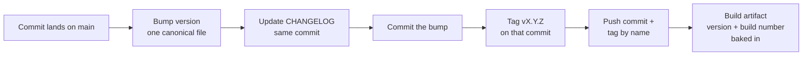
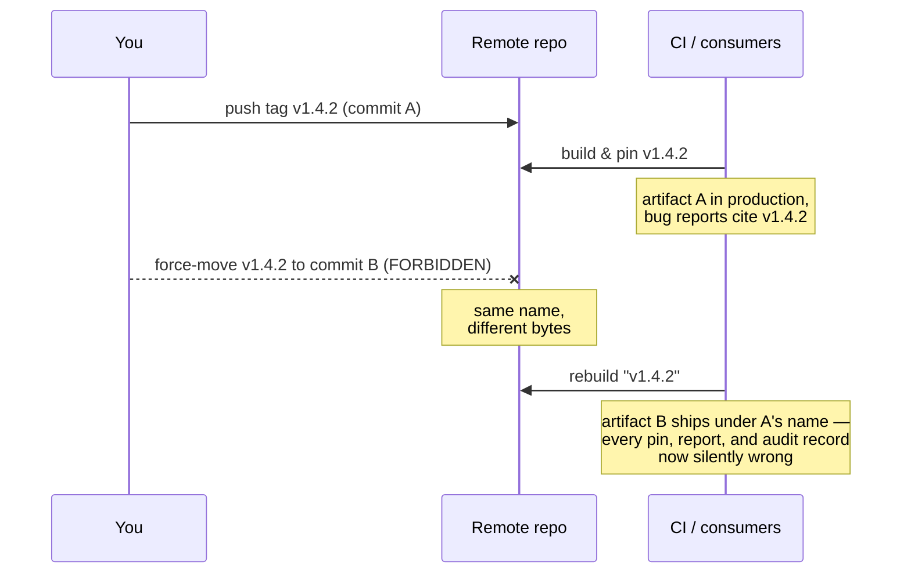
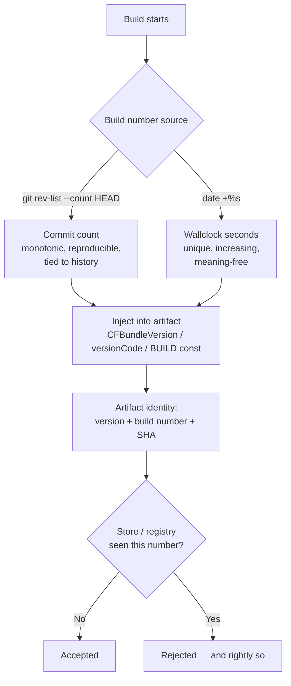

# Chapter 7 — Versioning and Release

A version number is a promise. The moment you publish `v1.4.2`, somebody — a container build, a deploy script, a downstream team, your own future self at 2 a.m. — pins to it. From that moment forward, `v1.4.2` means one thing: a specific set of bytes that behaves a specific way. Break that promise once and every consumer of your software learns the same lesson: your version numbers are decorative. They will start pinning to commit SHAs, vendoring your code, or worse, freezing on an old release forever because upgrading you is a gamble.

I spent the formative years of my career in embedded systems, where the question "what exactly is running on that box?" had to have an exact answer. Not "probably the March build." An exact answer, down to the build, because when a unit misbehaved in the field, the firmware image was the first variable to eliminate — and you can't eliminate what you can't identify. That discipline never left me, and it transfers perfectly to cloud services, CLI tools, and phone apps. The deployment substrate changed; the question didn't.

So this chapter is about two things, and they're really the same thing.

First: never break the promise. The version lives in exactly one place, only moves forward, and once a tag is pushed it is carved in stone. No moved tags, no reused tags, no "I'll just fix the tag real quick." The history of what you shipped is append-only, like a ship's log. You don't erase yesterday's entry because today you wish it said something else.

Second: always be able to answer "what is running, right now, in production?" in one command and ten seconds. The version shows up on the splash screen, in `--version`, on the `/health` endpoint. Every build carries a unique build number so two artifacts can never masquerade as each other. The changelog travels in the same commit as the bump, so the version and its story can never drift apart.

None of this is glamorous. It's bookkeeping. But it's the bookkeeping that turns "I think we deployed the fix" into "build 1847 is live, it contains commit `a3f9c01`, here's the changelog entry." Determinism isn't just for real-time schedulers. Ten rules.

## Rule 61: One version, one home

**Semantic versioning, with the version in exactly one canonical place — everything else reads from it.**

Two parts to this rule, and people usually nod at the first and violate the second.

SemVer first: `MAJOR.MINOR.PATCH`. Breaking change bumps major. New capability bumps minor. Fix bumps patch. This isn't aesthetics — it's a machine-readable contract about compatibility. A consumer pinned to `^1.4` is trusting you that `1.5.0` won't break them. SemVer is the grammar of the version-number promise; the rest of this chapter is the enforcement.

Now the part that actually bites: the version string lives in *exactly one* file. `pyproject.toml`, `package.json`, a `VERSION` file, a single constant in the package root — pick one per project and make everything else read from it at build time. The README badge, the CLI banner, the Dockerfile label, the `/health` payload, the installer metadata: all derived, none hand-maintained.

The failure mode is so common it's almost a rite of passage. The version is in the build manifest, and also in a constant in the source, and also in the docs header, and also in the install script. They agree on day one. Then a release goes out in a hurry, three of the four get bumped, and now your `--version` flag says `2.1.0` while the package metadata says `2.2.0`. Which one is lying? Both, sort of. Neither answers the only question that matters — what is this artifact? — because the artifact now disagrees with itself.

I think of it the way I think of any redundant state in a system: two copies of the same fact is one copy too many, because the copies *will* diverge, and they'll diverge on the worst possible day. One register, one writer, many readers. Everything else is a derivation, generated at build time, never edited by hand.

## Rule 62: Versions only move forward

**Bump on every release; versions only move forward. Roll back by rolling forward to a new patch.**

Every release gets a new number — even a trivial one, even a "we just rebuilt it" one. If the bytes can differ, the number must differ. Two artifacts with the same version and different contents is the release-engineering equivalent of two parts with the same serial number: now nothing about either one can be trusted.

The second half is where people flinch: you never roll *back* a version. Production is on `1.5.3`, it's on fire, and the instinct is to redeploy `1.5.2` and call it restored. Don't. Cut `1.5.4` — even if its entire content is "revert to the state of 1.5.2" — and deploy that.

Why insist on the ceremony? Because "we're running 1.5.2" becomes a lie the moment you roll back. You're running 1.5.2 *again*, after 1.5.3, with whatever migrations, cache state, config changes, and side effects 1.5.3 left behind. The timeline matters. A version history that reads `1.5.2 → 1.5.3 → 1.5.4 (reverts 1.5.3)` tells the whole story to anyone reading the changelog in six months. A history that reads `1.5.2 → 1.5.3 → 1.5.2` tells them nothing except that someone panicked, and your monitoring, your logs, and your incident timeline now contain two different deployments that both claim to be 1.5.2.

Time moves one direction. Your version numbers are a clock. Clocks that run backward aren't clocks anymore; they're props. Roll forward, always — the revert is a *new event* in the system's history, and it deserves a new number that says so.



*The release pipeline: the bump and the changelog travel in one commit, the tag marks it, and the artifact carries its identity baked in.*

## Rule 63: Tags are carved in stone

**Tags are immutable: never move, delete, or reuse a pushed tag.**

A pushed tag is a published fact: "`v1.4.2` is commit `a3f9c01`." People build on published facts. A container image was built from that tag. A deploy manifest pins it. A colleague's bug report says "reproduced on v1.4.2." An auditor's record says that's what was certified. Every one of those references assumes the tag still points where it pointed when they looked.

Move the tag — delete it and recreate it on a different commit — and every one of those references silently rots. The container built last month and the container built today are different software wearing the same name badge. The bug report now describes code that "v1.4.2" no longer contains. Nobody gets an error. Nobody gets a notification. The references just quietly stop meaning what their authors meant, and you find out during an incident, which is the most expensive possible time to find out.

This is why git itself makes you force-push to move a tag. That `--force` flag is the version-control equivalent of a lockwired bolt: the friction is the point. If you tagged the wrong commit, the fix is the same as rule 62: a *new* tag. `v1.4.2` was wrong? Ship `v1.4.3`. The bad tag stays in history as a record that the mistake happened — which is itself valuable information.

In my embedded days we had a phrase for shipped firmware: it's in the field now. You can ship a new image; you cannot reach out and change the bytes already burned into a thousand devices. Treat pushed tags with the same finality. The tag namespace is append-only. Write carefully, because there's no eraser.



*A moved tag fails nobody loudly. Every consumer who pinned the old commit keeps trusting a name that changed meaning underneath them.*

## Rule 64: Fetch before you tag

**Before creating a tag, fetch the remote's tags and compare — local is not the truth.**

Your local clone is a cache, and like every cache it can be stale. Another contributor tagged yesterday. A CI job auto-tagged a release this morning. An agent — and in the AI-assisted era there may be several working the same repo — tagged twenty minutes ago. None of that is in your clone until you ask for it.

So before creating any tag, you fetch:

```
git fetch --tags origin
git ls-remote --tags origin
```

Then you compare, and you confirm the tag you're about to create is strictly greater, under SemVer ordering, than the latest tag in the *union* of local and remote. Not just absent locally — absent and greater, remotely.

Skip this and you get one of two failures. The loud one: your push is rejected because the tag exists, and you lose ten minutes untangling it. The quiet one is worse: you tag `v1.6.0` not knowing the remote already has a `v1.7.0` someone else cut, your "new release" sorts *behind* the current one, and every consumer resolving "latest" keeps right on ignoring you. Or — the dangerous case — tooling somewhere force-pushes and one tag name now has two SHAs in the wild: rule 63's nightmare, arriving through carelessness instead of intent.

And if the fetch reveals that an existing tag points to a different SHA than you expected — stop. Don't "fix" it by retagging. Surface both SHAs and let a human decide, because one of two histories is wrong and you don't know which.

This is the distributed-systems lesson in miniature: never act on a stale view of shared state when a refresh costs one command. The fetch takes two seconds. The split-brain tag namespace takes an afternoon, plus some trust you won't get back.

## Rule 65: Push tags by name

**Push tags by name, never `--tags` reflexively.**

`git push --tags` shoves *every* local tag at the remote — the release you intended, plus every experimental tag, every fat-fingered tag, every half-baked local marker you forgot was sitting in your clone. You meant to publish one fact; you published your whole junk drawer.

The discipline is one word longer:

```
git push origin v1.4.2
```

Name the tag. Push exactly that ref. Nothing else goes along for the ride.

This rule is the cheap insurance that makes rule 63 hard to violate by accident. Suppose some tool, or some past mistake, rewrote a tag in your local clone so it points at a different commit than the remote's copy. With a named push, that stale local tag just sits there, harmless. With `--tags`, you're now attempting to clobber the remote's version of a published tag — and depending on the remote's settings and your flags, you might succeed. A reflexive `--tags` is how tags get moved by someone who would swear, honestly, that they'd never move a tag.

The general principle here outlives the specific flag: make publication *intentional*. A push that crosses a trust boundary should name what it's publishing, so the human (or agent) doing it has to look at the name and mean it. Broadcast commands — push everything, sync all, mirror the lot — are fine for backup paths you fully control and exactly nowhere else.

One extra character of typing per release. In exchange: nothing leaves your machine wearing a version number unless you said its name out loud. That's the cheapest determinism you'll buy all week.

## Rule 66: Every build wears a serial number

**Every build gets a unique, monotonically increasing build number (`git rev-list --count HEAD` works) — stores reject reused ones.**

The version is the *marketing* identity: what changed for the user. The build number is the *manufacturing* identity: which artifact this is, exactly. You need both, because one version can produce many builds — you build `1.4.2`, the upload fails, you fix the signing config and build `1.4.2` again. Same version, different bytes. Without a build number, those two artifacts are indistinguishable, and "indistinguishable artifacts" is a phrase that should make your skin crawl.

The app stores enforce this at the door: upload an artifact with a build number they've seen before and it bounces, full stop, regardless of what changed. Apple's `CFBundleVersion`, Android's `versionCode` — unique per upload, no exceptions, no appeals. They learned this lesson at planetary scale so you don't have to relearn it locally.

The trap is leaving the bump to a human. Humans forget, exactly once per release cycle, at the most annoying possible moment — usually discovered after the twenty-minute archive-and-upload dance completes and *then* rejects. So don't let a human touch it. Generate the number at build time, deterministically:

- `git rev-list --count HEAD` — the number of commits in history. Monotonic, survives clones, identical on every machine building the same commit. My preference, because it ties the artifact back to a point in history.
- `date +%s` — wallclock seconds. Trivially unique and always increasing, at the cost of meaning nothing.

Either way, bake it into the build script or a pre-build phase so the bump physically cannot be forgotten. A serial number that depends on someone remembering isn't a serial number; it's a suggestion.



*Build-number generation belongs to the build, not to human memory. Derive it, inject it, and the uniqueness check becomes a formality.*

## Rule 67: The version answers the door

**Display the version everywhere it matters: splash screen, `--version`, `/health`.**

The most common question in any debugging session involving deployed software is some variant of "what version are you running?" — and the answer should never require archaeology. Not "let me check the deploy logs." Not "whatever CI pushed Tuesday." The running artifact itself answers, immediately, through whatever front door it has:

- A CLI answers `--version`.
- A service answers on `/health` or `/version`.
- A GUI shows it on the splash screen or the about box.
- A log stream prints it in the first line at startup.

And the answer is the full identity, not just the marketing number: `v1.4.2 (build 1847, sha a3f9c01, built 2026-06-11)`. Version for the humans, build number for uniqueness, SHA for the precise commit, date for the sanity check. All of it embedded *at build time* — generated into a constant or stamped via the build environment — never read at runtime from some file that might not exist inside the container. An artifact that has to phone home or go spelunking on disk to learn its own name doesn't reliably know its own name.

Why so insistent? Because half of all "impossible" bug reports dissolve the moment you can see what's actually running. The fix that "didn't work" was never deployed. The two environments behaving differently are two different builds. Each is a five-second diagnosis *if* the artifact self-identifies, and a half-day goose chase if it doesn't.

Field rule from the embedded years: a unit that can't report its own firmware revision goes back on the bench until it can. Same rule here. Identification before diagnosis — always.

## Rule 68: The changelog rides in the bump commit

**Maintain a changelog in the same commit as the version bump.**

A version number says *that* something changed. The changelog says *what*. Rule 68 is about keeping those two facts physically inseparable: the commit that bumps the version is the commit that updates `CHANGELOG.md`. One commit, atomic, no exceptions.

The reasoning is the same as rule 61's: redundant state diverges unless it's written in one motion. Let the changelog lag "just until after the release," and you've created a window where `v1.5.0` exists but its story doesn't. Windows like that don't close; they accumulate. Three releases later someone is reverse-engineering the changelog from `git log`, guessing which commits mattered, and the document quietly transitions from "record" to "historical fiction." I've watched changelogs die this way more times than I can count, and it's always the same cause of death: the update was a separate step, and separate steps get skipped.

When the changelog and the bump share a commit, the tag from rule 63 pins both at once. Check out `v1.5.0` and the changelog at that ref describes exactly what `v1.5.0` is — guaranteed, mechanically, forever. The release notes write themselves: they're the top section of the file at the tagged commit.

Format-wise, follow Keep a Changelog or something near it: human-written entries grouped under Added, Changed, Fixed, Removed — written for the *user* of the software, not the author. A raw commit-log dump is not a changelog; nobody pinning your package cares that you "refactored the thing, again, properly this time." Tooling like `commitizen` or `release-please` can automate the mechanics of the bump-plus-changelog commit, and automation is welcome here precisely because it makes the atomicity unforgettable.

## Rule 69: After the release, take out the trash

**After a stable release, the first task is a cleanup sweep — before any new feature.**

The release just shipped, everyone's energy is pointed at the next shiny feature, and this rule plants itself in the doorway: not yet. First, the sweep. Dead code, unused imports, orphaned files, stale TODO entries, experiments that didn't make the cut, docs that describe the previous architecture — all of it gets hunted down and removed before any new feature work begins.

There are two reasons this lives *here*, attached to the release cadence, instead of floating as a vague "keep things tidy" aspiration.

First, a stable release is the one moment cleanup is genuinely safe and honest. The suite is green, the behavior is pinned by a tag, production is calm. Anything that survives the sweep visibly earns its keep against a known-good baseline; anything deleted can be checked against that same baseline. Mid-feature cleanup, by contrast, mixes "I deleted dead code" with "I changed behavior" in the same diff — and per the one-purpose-per-commit hard rule, that's exactly what we don't do.

Second, scheduled cleanup is the only cleanup that happens. "We'll tidy up when things slow down" is a sentence that has preceded more rotted codebases than any architectural mistake I've seen, because things never slow down — features arrive faster than discipline. Binding the sweep to the release makes it a recurring appointment instead of an aspiration. Run the dead-code tools (`vulture`, `ruff`, `ts-prune`, `knip`, `staticcheck` — whatever fits the stack), surface the findings as a reviewable list before deleting, and land the deletions as their own mechanical commits.

A release is a finish line. Cross it, take a breath, sweep the shop floor. *Then* build the next thing — on a clean floor.

## Rule 70: Plans tell you their own status

**Plans live in a `plans/` directory with a first-line `Status:` kept current — stale status on shipped work is a process violation.**

This is the version-number discipline applied to intent instead of artifacts. A plan document is a promise about future work the same way a tag is a record of past work — and like any published fact, it's only useful if it's true *right now*.

The mechanics are deliberately minimal. Plans live in `plans/`. The first line of every plan is its status: `Status: Not Implemented`, `Status: In Progress`, `Status: Implemented, <date>`, or `Status: Partial — Remaining: <items>`. When work starts against a plan, the status changes in the same motion. When work finishes, same thing. The first line is the one place a reader — human or agent — looks, and it never lies. Retired plans move to an `archive/` subdirectory and drop out of the accounting entirely.

Why be strict enough to call stale status a *violation* rather than untidiness? Because a plan whose status lies is worse than no plan. A new contributor reads `Status: Not Implemented` and starts building something that shipped in March — duplicated effort. An agent reads it and re-plans solved work — wasted tokens and a confused session. And this matters double in AI-assisted development: the agents resume from the written state of the repo, not from anyone's recollection of last Tuesday. Documents *are* the project's memory. Memory that's wrong is worse than memory that's absent, because absent memory at least sends you to go look.

The status line is your release ledger for intent: one canonical place, kept current, never trusted stale. Which is, you'll notice, the same rule this whole chapter has been repeating in different costumes. What's running in production, what a tag points to, what a plan's state is — publish the fact in one place, keep it true, and never make anyone guess.

### Chapter 7 card

- **Rule 61** — SemVer, in exactly one canonical place; everything else reads from it.
- **Rule 62** — Bump every release; versions only move forward. Roll back by rolling forward.
- **Rule 63** — Pushed tags are immutable: never move, delete, or reuse one.
- **Rule 64** — Fetch the remote's tags before creating one — local is not the truth.
- **Rule 65** — Push tags by name; never `--tags` reflexively.
- **Rule 66** — Every build gets a unique, monotonic build number, generated by the build itself.
- **Rule 67** — The version (plus build, SHA, date) shows on the splash, `--version`, and `/health`.
- **Rule 68** — The changelog updates in the same commit as the version bump.
- **Rule 69** — After a stable release, the first task is a cleanup sweep — before any new feature.
- **Rule 70** — Plans carry a first-line `Status:` kept current; stale status on shipped work is a violation.
