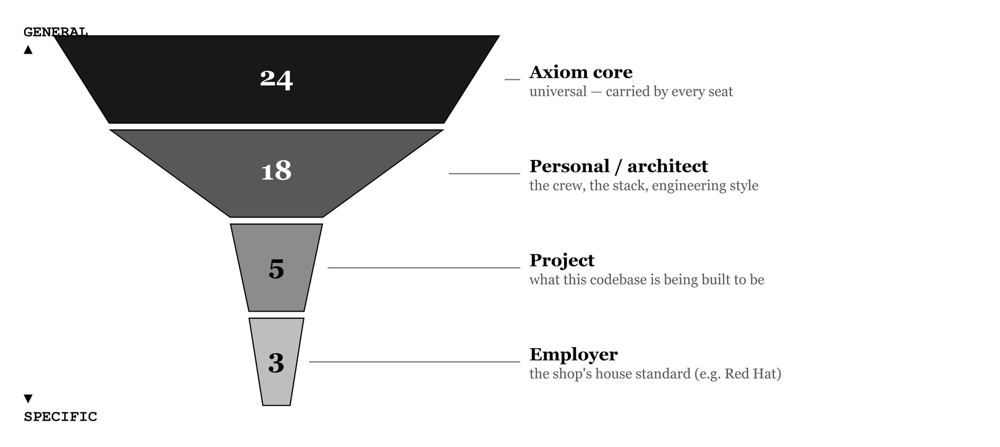
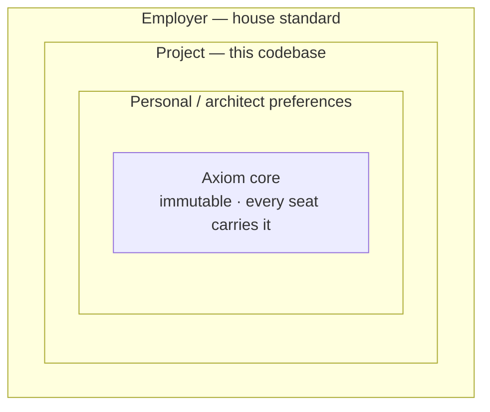
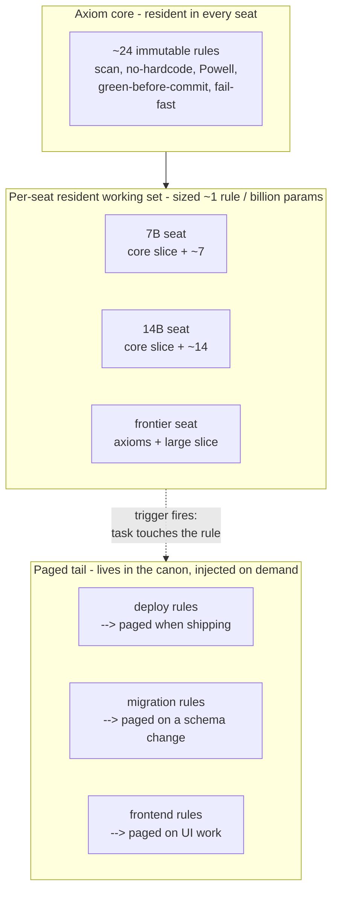
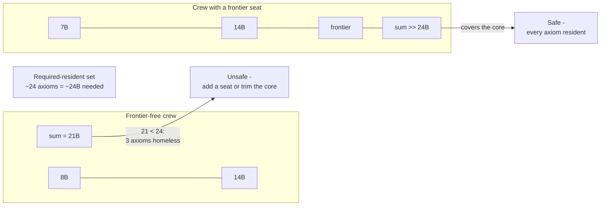

# Chapter 7 — From a Hundred Rules to an Axiom Core

> **Standing on Chapters 1–6:**
> - The hard rules never bend, and the Powell rule holds: gather 90% of the information, then decide (Chapter 1).
> - Nothing is hardcoded; everything that can change flows through config, behind an interface (Chapter 2).
> - Builds are portable, fail loudly, and carry the fewest dependencies that do the job (Chapter 3).
> - Every artifact is scanned clean and proven against the rubric with 100% branch coverage (Chapter 4).
> - Every artifact is identified, every decision and plan written down for the amnesiac who reads next (Chapter 5).
> - A fleet earns its keep by trusting the pipeline, not the model: a rule holds about one rule per billion parameters, so each seat carries a slice of the canon, not the whole book (Chapter 6).

Chapter 6 left a debt. It said a small model holds about one rule per billion parameters, so you slice the canon and give each seat only the rules its job needs. Fine. But slice *how*? A hundred rules in a flat list is a hundred things of supposedly equal weight. Hand that to the knife and the first question back is: which of these can the migration seat do without, and which can it never, ever miss? The list doesn't say. It's a hundred peers. A flat list has no grain to cut along.

This chapter is the grain. It adds no rules — the canon is still exactly one hundred, and the count is sacred. What it adds is a *shape*: the hundred is not a flat list and never was. It is a small immutable core that every seat must carry, wrapped in layers of preference that get paged in only when a task touches them. The number is the union. The structure is what makes the union fit on machines that can't hold it.

The shape came from an outside knife. I had been defending the flat hundred for months — keep the count, flag the weak ones, never cut. A reader named Guy Turgeon asked the one question I'd been routing around: *how small can the crew get and still be safe?* You cannot answer that about a flat list. You can only answer it about a structured one. So I structured it. The rest of this chapter is his scalpel.

## The hundred was never flat

I graded all hundred rules on one scale — a six-dimension rubric, the same one Chapter 4 demands of any project. The role rules and the project rules sank to the bottom. "Meet the crew" graded 33.5. "Go local" graded 25.5. The Podman-and-UBI stack graded 45. Down at the floor, looking like the weakest rules in the book.

They aren't weak. They're *mis-scoped*. The rubric scores a rule partly on generality — does it hold for everyone, everywhere — and a rule about my five personas graded as a universal law always loses on generality, because it was never a universal law. It's my preference. Grading it against the secret-scan rule is grading a house style against a law of physics. The low score isn't a verdict on the rule. It's the rubric noticing the rule is a different *kind* of rule and the flat list pretending it isn't.

That's the crack the whole chapter opens. Some of these rules are axioms — they hold for any serious engineer, any project, any shop. Some are opinions — good ones, mine, defensible, and disputed by reasonable people. The flat hundred filed them side by side and the grader couldn't tell them apart. Stop pretending they're the same kind, and the structure falls out on its own.

## The axiom core

At the center is the axiom core: the rules that hold no matter who you are or what you're building. Scan before every boundary. Never hardcode a secret. Destruction needs a human. Distrust every external input. The Powell rule. Autonomy bounded by version control. Green before commit. Fail fast. Around two dozen of them — the full list is in Appendix F.

The test for the core is not "is this rule good." Most of the hundred are good. The test is "would skipping this ever be defensible, anywhere?" An axiom is a rule whose violation is indefensible in every shop on the planet. Almost nobody argues that you should commit secrets, or skip the scan, or drop a production table without asking. Those are the axioms. They are few on purpose, because the core has to be the smallest set a seat must *never* be without — and a small model has room for a small core and nothing more.

Keep the core few and it travels. Every seat carries it, the 2-billion-parameter mechanical drone as much as the frontier architect, because there is no task cheap enough to be allowed to leak a key. The axioms are the rules with no off switch.

## The preference layers

Everything outside the core is a preference, and preferences come in scopes. Mine stack like this:

- **Personal and architect preferences** — my engineering opinions and my crew. Objects with one job. Files under five hundred lines. One non-trivial class per file. The config-precedence stack. The five personas and which model sits in each seat. All defensible, all disputed, all *mine* — opinions, so preferences, not axioms.
- **Project preferences** — what this particular codebase needs. The migration rules a database project lives by and a static site never sees. The schema a payload-reshaping task is held to.
- **Employer preferences** — the shop's house standards. Mine are Red Hat-shaped: Podman over Docker, UBI base images, OpenShift. Correct for me. Hardcoded to nobody else.

This is the book's own governance hierarchy, finally made literal — the town, the library, the bookshelf, the book, each free to tighten the rules it inherits and forbidden to loosen them. The axioms are the town laws: they bind everyone below and nobody may relax them. Each layer down adds its own constraints on top. A preference can make a rule stricter for its scope; it can never cancel an axiom. Constraints tighten downward. They never loosen.

*The same hierarchy as containment. The axiom core sits at the center, carried by every seat; each enclosing layer may make an inherited rule stricter for its scope, never laxer — and pages in only when a task reaches that scope.*

The low grades make sense now. "Go local" graded 25.5 not because it's a bad rule but because it's a personal-layer preference being scored as a town law. In its own layer, scored against its own scope, it's exactly right. It was only ever in the wrong column.

## Rules as a cache hierarchy

The layers aren't filing. They're a memory budget, and the budget is the one from Chapter 6: about one rule per billion parameters. Treat the ruleset the way a processor treats memory — a cache hierarchy, fastest and smallest at the center, largest and slowest at the edge.

- **Resident, per seat.** Each model carries a working set sized to its budget — held in weights by a fine-tune, or pinned in the system prompt on every call. The 7-billion seat resides about seven rules. The 14-billion seat resides fourteen. The frontier seat resides the axioms and a large slice besides.
- **Team-resident union.** No single seat holds the whole canon, but the seats *together* hold every rule that needs to be standing. That union is the canon made operational — Chapter 6's "the fleet carries the book" stated as a memory layout.
- **Paged tail.** Every rule no seat keeps resident still lives in the canon, and it gets paged into the context window the moment a task touches it. About to deploy — inject the deploy rules. Untrusted input on the bench — inject the input-validation rule. Just-in-time, bounded by the tier's context ceiling, gone again when the task is done.

*The ruleset as a cache hierarchy. The axiom core is resident everywhere. Each seat pins a working set sized to its budget. The rest is paged in by trigger and released — the canon held whole across the fleet, never whole in one seat.*

This is why the core has to be small. Resident space is the scarcest thing in the system. The always-on center can only be the rules that must never be a page-fault away — because the one time you need the secret-scan rule is the one time there's no slack to go fetch it.

## Guy's test — how small can the crew get?

Now Guy's question has an answer, because there's something to count. Team-resident capacity is the sum of the per-seat budgets. A crew is *safe* when that summed budget covers the required-resident set — the axioms, plus whatever project rules this job can't afford to page. Guy's test is the floor: the smallest crew, fewest seats and fewest parameters, whose budgets still cover the required-resident set. Below it, an axiom has nowhere to live and the system is unsafe. At it or above it, every must-hold rule has a home.

Run the test on my own crew and it bites immediately. The axiom core is twenty-four rules, so holding every axiom resident needs about twenty-four billion parameters of summed budget. A frontier-free crew of small models — say an 8-billion seat and a 14-billion seat — sums to twenty-one. Twenty-one is short of twenty-four. Three axioms have nowhere to sit. That crew is unsafe by three rules, and the test says so in one line of arithmetic.

Two levers fix it. Add a frontier seat, whose budget swallows the whole core and a long slice besides — which is what my working crew does:

| Seat | Model | Budget | Resident | Paged |
|------|-------|-------:|---------:|------:|
| Jason | 7B coder | 7 | 7 | 35 |
| Claude | 14B | 14 | 14 | 33 |
| Claudius | frontier | 200 | 50 | 0 |

Or — if you want a crew with no frontier seat at all, cheaper and fully local — trim the axiom core until it fits the small models' summed budget. Get the core to twenty-one and the 8-plus-14 crew clears it with nothing to spare. That is the real pressure to keep the core lean: every axiom you add is a billion parameters of crew you've just made mandatory.

*Guy's test. Sum the seats' budgets; compare to the required-resident set. The frontier-free pair falls three rules short — fix it by adding a seat or trimming the core. The crew with a frontier seat clears it outright. Crew size is the capacity dial: harder project, add seats; easier one, drop a seat and let more rules page.*

Crew size, then, is not a staffing accident. It's the capacity dial. A harder project needs more rules held standing at once, so you add seats and the resident capacity grows. An easier one drops a seat and lets more of the canon page in on demand. The dial reads in billions of parameters, and Guy's test tells you where the bottom of the dial is.

## Chapter 7 card

This chapter adds no rules. It gives the hundred a shape — carry this shape, not a flat list:

1. **The hundred was never flat** — some rules are axioms (indefensible to skip, anywhere), some are preferences (yours, good, disputed). A flat list hides the difference; the grader can't.
2. **The axiom core** — about two dozen immutable, universal rules, resident in every seat. Few on purpose: the always-on center holds only what must never be a page-fault away.
3. **The preference layers** — personal/architect, project, employer, by scope. The governance hierarchy made literal: each layer tightens what it inherits, never loosens. Constraints tighten downward.
4. **Rules as a cache hierarchy** — resident working set per seat (~1 rule/billion), team-resident union = the canon, paged tail injected by trigger and released.
5. **Guy's test** — the smallest crew whose summed budget covers the required-resident set. Below it, an axiom is homeless and the system is unsafe. Fix it by adding a seat or trimming the core.
6. **Crew size is the capacity dial** — harder project, add seats and hold more resident; easier one, drop a seat and page more. The dial reads in billions of parameters.

---

The hundred didn't shrink to twenty-four. It got a center. The count is still the union of everything the fleet holds; the structure is the cache that lets a fleet of forgetful machines hold it — a small core that never leaves, and a long tail that arrives exactly when a task reaches for it. Chapter 6 said distribute the canon, don't replicate it. This is the map of the distribution: what stays, what pages, and how few seats it takes to keep every law of the place standing. Guy asked how small the crew could get. The honest answer is a number now, and you can read it off the dial.
