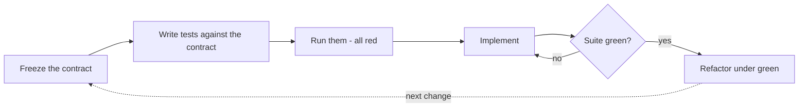
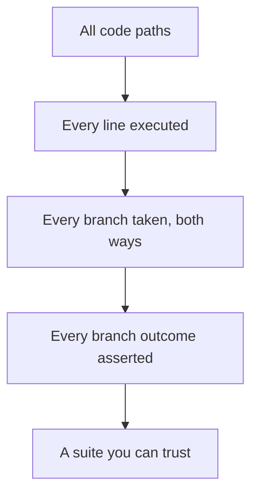
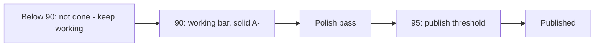
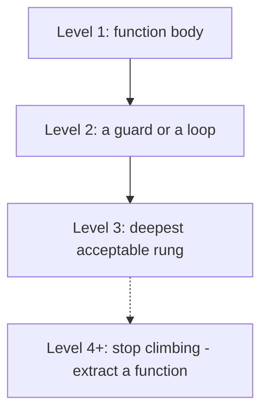

# Chapter 8 — Testing and the Quality Bar

You get what you inspect, not what you expect. I first heard that line decades ago from a quality engineer on a program where the hardware got X-rayed, the solder joints got sampled, and the software got — a shrug and a demo. Guess which part of the system came back from the field. The expectation was that the code worked because smart people wrote it carefully. The inspection would have told us that one branch in the retry logic had never executed even once, in the lab or anywhere else, until a customer's flaky link executed it for us.

For most of my career, the honest objection to full inspection was cost. Writing the 400th test case is mind-numbing work. Humans get bored, and bored humans write tests that assert `result is not None` and call it coverage. So we rationed: test the happy path, test the scary paths, and let the long tail ride on hope. Every coverage target below 100% is exactly that — a documented decision about which branches we'd rather discover in production.

That economics is dead. A machine does not get bored writing the 400th test case. It does not get bored writing the 4,000th. It writes the test for the branch where the config file exists but is zero bytes, and the one where the timeout fires during the retry of the retry, with the same patience as the first happy-path check. The historical excuse for partial inspection — human stamina — is gone, and the rules in this chapter follow from that one fact. One hundred percent line *and* branch coverage is no longer a zealot's slogan; it is an afternoon of agent time. So I require it.

Coverage tells you the code was *inspected*. It doesn't tell you the software is *good* — a fully covered pile of mush is still mush. So this chapter also carries the quality bar: every project keeps a rubric that scores what the software actually does, and the grades have teeth. Ninety percent on the rubric is the working bar — solid A− software, the kind you'd let a colleague depend on. Polish takes it to 95. Nothing publishes below 95. That's the definition of done, written down where nobody can renegotiate it at 5 p.m. on demo day.

And because nothing makes 100% branch coverage tractable except keeping the branch count sane, the complexity-budget rules live here too: small functions, shallow nesting. They're not style preferences. They're what makes total inspection affordable.

## Rule 71: No test, no ship

**New logic ships with tests; bug fixes ship with a regression test written failing-first, before the fix.**

Two clauses, and the second one is where the discipline lives. Anyone can agree that new code needs tests. The failing-first regression test is the part people skip, and it's the part that pays.

Here's the failure mode. A bug comes in. You read the code, spot the off-by-one, fix it, and *then* write a test to memorialize the fix. The test passes. Wonderful. But you never saw it fail — so you have no evidence it detects the bug at all. I have watched a team carry a "regression test" for two years that asserted the behavior of a code path the bug never touched. The bug came back. The test stayed green. Both facts were discovered in the same incident review, which is the most expensive way to learn anything.

The order is the whole rule: reproduce the bug as a test, run it, watch it fail, *then* fix the code, then watch the test flip to green. That red-to-green transition is the only proof you'll ever have that the test and the bug are actually connected. Skip it and you're filing paperwork, not building a regression net.

For new logic, "ships with tests" means in the same commit — not a follow-up ticket, not "once things settle down." Things never settle down. A commit that adds behavior without adding the inspection of that behavior is half a commit, and the missing half is the half that protects you next quarter when somebody — possibly an AI agent, possibly you — refactors the module without remembering what it promised.

## Rule 72: Contract first, code second

**Define and freeze the API or interface, write the tests against the contract, then implement. Never the reverse.**

When you write the implementation first and the tests after, the tests inevitably describe what the code *does*, not what it *should do*. They pin the accidents along with the intent — that quirky null return, that undocumented ordering. Now the bugs have test coverage protecting them. I've inherited suites like that: hundreds of green checks, every one of them an affidavit swearing the mistakes were on purpose.

So invert it. First, decide what the thing promises — the function signatures, the endpoint shapes, the error behavior — and freeze that contract. Second, write the tests against the contract while the implementation doesn't exist yet, which guarantees the tests can't peek at internals, because there are no internals. Third, implement until the suite goes green. The contract is the specification, the tests are the specification made executable, and the implementation is merely the first thing that satisfies it.

This matters double when an AI is writing the implementation. An agent given a frozen contract and a failing test suite has a precise, machine-checkable target; it will iterate against the suite until everything passes. An agent told "build a user service, then add some tests" will happily build something and then certify its own guesses. Test-after with an AI isn't just weaker — it's circular.

*The contract-first loop: the specification exists and is executable before the first line of implementation does.*

## Rule 73: 100% — lines and branches

**100% line and branch coverage — every branch exercised and asserted. Yes, 100%; configure the runner to fail under it.**

Every time I say this out loud, somebody quotes me the conventional wisdom: 100% coverage has diminishing returns, 80% is the pragmatic sweet spot, chasing the last fifth is vanity. That wisdom was correct — when humans wrote the tests. The last 20% of branches are the tedious ones: the error handlers, the empty-input guards, the else-arms of defensive checks. Tedium is precisely the cost that no longer applies. The machine writes those tests without complaint, so the old cost-benefit math is obsolete, and I've updated my answer accordingly.

Note the rule says *branch* coverage, and then it says more than that: exercised *and asserted*. Line coverage is the weakest signal there is — a line "covered" by a test that asserts nothing has merely been executed, not inspected. Branch coverage is stronger: both arms of every `if`, every loop's zero-iteration case, every early return. But even an exercised branch proves nothing unless the test asserts what happened on that path. The funnel narrows from "it ran" to "it ran both ways" to "we checked the result both ways," and only the bottom of the funnel is inspection.

*The coverage funnel: each stage is necessary; only the last one is sufficient.*

Make the threshold mechanical. The runner fails under 100% — `--cov-branch --cov-fail-under=100` or your stack's equivalent — so the bar is enforced by tooling, not by whoever feels strict that week. A threshold that requires a human to defend it will eventually meet a deadline that outranks the human.

## Rule 74: Coverage never goes down

**Coverage going down is a stop-and-fix, not a "justify it."**

Most coverage policies I've seen have a ratchet with a release lever: coverage shouldn't drop, but if it does, write a paragraph explaining why and carry on. I've watched that lever get pulled so many times the paragraph became a template. "Coverage temporarily reduced pending follow-up" — there's a phrase that has outlived several of the companies it was written at.

The problem with "justify it" is that justification is a negotiation, and negotiations get won by whoever has the deadline. Stop-and-fix is not a negotiation. The number went down; the work stops until it goes back up. That's the entire policy, and its strength is that it has no second sentence.

Mechanically, a coverage drop means one of two things happened. Either new branches arrived without tests — which is a Rule 71 violation wearing a trench coat — or a refactor orphaned some tests and the paths they used to inspect are now dark. Both are defects in the change that's in front of you right now, while the context is loaded in your head and the diff is small. Fixing them today costs minutes. Fixing them in six months costs an archaeology project: which commit dropped it, what was that branch for, does anyone remember what this error path was supposed to do?

If you hold the line at 100% (Rule 73), this rule enforces itself — the runner simply fails. Rule 74 exists for the transition period, the legacy repo you're ratcheting upward, the project you inherited at 60%. Whatever today's number is, it is the floor. The ratchet only turns one way, and there is no lever.

## Rule 75: Correctness over speed

**The delay to reach full coverage and verified behavior is acceptable and expected.**

This rule exists because every other rule in this chapter will, at some point, be standing between you and a deadline, and somebody will propose the obvious trade: ship now, test later. This rule is the pre-written answer, agreed to in calm weather so it doesn't have to be litigated in a storm: no. The delay is not a regrettable cost overrun. It is the budgeted price of knowing the thing works, and it was approved when the project started.

I spent years in environments where the software shipped inside hardware — burned into devices that went places no patch could follow. Nobody in that world asked whether verification was worth the schedule slip, because everyone could picture the alternative: a recall, a field failure, a very quiet meeting. The web era taught a generation that shipping broken is fine because patching is cheap. Patching is cheap. Burned trust, corrupted data, and 2 a.m. incident bridges are not, and those are what "ship now, test later" actually purchases.

The AI twist cuts both ways here, and it's worth being honest about it. Agents have made the *delay* smaller — full coverage costs hours now, not weeks, which makes the trade easier to refuse. But agents have also made it cheaper than ever to generate plausible, confident, untested code at volume. Speed of production without speed of verification just means you can now be wrong at scale. The machine's patience for writing tests is only an advantage if you spend it.

So when the estimate includes the testing time and someone asks if there's a faster version: there is, and we're not shipping it.

## Rule 76: No network in unit tests

**No network calls in unit tests — fakes, mocks, and fixtures.**

A unit test that touches the network is not a unit test. It is an integration test with a unit test's name tag, and it will betray you on exactly the schedule networks fail: intermittently, unreproducibly, and always during the release build.

The damage compounds in a specific way. The first time the suite fails because some staging endpoint hiccuped, somebody reruns it and it passes. The third time, "rerun the suite" becomes standard advice. By the tenth time, a red build means nothing — maybe a bug, maybe the Wi-Fi — and a test suite whose red can't be trusted is worse than no suite, because it still costs maintenance while providing alibis instead of information. Flakiness isn't a nuisance; it's how a suite dies.

The fix is the seam you already built if you've been following Chapter 4: dependencies arrive through interfaces via constructor injection, so the test hands in a fake. The fake returns canned responses in microseconds, simulates the timeout and the 500 and the malformed payload on command — failure modes you could wait weeks for a real endpoint to produce, served deterministically and on demand. Unit tests get fakes; the offline-by-construction suite runs in seconds, anywhere, including on a plane and in a CI runner with no egress.

Real-network testing still happens — in the integration tier, clearly labeled, running on its own cadence, allowed its own failure modes. The rule isn't "never test the network." It's that the fast suite — the one gating every commit under Rule 77 — depends on nothing but the code under test. That suite must be incapable of lying about whose fault a failure is.

## Rule 77: Full regression, every feature, with the numbers

**Run the full regression suite after every feature; report the test count and any failures.**

The first half is mechanical: after every feature lands, the entire suite runs. Not the tests near the change — all of them. The whole point of a regression suite is catching the breakage you didn't predict, and selecting "relevant" tests by hand is predicting it. When suites are fast — and offline-by-construction suites (Rule 76) are fast — running everything is cheap enough that selectivity is pure risk with no payoff.

The second half is the part people leave out, and it's the part I actually insist on: *report the count*. Not "tests pass" — "412 tests, 0 failures." The habit looks like bureaucracy until the day it catches something. "Tests pass" and "tests pass — all 9 of them, because the collector silently skipped the other 400 after an import error" produce identical green checkmarks. I've seen a misconfigured runner report success on a fraction of the suite for weeks; everyone read green and moved on. A human who'd been typing "412 tests" all month would have noticed "9 tests" instantly. The count is a heartbeat: cheap to take, and its absence is diagnostic.

This rule matters more with AI agents in the loop, not less. An agent reporting on its own work has every incentive — structural, not malicious — to summarize happily. Requiring the number forces the report to carry evidence instead of vibes, and it gives the human a one-glance sanity check that the inspection actually happened at the scale claimed. "All green" is an opinion. "All 412 green" is a measurement. We ship on measurements.

## Rule 78: You get what you inspect — and it gets a grade

**Test-driven, not test-after — and graded: every project keeps a rubric scoring how good the software actually is. 90% is the working bar, polish to 95%, nothing publishes below 95%.**

Coverage proves the code does what its tests say. It is structurally incapable of telling you whether the software is any good — whether the CLI's errors help anyone, whether the latency is tolerable, whether the docs let a stranger start in five minutes. A fully covered product can still be a bad product. Different question, different instrument.

The instrument is a rubric: a written, project-specific scorecard of what "good" means for *this* software — correctness, robustness, performance, usability, documentation, whatever the project actually owes its users — with weights and a score. Writing it forces the conversation teams otherwise have implicitly and too late, usually in the form of an argument about whether the thing is "done." The rubric is the definition of done, decided in advance, in writing, where deadline pressure can't renegotiate it.

The grades have teeth. Ninety percent is the working bar — solid A− software, dependable, honest about its limits. Below 90, it isn't done; keep working. From 90 you run a polish pass — the error messages, the rough edges, the README — to 95. Nothing publishes below 95.

*The rubric gauge: 90 means it works; 95 means you'd put your name on it.*

Why 95 and not 100? Because the last five points cost more than the next project's first ninety, and chasing them is how perfectionists ship nothing. A− working, A at the door. Inspected, graded, and published with the grade on record.

## Rule 79: Small functions

**Functions target ≤50 lines and ≤5 parameters — refactor instead of stretching.**

This rule reads like a style guideline that wandered in from another chapter. It lives here on purpose: Rule 73's 100% branch-coverage requirement is only affordable if the branch count per function stays sane, and function size is the budget that keeps it sane. Branch combinations multiply within a function's scope — a 50-line function with a handful of conditionals needs a handful of focused tests; a 300-line function with the same conditional *density* needs coverage of the interactions, and the test suite for it turns into a setup-heavy swamp where every case must construct the whole world first. Decompose the monster into five small functions and the combinatorics collapse: each piece is tested exhaustively in isolation, and one composition test ties them together. Small functions aren't prettier. They're cheaper to inspect — and we inspect everything, so the cost ceiling matters.

The parameter limit is the same economics on a different axis. Every parameter is a dimension of the input space your tests must cover. Five is a lot of dimensions already; eight is a sign the function is several functions in a shared trench coat, or that those parameters wanted to be an object with invariants of its own — which you can then validate and test *once*, instead of in every caller.

Fifty lines and five parameters are targets, not handcuffs; the occasional honest 60-liner that resists splitting is fine. But "refactor instead of stretching" is the operative clause. When a function starts crowding the limit, the move is to extract — not to argue that this particular function is special. They all think they're special. None of them are.

## Rule 80: Shallow nesting

**More than ~3 levels of nesting → extract.**

Rule 79 capped the size of the test surface; this rule caps its depth. Nesting is where branch coverage goes to die. A condition at nesting level four can only be reached by first satisfying levels one through three, so every test for that inner branch has to construct a state that threads the entire gauntlet. The arrange section grows to ten times the assert section, the test breaks whenever any *outer* condition changes, and the deepest branches — the error handling, naturally, the code you most need inspected — end up the worst-tested code in the module. Under Rule 73 you'll write those tests anyway. This rule decides whether writing them is an afternoon or a campaign.

Depth is also where human review fails. Reading nested code means simulating a stack in your head — at level four you're tracking three suspended contexts to understand the one in front of you. I've debugged 2 a.m. failures rooted in an `else` that bound, after two hours of staring, to a different `if` than everyone had assumed for years. No deep-nested bug is shallow to find.

*The nesting ladder: three rungs up, the next move is a new function, not a fourth rung.*

The escape moves are mechanical: guard clauses that return early and flatten the happy path; extracting the inner block into a named function, which converts a nesting level into a name and a directly testable seam; flipping conditions to fail fast. Each extraction feeds Rule 79's small functions, which feed Rule 73's coverage budget. The chapter is one system. This rule is its floor.

### Chapter 8 card

- **71.** New logic ships with tests; bug fixes ship with a regression test that failed first.
- **72.** Freeze the contract, write tests against it, then implement — never the reverse.
- **73.** 100% line *and* branch coverage, every branch asserted; the runner fails under it.
- **74.** Coverage going down is stop-and-fix, not "justify it."
- **75.** Correctness over speed — the verification delay is budgeted and expected.
- **76.** No network in unit tests; fakes, mocks, and fixtures only.
- **77.** Full regression after every feature; report the test count, not just "green."
- **78.** Keep a rubric and grade the software: 90 is the working bar, polish to 95, publish at 95+.
- **79.** Functions ≤50 lines, ≤5 parameters — refactor instead of stretching.
- **80.** More than ~3 levels of nesting → extract a function.
