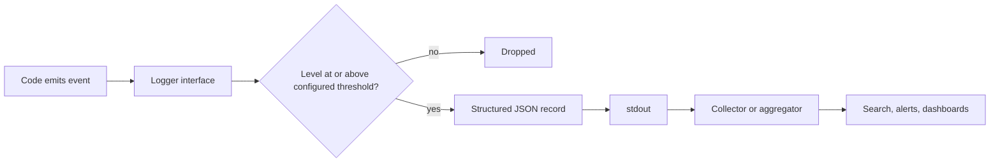
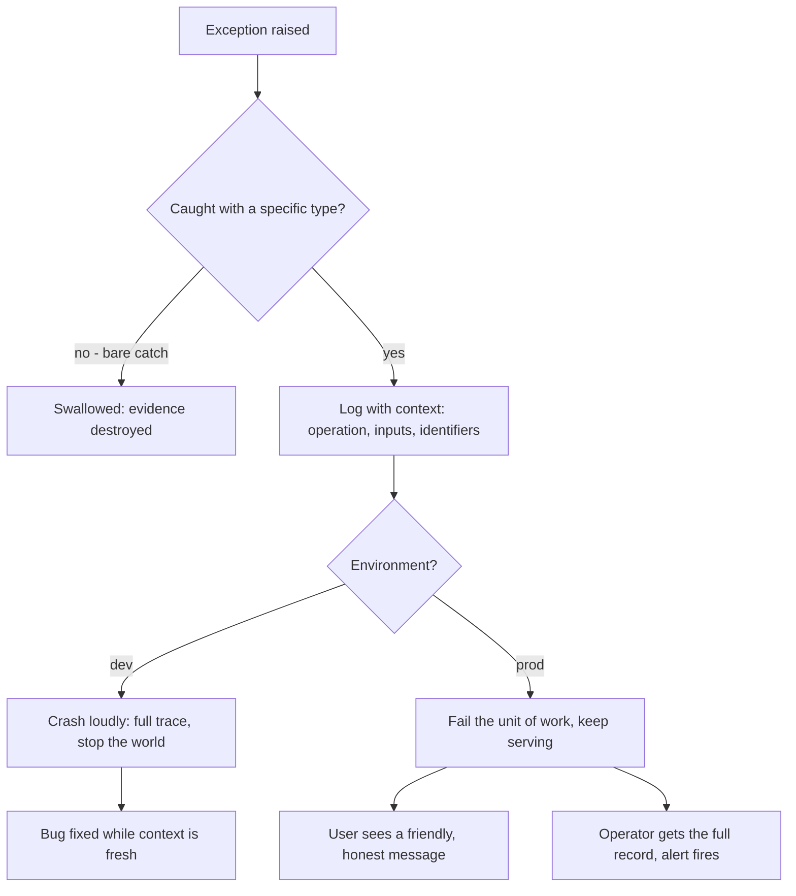
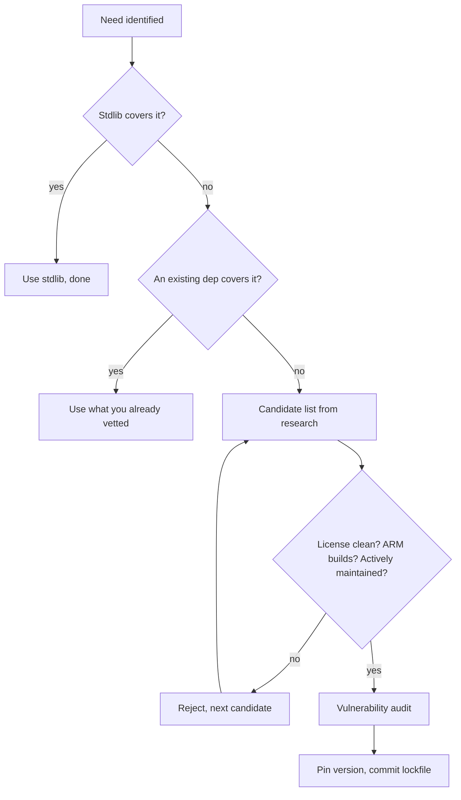

# Chapter 9 — Errors, Observability, Dependencies

Every production failure is eventually diagnosed at 3 a.m. by somebody squinting at whatever context your error handling bothered to keep. That somebody is usually you, six months older, memory wiped. The rules in this chapter are a letter to that future debugger.

I learned this on systems where "attach a debugger" was not on the menu. When a box in a locked equipment room a thousand miles away misbehaves, the only witness is the log, and the log only knows what the code chose to tell it. A swallowed exception is a witness who saw everything and says nothing. A `print` statement is a witness who mumbles into the void. The expensive failures of my forty-seven years were almost never the exotic ones — they were ordinary errors that somebody's error handling quietly ate, leaving the system to limp along corrupting state for hours before anyone noticed.

The second half of this chapter is about dependencies, and the pairing is not an accident. A dependency is an error you haven't had yet. Every package you pull in is somebody else's code, somebody else's release discipline, somebody else's security posture — adopted, sight mostly unseen, into your failure surface. The transitive closure of a "small" dependency can be hundreds of packages, each a place where a vulnerability, a breaking change, or an abandoned maintainer can reach into your build. You don't get to skip dependencies — nobody should write their own TLS stack — but you do get to vet them, pin them, audit them, and keep them in a fenced-off environment where they can't contaminate anything else on the machine.

The common thread is humility about the future. You will not remember why this code fails. The maintainer of that package will not stay interested forever. The environment your script runs in will not stay clean. The rules here are cheap insurance against all three: keep context when things break, make the breakage visible at the right volume, and treat every external package as a guest — welcome, vetted, and never handed the keys to the house. None of this is glamorous; all of it is what separates software you can operate from software you can only restart and pray over.

## Rule 81: Catch specific, never swallow

**No bare `except:`/`catch (e)` swallows — catch specific exceptions, rethrow or log with context.**

A bare `except: pass` is the single most expensive two-line construct in software. It costs nothing to write and weeks to pay for, because the bill arrives later, somewhere else, as state that quietly went wrong while the code insisted everything was fine.

The discipline has three parts. First, catch the *specific* exception you can actually handle — `FileNotFoundError`, `ConnectionRefusedError`, the typed error your library documents. A bare catch claims you can handle *anything*, including the typo you introduced last Tuesday and the interrupt the operator sent to shut you down cleanly. You can't, and pretending otherwise converts every future bug in that block into a silent one.

Second, when you catch, *do something honest*: handle it for real, or log it with context and rethrow. "Handle it for real" means the program is in a known-good state afterward — a retry, a documented fallback, a clean abort of the unit of work. Logging the message and continuing is not handling; that's swallowing with a paper trail.

Third — and this is the part everyone skips — log with *context*. `"connection failed"` is useless at 3 a.m. `"connection to inventory-db at db-host:5432 failed after 3 retries during nightly reconciliation, last error: timeout"` is a diagnosis half-written. The exception object knows what went wrong; only your code knows what it was *trying to do*. Attach the operation, the relevant inputs, and the identifiers a human would search for — the order ID, not the exception class name.

If you genuinely must ignore an error — a best-effort cache warm, say — catch the narrow type and log at debug level *why* ignoring is correct. Intent, written down.

## Rule 82: A logger, never print

**Use a logger, never `print`, in shipped code; log level configurable.**

`print` is fine in a throwaway script and a liability everywhere else, for one structural reason: it has no controls. No level, no timestamp, no source, no off switch. It is a statement hardcoded to shout at whoever happens to be holding the terminal — and in production, nobody is holding the terminal.

A logger gives you the four things `print` can't. **Severity**, so the reader can tell "routine" from "the building is on fire" without reading every line. **Provenance** — timestamp, module, process — attached automatically, so you never play the "which of our six services printed this?" game. **Routing**, so output goes to stdout, a file, or an aggregator without touching the call sites. And **volume control**: a configurable level means the same binary runs quiet in production and verbose on the box where you're chasing a bug.

That last word — *configurable* — is doing real work, and it ties back to the configuration chapter. The log level is an environment variable or a config key, never a constant. The debugging session that requires editing source and redeploying just to see debug output is a debugging session that starts an hour late. I have watched that hour get lost on systems where redeploying meant a change window and a sign-off sheet.

Every mainstream language ships a logging facility in the standard library or one boring, universal package. Set it up in the first hour of the project, wire its level to config, and `print` never gets a chance to metastasize. Retrofitting a logger into a codebase with four hundred print statements is an afternoon of mechanical penance; doing it on day one is five minutes.

## Rule 83: Structured logs once it's more than a script

**Structured logging (JSON) once the project is more than a script.**

Human-readable log lines are a love letter to a human who isn't coming. In any real deployment, the first reader of your logs is a machine — an aggregator, a search index, an alerting rule — and machines are terrible at reading prose. `"User 4711 failed login from 10.0.0.7 (attempt 3)"` requires a regex to query; the same event as JSON — `{"event": "login_failed", "user_id": 4711, "source_ip": "10.0.0.7", "attempt": 3}` — requires nothing but a field name. The moment you want "all failed logins for this user across all services last week," structure is the difference between a ten-second query and an afternoon of grep archaeology.

The threshold is "more than a script." A fifty-line tool you run by hand can print prose. The moment the thing runs unattended, has more than one component, or emits logs somebody else will read, switch to structured output. The cost is one formatter configured at startup; the call sites barely change.

Two practices make structured logging earn its keep. First, **consistent field names** across the codebase — `user_id` everywhere, not `uid` here and `userId` there. A five-line conventions note prevents the schema drift that makes cross-service queries lie to you. Second, **log events, not sentences**. An event name plus fields beats an English sentence with values interpolated into it, because the sentence version has infinite variants and the event version has one.

*The logging pipeline: code talks to one logger interface; level filtering, JSON structuring, and routing happen downstream of the call site — which is why call sites never need to change when the destination does.*

And per the container rules earlier in this book: the destination is stdout. The platform owns shipping the bytes; your process owns making them queryable.

## Rule 84: Loud in dev, graceful in prod, diagnosable always

**Fail loudly in dev, gracefully in prod, diagnosably always.**

These sound like opposites. They aren't — they're the same principle applied to two different audiences.

In development, the audience is the person who just caused the bug, context fresh. Serve them the failure at full volume: crash, print the whole trace, stop the world. Every error you soften in dev is a bug you've granted a visa to production. The fail-fast hard rule from Chapter 1 is this rule's blunt cousin: a dev environment that limps along after an error is a bug-laundering operation.

In production, the audience splits in two, and you owe each a different artifact. The *user* gets graceful: the request fails cleanly, the rest of the system keeps serving, the message is honest and useful — not a stack trace, which to a user is both gibberish and an information leak. The *operator* gets diagnosable: the full exception, the context from rule 81, the structured fields from rule 83, captured at the moment of failure. Graceful degradation without diagnosis is the worst outcome of all — the system absorbs errors so politely that nobody notices it's been failing for a week.

*The error-propagation ladder. The dev path and the prod path diverge only at the last step — what to show, and to whom. The capture step before the fork is identical, which is the point.*

The word "diagnosable" carries the whole rule. Whatever the audience-facing behavior, the record is complete. If you can't reconstruct what happened from the logs alone — no debugger, no reproduction, no guessing — the error handling failed, even if the catch block ran perfectly.

## Rule 85: Cleanup is structural, not hopeful

**Resource cleanup uses context managers / `defer` / `using` — no close-and-hope.**

Every resource you acquire — file handle, socket, lock, database connection, temp directory — is a debt, and the question is what happens to the debt when the code between acquire and release throws. The manual pattern — open, work, close — answers: the debt is never paid. The close call sits on the happy path, and the happy path is exactly where exceptions don't go.

Every serious language has solved this structurally. Python has `with`, Go has `defer`, C# has `using`, Java has try-with-resources, Rust ties cleanup to scope itself. The shapes differ; the contract is identical: *release is bound to acquisition at the moment of acquisition*, and the language runtime — not your discipline, not your memory of last month's early return — guarantees it runs on every exit path.

The failure mode this prevents is nasty precisely because it's slow. A leaked handle is invisible in development, invisible in the demo, invisible in week one of production. Then the file-descriptor table fills, or the connection pool drains, or a lock is held by a thread that died, and the system fails in a way that points nowhere near the leak. I once spent an unpleasant stretch of my embedded years chasing a system that hard-locked every nine days; the culprit was a cleanup call sitting below an error return. The fix was one line; the structural version of that fix is this rule.

Two corollaries. If a resource type doesn't support the language's cleanup construct, wrap it once so it does — an hour, paid once. And in code review, treat a manual close as a defect, not a style nit. The author isn't wrong about today's control flow; they're wrong about every future edit to it.

## Rule 86: AI errors surface; agents don't invent tools

**AI/LLM errors surface to the user as friendly messages — never a silent failure, never a raw stack trace. And agents only call tools that actually exist in their tool list — never fabricate one.**

This is rule 84 specialized for the AI era, with a clause the AI era made necessary.

When an LLM call fails — backend down, rate limit, context overflow, malformed response — two failure modes are tempting and both are wrong. The silent one: the feature degrades, a summary comes back empty, generated text just doesn't appear, and the user concludes the product is broken in some vague way they can't report. The loud-but-useless one: a raw provider stack trace lands in the UI, exposing internals to someone who just wanted a summary. The correct behavior is the prod path from rule 84: tell the user plainly that the assistant is unavailable and what to do about it, while the operator's log captures the provider, model, status code, and request context. LLM backends fail *constantly* compared with databases — treat their failure handling as a first-class feature, not an edge case.

The second clause is about agents calling tools. A model under pressure will sometimes invent a plausible-sounding tool name — `search_codebase`, `run_linter` — that simply isn't there. Each hallucinated call burns tokens, fails, and stalls the session in a retry loop. The rule for any agent operating under this book: the tool list is a contract, not a suggestion. If the tool you want doesn't exist, fall back to the primitives that do — shell, file reads — or stop and ask for the tool to be wired in. Fabricating a tool call is calling a function you never imported, with no compiler to catch it — the discipline has to live in the rules instead.

## Rule 87: Pin it and lock it

**Pin versions and commit the lockfile.**

An unpinned dependency is a build that changes underneath you while you sleep. "Install whatever's newest" means your repeatability is hostage to every maintainer's release schedule: the build that passed Friday fails Monday, and nothing in *your* repo changed. Debugging a breakage you didn't cause, in a package three levels down, is among the least dignified ways to lose a morning.

The fix is two artifacts doing two jobs. The **manifest** states your direct dependencies and the ranges you'll tolerate — this is what humans edit. The **lockfile** records the exact resolved version and integrity hash of *every* package in the transitive closure — this is what machines obey. Commit both. A lockfile that isn't committed is a diary that isn't written: the whole value is that your machine, your colleague's machine, CI, and the production image all install byte-identical dependency trees from it.

The lockfile buys three distinct things. **Repeatability** — today's checkout builds the same way in five years, and my software has tended to live decades. **Reviewability** — a dependency change becomes a visible diff in the pull request instead of a silent drift at install time; when something breaks, `git log` on the lockfile is your suspect list. **Integrity** — the recorded hashes make a tampered or republished package fail the install, converting a class of supply-chain attack into a loud error.

Upgrades still happen — deliberately. A version bump is its own commit (one purpose per commit), run against the full test suite, with the lockfile diff right there in review. The difference between that and an unpinned build is the difference between merging a change and being mugged by one.

## Rule 88: Stdlib plus one good dependency

**Prefer stdlib plus one well-maintained dependency over five small ones.**

Every dependency is recurring overhead dressed up as a one-time convenience. The install is free; the audits, upgrades, compatibility matrix, license tracking, and eventually-abandoned-maintainer succession planning are forever. So the arithmetic favors fewer, better packages: one well-maintained dependency means one changelog to read, one security advisory feed, one project whose health you track. Five small ones means five of each, plus the interactions between them. Small packages are likelier to be one volunteer's weekend project, to go quiet, to be the soft target in a supply-chain attack. The industry already ran this experiment with an eleven-line string-padding package; it went poorly.

The decision sequence, in order. **Stdlib first** — modern standard libraries cover HTTP, JSON, paths, concurrency, and far more than most people who learned the ecosystem a decade ago remember; check before you shop. **Existing dependencies second** — the well-maintained package you already vetted often covers the new need in a corner you haven't read about. **A new, healthy dependency third** — active maintenance, real adoption, responsive issue tracker, clean license, ARM builds (per the cross-platform chapter). **Writing it yourself last** — consistent with the research-first rule in the architecture chapter; original code is the fallback, not the default, but for twenty lines of glue it beats adopting a stranger's repo and their next five years of CVEs.

*The dependency vetting funnel. Most needs should die in the first two gates; only the survivors earn a slot in the lockfile.*

The funnel looks like bureaucracy. It's the opposite: ten minutes at the top saves the slow-drip years at the bottom.

## Rule 89: Audit for vulnerabilities — on a schedule and at the door

**Run a vulnerability audit periodically and on every new dependency.**

Your dependency tree is a fixed snapshot; the world's knowledge of its holes is not. A tree that audited clean in March can be carrying a critical CVE by June without a single line of your code changing — the vulnerability was always there, the disclosure is what's new. That asymmetry is why this rule has two triggers, and why neither replaces the other.

**At the door:** every new dependency gets audited before it lands, as the last gate of the rule-88 funnel. The tooling is free and fast — `pip-audit` for Python, `npm audit` for Node, `govulncheck` for Go — and it checks the entire transitive closure, which matters because the package you chose is rarely the problem; it's the dependency *it* chose, three levels down, that ships the vulnerable parser.

**On a schedule:** the same audit runs periodically against the lockfile you already have — in CI on every build if it's cheap enough, on a weekly timer at minimum. This is the trigger people skip because it generates unasked-for work — which is precisely its value: the gap between "CVE published" and "you found out" is the window in which you're vulnerable *and ignorant* — strictly worse than vulnerable and scrambling.

Findings get triaged like bugs, not like noise. A finding in code you actually execute gets fixed now — usually a one-line lockfile bump. A finding in an unreachable path gets documented as accepted, so the next audit doesn't re-litigate it. What a finding never gets is silently waved through; an audit whose output is habitually ignored is theater, and worse than no audit because it manufactures false confidence. The deploy gates in Chapter 5 already halt on findings — this rule is why they're entitled to.

## Rule 90: Project-local virtualenvs, always

**Python work always uses a project-local virtualenv — never install into the system Python.**

The system Python is load-bearing infrastructure that happens to look like a programming environment. On most Linux systems the OS tooling itself runs on it; on any developer machine, a half-dozen unrelated projects are one `pip install` away from sharing — and corrupting — a single global package namespace. Install project A's pinned framework version globally, and project B, which pinned a different one, breaks at a distance, with an error message that names neither project. Modern distributions now refuse bare global installs outright — a rare case of the platform enforcing my rules for me.

The virtualenv is the fence: a project-local environment, in the project directory, holding exactly what the lockfile says and nothing else. Every project gets its own; no exceptions for "it's just a script" — the just-a-script projects are precisely the ones that resurface in three years, and rule 87's lockfile can only reproduce an environment isolated enough to be *described*. The virtualenv directory itself is disposable and gitignored: the lockfile is the source of truth, the environment is a build artifact you can delete and regenerate without ceremony. If deleting it scares you, your lockfile is lying.

Mechanically this costs one command at project start and roughly zero thereafter. The companion discipline is *never invoking the bare system interpreter* for anything that imports project dependencies: run through the environment, every time, in the shell and in CI alike, so the environment that passes tests is the environment that ships. Other ecosystems get this for free — Node's `node_modules` is per-project by construction. Python makes you ask. Ask every time.

### Chapter 9 card

- **81.** Catch specific exceptions; rethrow or log with context — never a bare swallow.
- **82.** Logger, never `print`, in shipped code; log level set by config.
- **83.** Structured JSON logs the moment the project is more than a script.
- **84.** Fail loudly in dev, gracefully in prod, diagnosably always.
- **85.** Cleanup via context managers / `defer` / `using` — never close-and-hope.
- **86.** AI errors reach the user as friendly messages; agents call only tools that exist.
- **87.** Pin versions and commit the lockfile — builds are repeatable or they're roulette.
- **88.** Stdlib plus one well-maintained dependency beats five small ones.
- **89.** Vulnerability audit on every new dependency and on a schedule.
- **90.** Project-local virtualenv, every project — the system Python is not yours.
