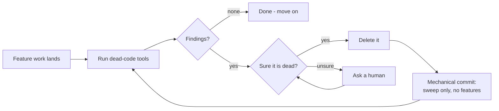
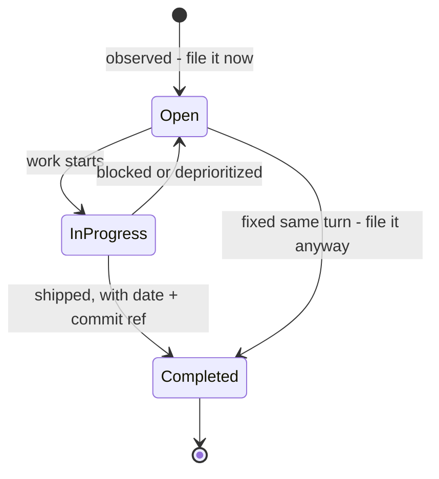
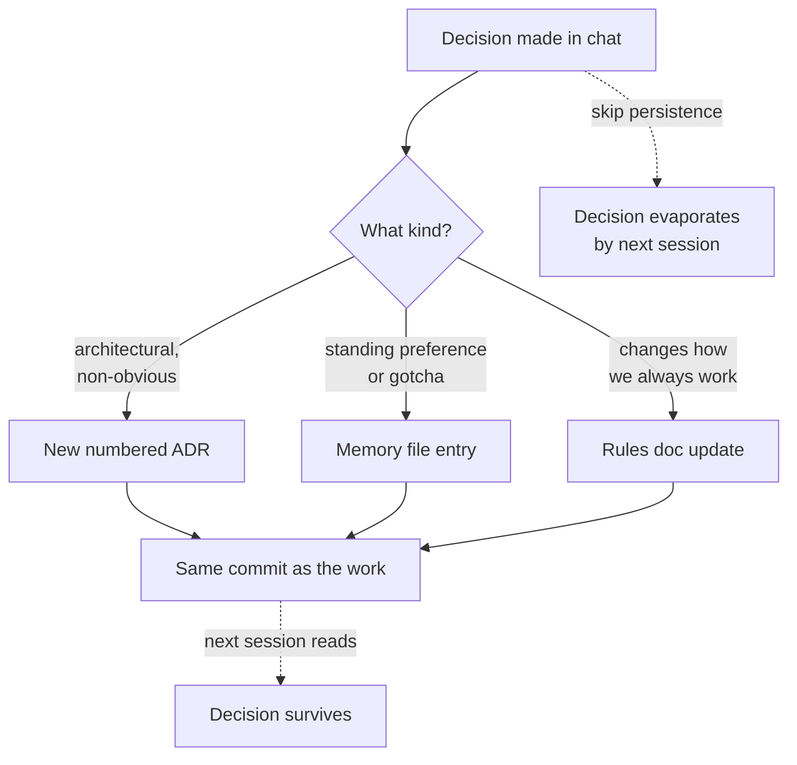

# Chapter 10 — Hygiene, Memory, Process

Every piece of unwritten knowledge has a half-life, and it is shorter than you think. The reason we chose the message queue over the database trigger; the gotcha in the vendor's auth flow that cost us a week — if it lives only in a chat scroll or somebody's head, it is already decaying. People leave. Chat logs scroll past the retention window. Memory edits itself: six months later you'll remember a confident reason that is not the reason. I have watched teams re-litigate the same architectural decision three times in two years, each round burning a week, because nobody wrote down the verdict the first time. The code remembered what was decided. Nothing remembered why.

For most of my career this was a chronic, low-grade tax, paid in re-explained context and re-fought arguments. Then the AI teammates showed up and turned a chronic condition into an acute one. An AI coding agent forgets everything between sessions. Everything. It starts every morning as the smartest amnesiac you've ever hired. If your project's memory lives in heads and scrollback, your AI teammate's effective memory is zero, and you will spend every session re-teaching it the things you decided last month — or worse, you won't, and it will cheerfully undo them. Written memory used to be a nicety, the thing diligent teams did and the rest of us admired. Now it is the load-bearing wall. The files in this chapter — ADRs, bug trackers, memory docs, regenerated READMEs — are not documentation in the old "write it for the auditors" sense. They are the persistent state of a system whose most productive workers are stateless.

This is also the chapter that makes the other nine stick. Secret scans, coverage bars, immutable tags — every rule in this book degrades into folklore unless something keeps it written, current, and in front of whoever (or whatever) is doing the work. Hygiene keeps the codebase legible. Memory keeps the decisions alive. Process keeps the humans and the machines honest with each other. Ten rules, and then you're on your own.

## Rule 91: Say what you're installing

**State the name, purpose, license, and maintenance status before adding any dependency.**

Rule 4 back in Chapter 1 made this a hard rule: no dependency lands without disclosure. This rule is the working procedure. Before any agent — human or AI — adds a line to the manifest, it states four things out loud: the dependency's name, what problem it solves here, its license, and whether anyone is still maintaining it (last release, native builds for the architectures we target).

Why the ceremony? Because every dependency is a small adoption. You are taking in someone else's code, their bugs, their security posture, their license obligations, and their maintenance schedule — forever, or until the painful day you rip it out. The four-question disclosure takes thirty seconds and catches the bad adoptions before they happen. The GPL library in your proprietary product. The "tiny utility" with forty transitive dependencies. The package whose last release predates the framework you're using it with. The one with no ARM build, discovered three weeks later on the new laptops.

I once watched a build break on a package whose sole maintainer had deleted their account. Nobody on the team could say why the package was there. It had arrived years earlier inside a copy-pasted snippet and quietly become a single point of failure with no owner. Thirty seconds of disclosure at adoption time would have kept it out, or at least left a record that made the surgery trivial instead of archaeological.

AI agents make this rule more important, not less. An agent will happily `npm install` its way to a working demo. Force the disclosure: if it can't state the license and the maintenance status, it hasn't looked — and you're adopting blind.

## Rule 92: Sweep the dead code

**After meaningful feature work, run a dead-code pass — vulture and ruff for Python, ts-prune and knip for TypeScript, staticcheck for Go. Remove unused imports, parameters, branches, and files. Ask before deleting anything you're unsure about.**

Feature work sheds debris. You refactor a function and the old helper goes quiet; you swap a backend and the previous adapter sits unused; you delete a call site and three imports go stale. None of it breaks anything, which is exactly the problem: dead code doesn't announce itself. It just sits there, getting read by every future maintainer — and ingested into the context window of every future AI session — as if it mattered. With AI teammates it literally costs tokens: the agent reads the corpse, reasons about the corpse, and sometimes resurrects the corpse.

So the sweep is scheduled, not aspirational. After meaningful feature work — not every commit, but every time the dust settles on something real — run the tools. They're fast, they're free, and they find what eyes skip.

*The dead-code sweep cycle: tools find candidates, certainty gates deletion, the sweep lands as its own mechanical commit.*

Two qualifiers carry the weight. First: *ask before deleting anything you're unsure about*. Static analysis can't see reflection, dynamic dispatch, plugin discovery, or the entry point that only the cron job calls. "Looks dead" and "is dead" are different claims, and the difference is a production incident. Second, per Rule 8: the sweep is its own commit, mechanical and reviewable, never smuggled into a feature. A pure-deletion diff is the easiest review in the world. A deletion folded into a feature is where mistakes hide.

## Rule 93: No commented-out code

**No commented-out code in the repository — git history is the archive.**

Commented-out code is a question mark with no answer attached. Every reader who encounters that gray block has to stop and wonder: Is this coming back? Was it broken? Does the author know something I don't? The block can't answer, the author is long gone, and so it survives — too scary to delete, too dead to run. I've seen functions where the commented-out carcass outweighed the living code three to one, and the living code had been edited so many times the carcass no longer corresponded to anything.

The reason this habit exists is rational fear from a pre-version-control world: *I might need this again, and if I delete it, it's gone.* That fear has been obsolete for decades. Git is the archive. Every line you delete is recoverable, with its full context, its author, its date, and the commit message explaining why it died. `git log -S "the_function_name"` will find it faster than you can scroll through the file looking for the right gray block. Deletion in a version-controlled repo is not destruction; it's filing.

There's an AI angle here too, and it's not hypothetical. Commented-out code sits in the agent's context window looking almost exactly like live code. Agents pattern-match; a big block of plausible-looking logic is a big attractor. I have watched an agent "fix" a bug by un-commenting an obsolete implementation, because the carcass looked more like the training data than the living replacement did. Clean code isn't just for human readers anymore — it's prompt hygiene.

If it might come back, delete it anyway and say so in the commit message. That's what the message is for.

## Rule 94: No orphan TODOs

**No TODO without a tracker link. Otherwise it's a dated FIXME with a named owner.**

A bare `TODO: handle the error case` is a wish, not a plan. It has no owner, no deadline, no priority, and no presence in any list anyone actually reads. Nobody triages the codebase's comment strings, so the bare TODO does the one thing it's good at: it survives. Grep any codebase more than a few years old and you'll find TODOs older than some of the people working on it.

The rule splits the cases. If the work is real, it gets a tracker entry — an issue, a `bugs.md` or `features.md` line (Rule 98) — and the comment carries the link: `TODO(#412): handle the partial-write case`. The tracker entry says *what and why*; the comment marks *where*. When the entry closes, grep for the ID and clear the markers. If the work is *not* tracker-worthy — a note to a near-future self in mid-flight work — it's a `FIXME` with a date and an owner: `FIXME(eddie, 2026-06-11): brittle, revisit after the adapter lands`. The date makes staleness self-evidencing: a dated FIXME from two years ago is a confession, and the next sweep (Rule 92) deletes it or promotes it.

This also disciplines the AI teammates, which scatter TODOs the way they scatter apologies. An agent that must attach a tracker link has to actually *file the item* — which means the gap it noticed gets recorded somewhere durable instead of buried in a comment the next session will never see. The comment string is the worst database you own. Stop writing to it.

## Rule 95: Lint and format every commit

**Lint and format on every commit; CI stays green.**

Formatting arguments are the most expensive zero-stakes arguments in software. Nobody's product ever shipped late because the braces were on the wrong line, but plenty of teams have burned real hours relitigating style in review — and plenty of diffs have hidden real bugs inside a blizzard of whitespace churn. The fix has been settled for years: pick a formatter, wire it into a pre-commit hook, and never discuss style with a human again. The formatter is not the best style; it's the *agreed* style, which is worth more.

Linting is the same bargain at one level up. The linter catches the unused variable, the shadowed name, the suspicious comparison — the whole class of bug that's trivial when caught at commit time and embarrassing when caught in production. Running it on every commit means findings arrive in batches of one or two, attached to fresh context. Running it "before release" means a four-hundred-finding cleanup that everyone defers.

The second clause is the one with teeth: **CI stays green.** Green-before-commit was Rule 7's hard line; this rule extends it to the shared pipeline. A red main branch is a broken contract with everyone downstream, and tolerance for red is cumulative: a "flaky" test gets shrugged at on Monday, masks a real regression on Wednesday, and by Friday nobody can say which of the nine failures matters. Red means stop. Fix it or revert it; never wave at it.

For AI agents this rule is load-bearing in both directions. The hooks catch the agent's style drift mechanically, and a green CI signal is the one verification an agent can't talk itself out of.

## Rule 96: Regenerate the README

**After every major change, regenerate the README from scratch rather than patching it. It answers, in order: what this is and who it's for, quick start, configuration table, how to test, architecture, deployment, troubleshooting.**

READMEs don't fail by being wrong all at once. They fail by being patched — a sentence appended here, a flag renamed there, a quick-start step that survived the refactor it described. Each patch is locally true and globally corrosive, and after a year the document is an archaeological dig: four eras of the project visible in its strata, with no indication which layer is current. A README the reader can't trust is worse than no README, because it costs them the failed attempt before they fall back to reading the code.

Hence: don't patch. After a major change — new subsystem, dependency swap, deployment change, breaking interface — regenerate from scratch. Stale claims don't survive regeneration because nothing survives regeneration. This used to be an unreasonable demand on human time, which is why nobody did it. With an AI teammate it's twenty minutes: the agent reads the current codebase and writes the current document, and your job shrinks to review.

The fixed section order is sequenced by reader need: **what is this and who is it for**, **quick start** (prove it runs, copy-pasteable), **configuration table** (every variable, default, required-or-not), **how to test**, **architecture overview**, **deployment notes**, **troubleshooting** (the top issues you actually hit, not the ones you imagine). A reader should be able to stop at any section boundary with their question answered. And the first audience for the regenerated README is the next AI session — which reads it before the code, believes what it says, and acts on every stale claim you left in it.

## Rule 97: ADRs are immutable

**Non-obvious decisions go in numbered Architecture Decision Records — immutable after acceptance. A later ADR supersedes; it never edits.**

An Architecture Decision Record is a small, numbered file with a boring shape: context (what was true when we decided), decision (what we chose), consequences (what it costs us), alternatives considered. The shape matters less than the discipline around it: every *non-obvious* decision gets one, and once accepted, the record never changes.

Immutability is the part people resist, and it's the part that makes ADRs worth keeping. A decision record you can edit is a decision record you can't trust — was this the reasoning at the time, or the reasoning someone retrofitted after the outcome was known? An immutable record is testimony: when ADR-0014 says "we chose the embedded store because we had two ops people and no cluster budget," you know that was true *then*, even if it's false now. When the world changes, you don't edit ADR-0014 — you write ADR-0031, state the new context, and mark the old record superseded with a pointer. The chain of supersessions *is* the history of your architecture's reasoning, and it's the most honest document your project owns precisely because nobody can launder it.

The payoff compounds. New human teammates absorb the ADR directory in an afternoon — a year of hallway osmosis, written down. AI teammates read it at session start and stop proposing the migration you rejected, with reasons, eighteen months ago; the most common failure of a stateless collaborator is re-deciding settled questions, and a scan of ADR titles is the cheapest vaccine. Keep them short. Keep them numbered. Never touch them after acceptance.

## Rule 98: File it the moment you see it

**Track every bug and every requested feature in `bugs.md` and `features.md` the moment it's observed — even if it's fixed the same turn. Open questions are filed inline with the entry; filing never blocks on answers.**

The cheapest moment to record a bug is the moment you're looking at it. You have the symptom, the context, the reproduction in your head — the entry takes ninety seconds. Every hour after that, the knowledge evaporates: by tomorrow it's "something was weird with the export," by next month a user finds it for you. Same for features: the half-formed "we should let people batch this" dies in the chat scroll unless it lands in a file before the conversation moves on.

So the rule is mechanical: observed means filed. Even — *especially* — if it's fixed in the same turn, because the pattern across filed-and-fixed entries is how you notice the module that produces a regression every month. And filing never waits for completeness. Unclear scope, missing repro steps, contested approach? File the entry anyway with the questions inline under it; they get answered when the entry is picked up, not before. A tracker that demands fully-specified entries trains people to not file things, which is the failure mode the tracker exists to prevent.

*The entry state machine. Note both paths into Completed: even a same-turn fix passes through the file.*

Entries update in place — status, resolution date, commit reference — so the file stays a live ledger, not a graveyard. For AI teammates this file is working memory: it's how the bug noticed in Tuesday's session survives to be fixed in Thursday's.

## Rule 99: Persist decisions in the same commit

**When a standing decision is made in chat, persist it — to an ADR, a memory file, or the rules doc — in the same commit. Chat history is not memory.**

Chat is where decisions get made now. A question comes up mid-session, you work through the options with the agent, you make the call: "from now on, default to the streaming API; the batch path is legacy." That decision now exists in exactly one place — a conversation buffer that will be gone by morning. The next session starts cold, picks the batch path because nothing says otherwise, and you make the same call again, slightly differently, building a fog of almost-consistent precedents.

The fix is a timing rule, and the timing is the whole rule: *the same commit.* Not "I'll write it up later" — later is where decisions go to die; the moment the conversation moves on, the writing-up has lost its slot. The decision and its persistence travel together: chat produces the verdict, the verdict lands in the right file, and the commit that ships the work carries the memory with it.

*The decision flow. The solid path is the rule; the dashed path to evaporation is what happens by default.*

Routing is easy: architectural and non-obvious goes to an ADR (Rule 97); standing preferences and gotchas to the memory file; anything that changes how you always work amends the rules doc itself. The test for what needs persisting: *would I want the next session to know this without being told?* If yes, it goes in a file, now, in this commit. With teammates that forget everything overnight, an unwritten decision isn't a decision. It's a mood.

## Rule 100: Verbatim errors, diffs not prose, assumptions out loud

**Quote errors verbatim — never paraphrase a stack trace. Show diffs, not prose, when the question is "what changed?" Surface assumptions explicitly.**

The last rule in the book is about the quality of the signal between collaborators, and it has three clauses that are really one principle: *transmit evidence, not interpretation.*

Errors, verbatim. A paraphrased error is interpretation wearing the costume of evidence. "It couldn't connect to the database" might be a refused connection, an auth failure, a DNS miss, a timeout, or a TLS mismatch — five different bugs flattened into one sentence by a helpful summarizer. The raw text carries the error code, the hostname, the line number, the one weird detail that cracks the case. I have lost entire days to debugging the paraphrase instead of the error. Paste the real thing.

Diffs, not prose. When the question is "what changed?", a description is a secondhand account from a witness with an incentive to look good. The diff is the change: prose says "refactored the retry logic"; the diff shows the timeout that also quietly went from 30 to 5. Reviewers approve prose. They catch things in diffs.

Assumptions, out loud. Every nontrivial task runs on unstated assumptions — what the user meant, which environment matters, what's in scope. Stated, an assumption is a checkpoint: "I'm assuming you want this configurable with the local backend as default — confirm?" costs one line and catches the wrong turn before the work, not after. Unstated, it's a landmine with a delay fuse — and the AI's wrong assumptions are the expensive ones, executed at machine speed.

Evidence over interpretation, in every channel. That's the rule the other ninety-nine ride on.

### Chapter 10 card

- **91.** State name, purpose, license, and maintenance status before adding any dependency.
- **92.** Run a dead-code pass after meaningful feature work; ask before deleting anything uncertain.
- **93.** No commented-out code — git history is the archive.
- **94.** No TODO without a tracker link; otherwise a dated FIXME with an owner.
- **95.** Lint and format on every commit; CI stays green.
- **96.** Regenerate the README from scratch after major changes — never patch it.
- **97.** Non-obvious decisions go in numbered ADRs, immutable after acceptance; supersede, never edit.
- **98.** File every bug and feature the moment it's observed, even if fixed the same turn; questions go inline.
- **99.** Persist standing decisions in the same commit they're made — chat history is not memory.
- **100.** Quote errors verbatim, show diffs not prose, surface assumptions explicitly.

---

That's a hundred. Every one is a scar with a sentence attached — something that went wrong on a real project, got diagnosed, and got a rule so it wouldn't go wrong the same way twice. None came from a methodology book, and I'd be suspicious of any that did. Rules earned in your codebase will always outrank rules imported from mine.

Which is the send-off: steal what works, fork what doesn't. If your shop runs a different container stack, a different coverage bar, a different memory discipline — and it works, with evidence — then your rules are right for you and mine aren't. The point was never these specific hundred. The point is that you have *some* written, numbered, enforced set, small enough to actually read, fighting for every slot instead of growing forever, living where your collaborators — the human ones and the amnesiac ones — read it at the start of every session.

Forty-seven years in, the constant isn't any language, framework, or platform — all of mine are museum pieces now, and yours will be too. The constant is that software is built by collaborators who forget, misremember, and move on, and that written, enforced memory is the only thing that compounds. Everything here is provided as is, with no promises. Your mileage may vary. Do your own research — and then write it down.
