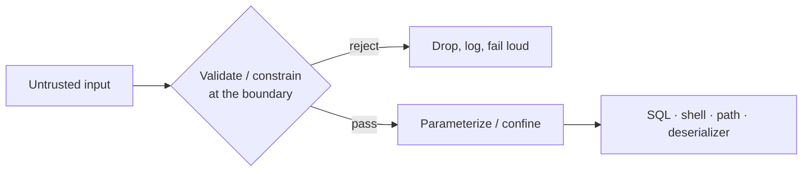

Status: In Progress — drafts for review (B12 step 1), 2026-06-13

# Book-sync drafts — the 4 new rule essays

Drafted in parallel against STYLE.md + real exemplars. **Not yet placed in the
chapters.** Awaiting Eddie/Iris: (a) voice pass, (b) fill the `[ANECDOTE: ...]`
placeholders (the author writes his own history), (c) normalize titles to the
book's sentence-case short-title style. Then integration (renumber, cards,
Appendix D, cross-refs) per PLAN_book-sync.md steps 2–6.

Placement: input-security → Ch1 (after the secret rules); idempotency → Ch3
(deploy/gates); latency → Ch4 (testing); STATE → Ch5 (memory).

---

## DRAFT 1 — Input-security (→ Chapter 1)

## Rule X: Distrust every external input

**Distrust every external input. Validate and constrain it at the boundary; parameterize queries and commands, resolve and confine paths, never interpolate untrusted data into SQL, a shell, HTML, or a deserializer. Secret hygiene guards what leaks out — this guards what gets in.**

The last several rules were about secrets leaking out. This is the first about something hostile getting in. The two are halves of the same coin. A leaked key lets an attacker walk through your front door; an injection flaw means he never needed the key — he gets your program to open the door for him. Most of this book worries about data escaping. Here we worry about data arriving, and arriving with intent.

The mechanism is always the same shape. A string that came from outside — a form field, a query parameter, a filename, a header, a row from another service — gets handed to something that interprets strings as instructions. SQL interprets it as a query. A shell interprets it as a command. A path resolver interprets `../../etc/passwd` as a place to go. A deserializer interprets it as objects to construct. An HTTP client interprets a user-supplied URL as a place worth fetching, and now your server is making requests on the attacker's behalf. In every case the fix is to stop concatenating and start parameterizing: bound parameters for SQL, argument arrays instead of shell strings, resolve-then-confine for paths, allowlists for anything that becomes a destination. Validate at the boundary, on the way in, before the value has touched anything that matters.

The AI angle is sharp here, because an agent's whole job is gluing systems together, and gluing means interpolating strings. Ask it to look up a user by name and it will reach for an f-string in the query before it reaches for a bound parameter — not from malice but from absence of instinct. It has no sense that the name might be `'; DROP TABLE`. There is a quieter trap underneath. When you are the only user of your own tool, the trust boundary is imaginary — you would never attack yourself, so the injection never fires, and the code looks correct for as long as it is private. The day a second user, a customer, or the open internet arrives, the boundary becomes real and every interpolation you let slide is now a door. [ANECDOTE: a benign-looking input that did real damage once it met a second user or a live network — Eddie to supply.]

This is also why you cannot test your way to safety with randomness. Throw a monkey at the keyboard, or a fuzzer at the input, and you will find crashes — null bytes, overlong strings, the robustness bugs. You will not find the attack. An attacker is not random. He is reading your code, your error messages, your stack traces, and choosing the one string in the space that turns your interpreter against you. Fuzzing measures how your program survives noise; it says nothing about how it survives a person who wants in.

The failure this prevents is the one where the input you trusted turned out to be a command you ran. The query that became a table drop, the filename that became someone else's file, the URL that made your server knock on a door it had no business touching. Secret hygiene keeps your own valuables from walking out. This keeps a stranger's instructions from walking in and wearing your program's privileges while they do their work.

---

## DRAFT 2 — Idempotency (→ Chapter 3)

## Rule X: A half-finished run is the normal case

**Make every operation idempotent and safe to re-run. Deploys, migrations, and setup scripts must converge to the same state run once or five times, and resume cleanly after an interruption — a half-finished run is the normal case, not the exception. Gate on the real end-state, never on a partial artifact that merely looks "done."**

Idempotency is the defining attribute of Ansible. You don't write Ansible to *do* things; you write it to *declare* a state and let it converge there. Run the playbook once, the box arrives at the state. Run it five times, the box is in the same state and four of those runs change nothing. That's the whole idea, and it's the right idea. A correct operation is one you can run again without flinching.

That instinct didn't come from configuration management. It came from determinism. [ANECDOTE: RTOS / Wind River — a function in a tight control loop that runs exactly once, on a deadline, with a known input and a known output.] When you own execution end to end, "run once" is a thing you can actually guarantee. The cloud took that guarantee away. The agent took what was left. Now the process dies halfway, the network hiccups, the container gets evicted, and something re-runs the thing. Re-running isn't the failure case anymore. It's the normal case.

AI agents make this worse because an agent fire-and-retries by reflex. It kicks off a step, the step half-completes, the agent loses the thread or the process is killed, and it runs the step again from the top. If your script isn't idempotent, the second run doesn't heal the first — it corrupts it. And the trap that catches everyone is the partial run that *looks* done. Same day I'm writing this, a setup script saw the config files already on disk and skipped a 19 GB model download — a download that was 1% complete. It gated on "directory non-empty." The directory was non-empty because the download had *started*. The check said done; the reality was a 200 MB stub where 19 GB belonged.

That's the rule in one line: gate on the real end-state, never on a partial artifact that merely looks done. "Directory exists" is a lie. "The weight files are present and the right size" is the truth. A naive check asks *did something happen here?* A correct check asks *is the end-state actually achieved?* Those are different questions, and an interrupted run is exactly the moment they give different answers.

The failure this prevents is the silent half-install: the deploy that "succeeded," the migration that "ran," the setup that "completed" — each of them leaving a system that is confidently, invisibly broken, because the gate was watching for the start of the work instead of the finish of it. You don't find it on the run that lied. You find it in production, later, when the missing 19 GB finally gets asked for.

---

## DRAFT 3 — Latency/determinism budget (→ Chapter 4)

## Rule X: Budget Latency Like You Budget Coverage

**Declare a latency and throughput budget, then gate regressions against it the way you gate coverage. Determinism and latency are features: measure them, set the ceiling explicitly, and fail the build when a change blows past it — a silent slowdown is a defect that ships.**

Most teams treat speed as a vibe. It feels fast, so it is fast, until a customer on a slow link or a box under load proves otherwise. That is backwards. A feature with no number is a wish. p99 latency is a number. Throughput floor is a number. Write them down, put them in the spec next to the functional requirements, and they become testable like everything else. An unmeasured budget is not a budget. It is a hope.

[ANECDOTE: a determinism/latency war story from the encryptor or RTOS days — Eddie to supply]

The how is mechanical and it is the same ratchet you already run for coverage. You declare the ceiling — p99 under N milliseconds, throughput above M requests per second — and you measure it in CI on a fixed, pinned harness so the numbers mean something run to run. The build asserts against the ceiling. A change that pushes p99 past the line fails red, the same way a drop in branch coverage fails red. You do not debate it in review. The gate already did. Raising the ceiling is a deliberate commit with a reason, not a quiet drift nobody noticed.

This rule almost did not get written, and the reason is the AI-era angle. I would never ship sloppy latency — forty-seven years wires that reflex deep, and you write rules for the mistakes that actually happen, not the ones you stopped making decades ago. But the agent does not inherit the reflex. Claude, left alone, writes the O(n²) loop over the collection, the query inside the loop that should have been one batched call, the synchronous fetch on the hot path — and it never glances at the clock. The code is correct. The tests pass. Coverage is green. And the thing is three times slower than last week, because nothing in the pipeline was watching the one axis I care about most. The gate is the reflex the executor lacks. It watches the clock so the agent does not have to remember to.

The failure this prevents is the slowdown that ships because no test was looking for it. Correct, covered, and slow all pass the same review. Without a latency gate, performance erodes one harmless-looking commit at a time until a user files the bug your CI should have. A silent slowdown is a defect. Make the build say so.

---

## DRAFT 4 — STATE / project memory (→ Chapter 5)

## Rule X: Keep one living state file the cold agent reads first

**Maintain a per-repo `STATE.md` (≤1024 words) ingested at session start and regenerated at the end of every commit, plus a one-line-per-repo `state.h` index at the projects root. It is an executive summary that *points* to the ADRs and trackers — never a log; when it overflows the cap, prune detail outward.**

An AI agent has no memory across sessions. Every conversation starts cold. We patch that with rules files, ADRs, READMEs, and trackers — and those sprawl. A fresh agent that has to read all of it before it does anything useful reads for an hour and still misses the one fact that mattered. The fix is a single capped briefing it reads first: where the project is, what just changed, what's in flight, what to touch next. One file. The agent orients in a page, then drills into the ADRs and trackers only where the work demands.

The how: `STATE.md` lives at the repo root, capped at 1024 words, ingested at session start and regenerated at the end of every commit. The commit is the right trigger because the commit is the unit of "something changed" — if it was worth committing, it was worth updating the state. The cap is load-bearing. It forces curation the same way "exactly 100 rules" forces this book to consolidate. When `STATE.md` overflows, you don't raise the cap; you prune detail outward — into the ADR that owns that decision, the tracker that owns that bug, the README that owns that setup. What stays is the summary and the pointer. The moment it becomes a log, it has failed.

At the projects root sits `state.h`: one to three sentences per repo, a master glance across everything. [ANECDOTE: the one-`.h`-per-directory TACLANE convention — every directory had exactly one header that summarized it; Eddie to supply.] The same convention, lifted up a level. You read `state.h` to know which repos are hot and which are dormant, then open the one repo's `STATE.md` to go deep. Two hops from "I just woke up" to "I know exactly where we are."

The AI-era angle is the whole point of the rule. A human engineer carries the project in their head between days; the agent carries nothing. So we externalize the head into a file the agent rebuilds every commit and reloads every session. The discipline cuts both ways: writing a good `STATE.md` forces the agent to state plainly what it just did and what comes next, which catches drift before it compounds. A project you can't summarize in 1024 words is a project you don't understand yet.

The failure this prevents: the cold-start amnesia tax — a fresh agent re-deriving context from scattered files, re-litigating decisions already settled in an ADR, re-opening a bug already closed, or charging off in a direction the last session abandoned for good reason. Without a single living briefing, every session pays that tax, and the bigger the project the higher the bill. `STATE.md` makes the first thing the agent reads the truest thing it could read.
